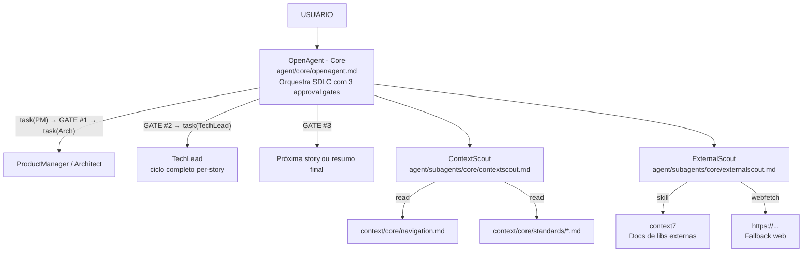
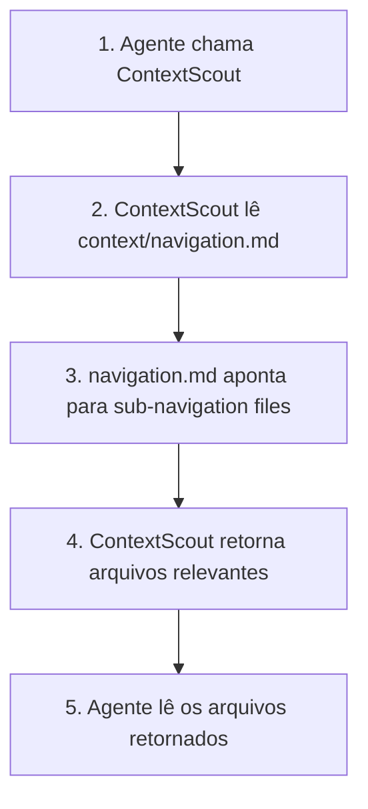
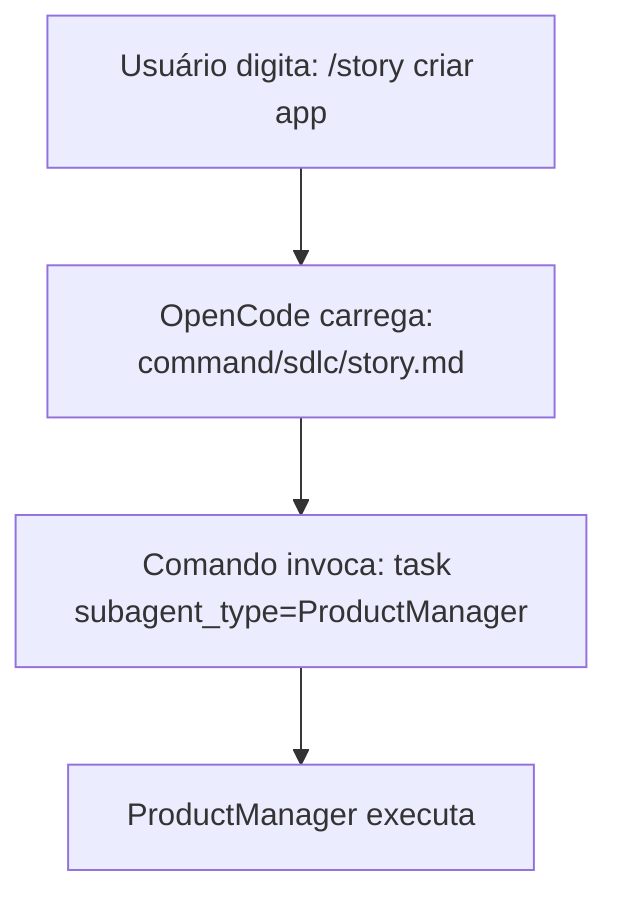

# Conexões e Extensões

Este documento explica tecnicamente como os componentes se conectam, onde cada conexão acontece (linhas de arquivo), e como estender o sistema com novos agentes, contextos, comandos, skills e tools.

---

## Visão Geral das Conexões



---

## 1. Como Agentes Chamam Outros Agentes

### Mecanismo: `task()` tool

**Onde está definido:** Cada agente tem uma seção que lista subagentes disponíveis e quando usá-los.

**Exemplo - OpenAgent chamando ProductManager:**

```javascript
// Arquivo: agent/core/openagent.md
// Linhas: 318-322

task(
  subagent_type="ProductManager",
  description="Create user story for finance app",
  prompt="Create a structured user story for: aplicativo de finanças pessoais..."
)
```

**Onde o OpenAgent sabe qual agente chamar:**

| Linha | Arquivo | O que faz |
|-------|---------|-----------|
| 88-101 | `agent/core/openagent.md` | Lista subagentes disponíveis |
| 116-124 | `agent/core/openagent.md` | Tabela "When to Use SDLC Pipeline" |
| 248-251 | `agent/core/openagent.md` | `<path type="sdlc">` define quando usar SDLC |
| 318-322 | `agent/core/openagent.md` | Código de invocação do ProductManager |

**Exemplo - TechLead chamando BackendDeveloper:**

```javascript
// Arquivo: agent/subagents/sdlc/tech-lead.md
// Linhas: ~150-160 (varia)

task(
  subagent_type="BackendDeveloper",
  description="Setup DB schema",
  prompt="Context to load: ... Task: Create database schema for..."
)
```

**Onde o TechLead sabe qual agente chamar:**

| Linha | Arquivo | O que faz |
|-------|---------|-----------|
| 118-132 | `agent/subagents/sdlc/tech-lead.md` | Tabela de routing por linguagem |
| 150-160 | `agent/subagents/sdlc/tech-lead.md` | Código de invocação |

---

## 2. Como Agentes Sabem Qual Contexto Usar

### Mecanismo: ContextScout + navigation.md

**Fluxo:**



**Onde está definido:**

| Linha | Arquivo | O que faz |
|-------|---------|-----------|
| 28-30 | `agent/subagents/core/contextscout.md` | Regra `context_root` - define onde começar |
| 74-77 | `agent/subagents/core/contextscout.md` | "Start by reading `{context_root}/navigation.md`" |
| 1-50 | `context/navigation.md` | Índice principal - aponta para sub-navigation |
| 1-30 | `context/core/navigation.md` | Navigation do core - aponta para standards/workflows |

**Exemplo - navigation.md:**

```markdown
<!-- Arquivo: context/navigation.md -->
<!-- Linhas: 1-30 -->

# Context Navigation

## Quick Access

| Domain | Navigation File | Purpose |
|--------|-----------------|---------|
| Core | [core/navigation.md](core/navigation.md) | Standards, workflows, context system |
| Development | [development/navigation.md](development/navigation.md) | Frontend, backend, patterns |
| Project Intelligence | [project-intelligence/navigation.md](project-intelligence/navigation.md) | Living notes, decisions |
```

**Como ContextScout usa isso:**

```javascript
// Arquivo: agent/subagents/core/contextscout.md
// Linhas: 74-77

1. glob("{context_root}/navigation.md")  // Encontra navigation.md
2. read("{context_root}/navigation.md")  // Lê o índice
3. Segue links para sub-navigation files
4. Retorna arquivos relevantes baseado na query
```

---

## 3. Como Agentes Sabem Qual Skill Usar

### Mecanismo: `skill()` tool + SKILL.md

**Skills são invocadas diretamente pelo agente quando precisa de funcionalidade específica.**

**Onde está definido:**

| Linha | Arquivo | O que faz |
|-------|---------|-----------|
| 15-17 | `agent/subagents/core/externalscout.md` | `skill: context7` permitido |
| 1-30 | `skills/context7/SKILL.md` | Define o que a skill faz |
| 1-30 | `skills/task-management/SKILL.md` | Define skill de tarefas |

**Exemplo - ExternalScout usando skill context7:**

```javascript
// Arquivo: agent/subagents/core/externalscout.md
// Linhas: 15-17

permission:
  skill:
    "*": "deny"
    "*context7*": "allow"  // ← Permite invocar skill context7

// Invocação (linha ~100):
skill("context7", { library: "react", topic: "hooks" })
```

**Estrutura de uma skill:**

```
skills/
├── context7/
│   ├── SKILL.md              ← Define a skill
│   ├── library-registry.md   ← Dados usados pela skill
│   └── ...
│
└── task-management/
    ├── SKILL.md              ← Define a skill
    ├── router.sh             ← Script bash
    └── scripts/task-cli.js  ← Script JavaScript
```

---

## 4. Como Agentes Sabem Qual Command Usar

### Mecanismo: Comandos são carregados pelo OpenCode, não pelos agentes

**Os comandos são atalhos que invocam agentes:**

```markdown
<!-- Arquivo: command/sdlc/story.md -->
<!-- Linhas: 1-30 -->

---
description: Create a structured user story from a feature request
---

# /story — Create User Story

Delegates to **ProductManager**:

task(subagent_type="ProductManager", description="Create user story", prompt="...")
```

**Fluxo:**



**Onde os comandos estão definidos:**

| Arquivo | Comando | Agente Invocado |
|---------|---------|------------------|
| `command/sdlc/story.md:15-20` | `/story` | ProductManager |
| `command/sdlc/plan.md:15-20` | `/plan` | Architect |
| `command/sdlc/implement.md:15-20` | `/implement` | TechLead |
| `command/sdlc/review.md:15-20` | `/review` | CodeReviewer |
| `command/sdlc/qa.md:15-20` | `/qa` | QAAnalyst |
| `command/sdlc/mr.md:15-20` | `/mr` | MergeRequestCreator |

---

## 5. Como Agentes Sabem Qual Tool Usar

### Mecanismo: Import direto no código

**Tools são módulos TypeScript importados por skills/scripts:**

```typescript
// Arquivo: skills/task-management/scripts/task-cli.js
// Linhas: 1-10

import { loadEnv } from '../../../tool/env/index.js'

// Uso:
const config = loadEnv()
```

**Onde as tools estão:**

| Arquivo | Função |
|---------|--------|
| `tool/env/index.ts` | Loader de variáveis de ambiente |
| `skills/task-management/scripts/task-cli.js:5` | Importa tool/env |

---

## 6. Mapa Completo de Conexões

### OpenAgent → Subagentes

| Subagent | Arquivo | Linha da Invocação |
|----------|---------|-------------------|
| ProductManager | `agent/core/openagent.md` | 318-322 |
| Architect | `agent/core/openagent.md` | 373-377 |
| TechLead | `agent/core/openagent.md` | 435-439 |
| ContextScout | `agent/core/openagent.md` | 317-326 |
| ExternalScout | `agent/core/openagent.md` | (detectado dinamicamente) |

### TechLead → Ciclo Completo (impl→test→QA→review→MR)

O TechLead **NUNCA escreve código diretamente**. Ele orquestra o ciclo completo de cada story:

| Fase | Agente Delegado | Arquivo TechLead |
|------|-----------------|-------------------|
| Implementação | BackendDeveloper / FrontendDev* | `agent/subagents/sdlc/tech-lead.md` (routing table) |
| Implementação | BackendDeveloperPython / C | `agent/subagents/sdlc/tech-lead.md` (routing table) |
| Testes | TestEngineer / TestEngineerPython / C | `agent/subagents/sdlc/tech-lead.md` (always_do rule) |
| QA | QAAnalyst | `agent/subagents/sdlc/tech-lead.md` (always_do rule) |
| Review | CodeReviewer / CodeReviewerPython / C | `agent/subagents/sdlc/tech-lead.md` (always_do rule) |
| MR | MergeRequestCreator | `agent/subagents/sdlc/tech-lead.md` (always_do rule) |

*Selecionado automaticamente por detecção de linguagem/framework

### Agentes → ContextScout

| Agente | Arquivo | Linha da Regra |
|--------|---------|----------------|
| CoderAgent | `agent/subagents/code/coder-agent.md` | 30-31 |
| BackendDeveloper | `agent/subagents/code/backend-developer.md` | 36-37 |
| FrontendDeveloperReact | `agent/subagents/development/frontend-developer-react.md` | 39-40 |
| TestEngineer | `agent/subagents/code/test-engineer.md` | 37-38 |
| CodeReviewer | `agent/subagents/code/code-reviewer.md` | 21-22 |
| ProductManager | `agent/subagents/sdlc/product-manager.md` | 53-54 |
| Architect | `agent/subagents/sdlc/architect.md` | 47-48 |
| TechLead | `agent/subagents/sdlc/tech-lead.md` | 67-68 |

### ContextScout → Context Files

| Context File | Arquivo do ContextScout | Como Chega Lá |
|--------------|------------------------|----------------|
| `context/navigation.md` | `agent/subagents/core/contextscout.md:29` | Regra `context_root` |
| `context/core/navigation.md` | `agent/subagents/core/contextscout.md:35` | Segue link do navigation principal |
| `context/core/standards/*.md` | `agent/subagents/core/contextscout.md:64` | Segue navigation do core |

### ExternalScout → Skills

| Skill | Arquivo do ExternalScout | Linha |
|-------|-------------------------|-------|
| context7 | `agent/subagents/core/externalscout.md` | 16-17 |

---

## 7. Como Adicionar Novos Componentes

### 7.1 Adicionar Novo Agente

**Passos:**

1. **Criar arquivo do agente:**

```bash
# Criar em:
new-opencode-workflow/agent/subagents/{categoria}/{nome-do-agente}.md
```

2. **Estrutura do arquivo:**

```markdown
---
name: NovoAgente
description: "O que este agente faz"
mode: subagent
temperature: 0.1
permission:
  bash:
    "comando permitido": "allow"
    "*": "deny"
  edit:
    "**/*": "deny"
  task:
    contextscout: "allow"
---

# NovoAgente

> **Mission**: O que este agente faz

<rule id="context_first" scope="all_execution">
  ALWAYS call ContextScout BEFORE any work.
</rule>

<rule id="approval_gate" scope="stage_transition">
  Approval gates between SDLC stages are handled by OpenAgent.
  Focus on implementation without individual file approvals.
</rule>

<!-- Resto do agente... -->
```

3. **Registrar no metadata:**

```json
// Arquivo: config/agent-metadata.json
// Adicionar entrada:

"novo-agente": {
  "id": "novo-agente",
  "name": "NovoAgente",
  "category": "subagents/{categoria}",
  "type": "subagent",
  "version": "1.0.0",
  "author": "seu-nome",
  "tags": ["tag1", "tag2"],
  "dependencies": [
    "subagent:contextscout"
  ]
}
```

4. **Adicionar aos routing tables (se necessário):**

```markdown
<!-- Arquivo: agent/core/openagent.md -->
<!-- Adicionar na seção "Available Subagents" -->

- `NovoAgente` - O que faz

<!-- Arquivo: agent/subagents/sdlc/tech-lead.md -->
<!-- Adicionar na tabela de routing -->

| detecção | NovoAgente |
```

---

### 7.2 Adicionar Novo Contexto

**Passos:**

1. **Criar arquivo de contexto:**

```bash
# Criar em:
new-opencode-workflow/context/{dominio}/{topico}.md
```

2. **Estrutura do arquivo (MVI):**

```markdown
<!-- Context: {dominio}/{topico} | Priority: high | Version: 1.0 -->

# {Título}

**Purpose**: O que este contexto fornece

---

## Core Concept (1-3 sentences)

Descrição breve do conceito.

---

## Key Points (3-5 bullets)

- Ponto 1
- Ponto 2
- Ponto 3

---

## Quick Example (5-10 lines)

```javascript
// Exemplo mínimo
```

---

## Reference

- Link para documentação completa
```

3. **Adicionar ao navigation:**

```markdown
<!-- Arquivo: context/{dominio}/navigation.md -->

| File | Purpose | Priority |
|------|---------|----------|
| {topico}.md | O que cobre | high |
```

4. **ContextScout encontrará automaticamente** via navigation.

---

### 7.3 Adicionar Novo Comando

**Passos:**

1. **Criar arquivo do comando:**

```bash
# Criar em:
new-opencode-workflow/command/{categoria}/{nome-do-comando}.md
```

2. **Estrutura do arquivo:**

```markdown
---
description: O que este comando faz
---

# /{comando} — {Título}

Delegates to **{Agente}**:

task(
  subagent_type="{Agente}",
  description="{descrição}",
  prompt="..."
)
```

3. **OpenCode carregará automaticamente** quando usuário digitar `/{comando}`.

---

### 7.4 Adicionar Nova Skill

**Passos:**

1. **Criar diretório da skill:**

```bash
mkdir -p new-opencode-workflow/skills/{nome-da-skill}
```

2. **Criar SKILL.md:**

```markdown
# {Nome da Skill}

**Purpose**: O que esta skill faz

**Usage**:
skill("{nome-da-skill}", { param: "value" })

**Files**:
- `SKILL.md` - Esta definição
- `scripts/` - Scripts da skill
- `data/` - Dados usados pela skill
```

3. **Criar scripts/dados necessários.**

4. **Permitir nos agentes que precisam:**

```yaml
# Arquivo: agent/subagents/{agente}.md

permission:
  skill:
    "{nome-da-skill}": "allow"
```

---

### 7.5 Adicionar Nova Tool

**Passos:**

1. **Criar arquivo da tool:**

```bash
# Criar em:
new-opencode-workflow/tool/{nome}/index.ts
```

2. **Implementar a tool:**

```typescript
// tool/{nome}/index.ts

export function minhaTool(config: Config): Result {
  // Implementação
  return result
}
```

3. **Importar nas skills/scripts que precisam:**

```typescript
import { minhaTool } from '../../tool/{nome}/index.js'
```

---

## 8. Checklist de Extensão

### Novo Agente

- [ ] Criar `agent/subagents/{categoria}/{nome}.md`
- [ ] Adicionar frontmatter (name, description, mode, temperature, permission)
- [ ] Adicionar regras `context_first` e `approval_gate`
- [ ] Registrar em `config/agent-metadata.json`
- [ ] Adicionar aos routing tables (OpenAgent, TechLead, etc.)
- [ ] Testar invocação via `task(subagent_type="Nome", ...)`

### Novo Contexto

- [ ] Criar `context/{dominio}/{topico}.md`
- [ ] Seguir formato MVI (<200 linhas)
- [ ] Adicionar frontmatter (Context, Priority, Version)
- [ ] Adicionar ao `context/{dominio}/navigation.md`
- [ ] Testar descoberta via ContextScout

### Novo Comando

- [ ] Criar `command/{categoria}/{comando}.md`
- [ ] Adicionar frontmatter (description)
- [ ] Definir agente delegado
- [ ] Testar com `/{comando}`

### Nova Skill

- [ ] Criar `skills/{nome}/SKILL.md`
- [ ] Criar scripts/dados necessários
- [ ] Adicionar permissão nos agentes que usam
- [ ] Testar invocação via `skill("{nome}", ...)`

### Nova Tool

- [ ] Criar `tool/{nome}/index.ts`
- [ ] Exportar função principal
- [ ] Importar nas skills/scripts que usam
- [ ] Testar importação

---

## 9. Resumo Visual

```mermaid
graph TD
    subgraph Agente["NOVO AGENTE"]
        A1["agent/subagents/categoria/nome.md"] --> A2["config/agent-metadata.json"]
        A2 --> A3["agent/core/openagent.md<br/>Adicionar routing"]
    end

    subgraph Contexto["NOVO CONTEXTO"]
        C1["context/dominio/topico.md"] --> C2["context/dominio/navigation.md<br/>Adicionar link"]
    end

    subgraph Comando["NOVO COMANDO"]
        CM1["command/categoria/comando.md"]
    end

    subgraph Skill["NOVA SKILL"]
        S1["skills/nome/SKILL.md"] --> S2["agent/agente.md<br/>Adicionar permissão"]
    end

    subgraph Tool["NOVA TOOL"]
        T1["tool/nome/index.ts"] --> T2["skills/skill/scripts/*.ts<br/>Importar"]
    end
```


