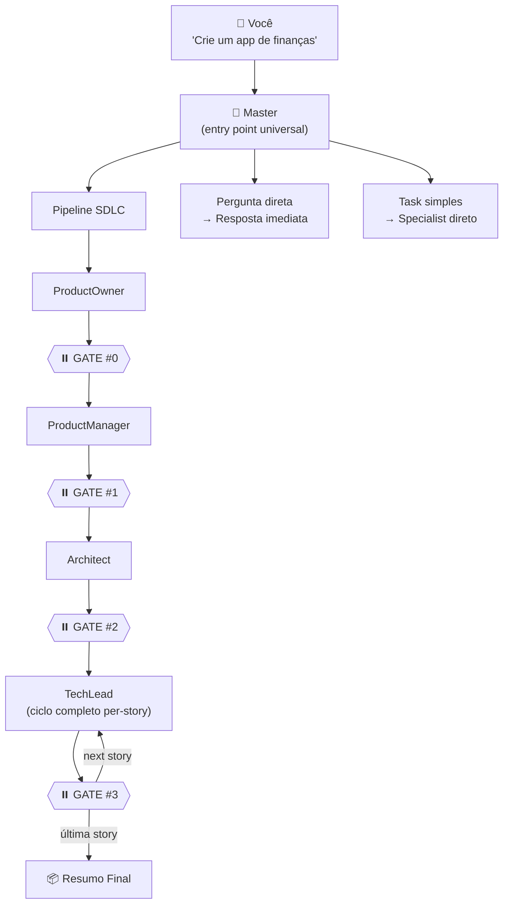
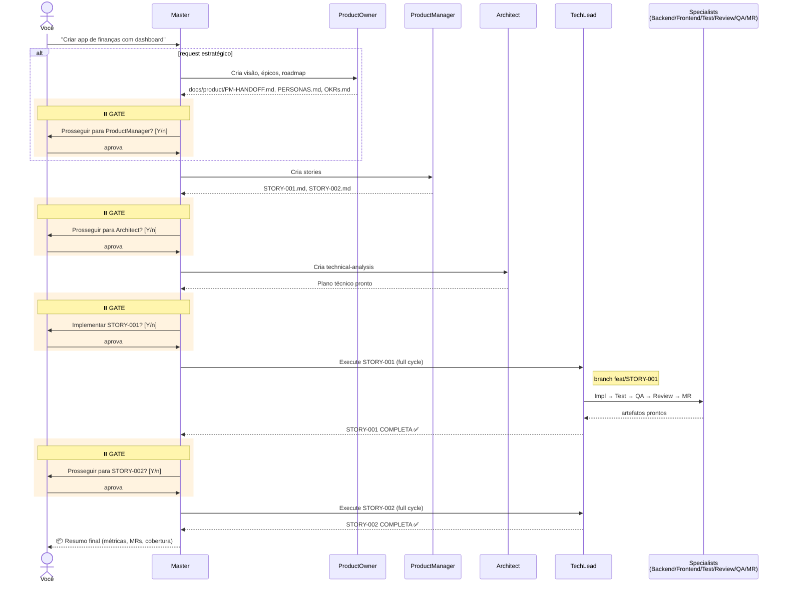
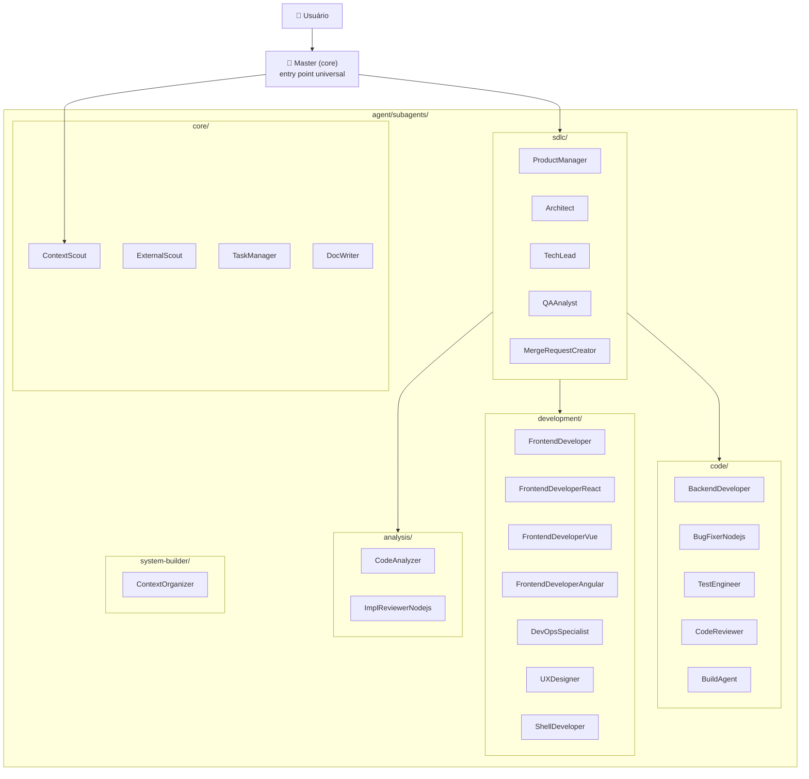
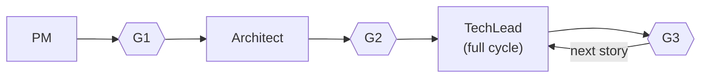
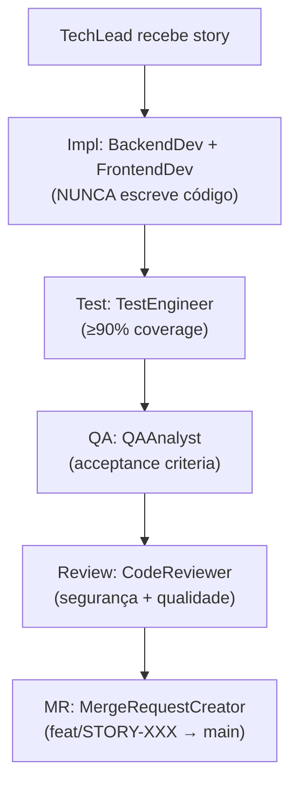

<a name="indice"></a>

# 📘 New OpenCode Workflow — Guia Completo

> **Sistema de agentes IA para SDLC com 4 Approval Gates, instalação local por projeto.**
>
> Master orquestra ProductOwner → ProductManager → Architect → TechLead, que coordena especialistas
> (BackendDev, FrontendDev, TestEngineer, CodeReviewer, QAAnalyst, MR Creator).
> Contexto carregado on-demand via ContextScout (5 buckets) + ExternalScout (Context7).

---

## 📑 Índice

| # | Seção | Descrição |
|---|-------|-----------|
| 1 | [🔭 Visão Geral](#visao-geral) | O que é, por que existe, para quem |
| 2 | [⚡ Início Rápido](#inicio-rapido) | Instalar e rodar em 30 segundos |
| 3 | [📦 Instalação](#instalacao) | Pré-requisitos, install.sh, verificação |
| 4 | [🚀 Uso](#uso) | Linguagem natural, comandos slash, fluxo SDLC |
| 5 | [🏗️ Arquitetura](#arquitetura) | Estrutura, agentes, comandos, sistema de contexto |
| 6 | [📜 Regras Fundamentais](#regras) | Context First, ExternalScout, Coverage, Gates, MVI |
| 7 | [🔧 Configuração de Projeto](#config-projeto) | Stack detection, project intelligence |
| 8 | [📚 Referência Rápida](#referencia) | Cheat sheet de agentes, comandos, diagramas |
| 9 | [❓ Troubleshooting](#troubleshooting) | Erros comuns e soluções |
| 10 | [📖 Glossário](#glossario) | Termos do domínio |

---

<a name="visao-geral"></a>

## 🔭 1. Visão Geral

**O que é**: um conjunto de 26 agentes especializados que trabalham em pipeline para entregar features completas (visão/épicos → story → plano técnico → código → testes → QA → review → merge request), com **4 momentos de aprovação humana** entre etapas críticas.

**Por que existe**:

- Reduzir uso de tokens com **descoberta on-demand** de contexto (ContextScout) e busca atualizada de docs externas (ExternalScout via Context7).
- Garantir **qualidade obrigatória**: cobertura de testes ≥90%, code review automatizado, validação contra critérios de aceitação.
- Manter o humano no controle com **gates explícitos** entre PM, Architect, TechLead e próxima story.

**Para quem**: desenvolvedores e times que usam o **OpenCode CLI** e querem padronizar o ciclo SDLC com agentes IA.



[⬆️ Voltar ao Índice](#indice)

---

<a name="inicio-rapido"></a>

## ⚡ 2. Início Rápido

```bash
# 1. Clonar e instalar (modo local, dentro do projeto)
git clone <repo-url> new-opencode-workflow
cd /caminho/para/seu-projeto
bash /caminho/para/new-opencode-workflow/install.sh

# 2. Iniciar o agente Master
opencode --agent Master

# 3. Falar em linguagem natural
> "Crie uma feature de login com email e senha, validação Zod e testes."
# → Master detecta intenção, dispara pipeline SDLC com 4 gates
```

> **Nota**: instalação só na modalidade **local** (`<projeto>/.opencode/`). Modos global e híbrido foram removidos para simplicidade.

[⬆️ Voltar ao Índice](#indice)

---

<a name="instalacao"></a>

## 📦 3. Instalação

### 3.1 Pré-requisitos

| Ferramenta | Versão | Como verificar |
|------------|--------|----------------|
| **OpenCode CLI** | qualquer | `opencode --version` |
| **Bun** (runtime JS) | ≥ 1.0 | `bun --version` |
| **Git** (recomendado) | qualquer | `git --version` |

Instalar Bun caso ausente:

```bash
curl -fsSL https://bun.sh/install | bash
```

### 3.2 Modalidade: apenas LOCAL

A instalação cria a pasta `.opencode/` dentro do **projeto destino** e é versionada junto com o código:

| Caminho | Conteúdo | Versionar? |
|---------|----------|------------|
| `<projeto>/.opencode/` | agentes, comandos, contexto, skills, plugins | ✅ commit |
| `<projeto>/.opencode/node_modules/` | dependências Bun | ❌ `.gitignore` |

### 3.3 Instalação automatizada

Use `install.sh` no diretório do workflow apontando para o projeto destino:

```bash
# Modo interativo (pergunta destino)
cd /caminho/para/new-opencode-workflow
bash install.sh

# Especificando destino diretamente
bash install.sh --dest /caminho/para/seu-projeto
```

O script faz:

1. Verifica `opencode`, `bun`, `git`
2. Confirma destino (ou pergunta interativamente)
3. Detecta instalação anterior e pede confirmação para sobrescrever
4. Copia: `agent/`, `command/`, `config/`, `context/`, `plugins/`, `skills/`, `tool/`, `package.json`, `opencode.json`, `instructions.md`
5. Roda `bun install` no destino
6. Atualiza `.gitignore` com `.opencode/node_modules/`
7. Verifica integridade da instalação

### 3.4 Atualização e desinstalação

```bash
# Atualizar instalação local existente (preserva context/project/)
bash update.sh --dest /caminho/para/seu-projeto

# Desinstalar
bash uninstall.sh --dest /caminho/para/seu-projeto
```

### 3.5 Instalador auto-contido (distribuição)

Para distribuir um único arquivo executável:

```bash
bash build-installer.sh
# Gera: opencode-workflow-installer.sh (com tarball embutido em base64)

# No destino:
bash opencode-workflow-installer.sh --dest /projeto
```

### 3.6 Verificação manual

```bash
cd <projeto>/.opencode

ls                          # agent/ command/ config/ context/ plugins/ skills/ tool/
find agent -name "*.md" | wc -l        # esperado: 25
find command -name "*.md" | wc -l      # esperado: 17
find context -name "*.md" | wc -l      # esperado: 35 (≈ 33 indexáveis em INDEX.md + INDEX + README)
ls context/INDEX.md context/README.md  # ambos devem existir
```

### 3.7 Diagrama do fluxo de instalação

```mermaid
sequenceDiagram
    actor User as Usuário
    participant Sh as install.sh
    participant Src as new-opencode-workflow/
    participant Dst as &lt;projeto&gt;/.opencode

    User->>Sh: bash install.sh --dest /projeto
    Sh->>Sh: calculateMetrics()
    Sh->>Sh: checkPrerequisites (opencode, bun, git)
    Sh->>User: Confirmar destino?
    User->>Sh: y
    Sh->>Dst: confirmOverwrite()
    alt já existe
        Sh->>Dst: removeExistingInstallation()
    end
    Sh->>Src: copyWorkflowFiles → Dst
    Sh->>Dst: bun install
    Sh->>Dst: updateGitignore (.opencode/node_modules/)
    Sh->>Dst: verifyInstallation
    Sh-->>User: ✓ Concluído. opencode --agent Master
```

[⬆️ Voltar ao Índice](#indice)

---

<a name="uso"></a>

## 🚀 4. Uso

### 4.1 Linguagem natural vs comandos slash

Você **não precisa** de slash commands na maioria dos casos. O Master detecta a intenção:

| O que você diz | O que o Master faz |
|----------------|---------------------|
| "Crie um site de investimento com dashboard" | **SDLC automático**: PO(épicos) → PM(stories) → ⏸️#1 → Arch → ⏸️#2 → TechLead(full cycle) → ⏸️#3 → next story |
| "Implemente um sistema de pagamentos" | **SDLC automático**: pipeline completo |
| "Fix this bug in `auth.ts`" | **Task direto**: correção simples (sem SDLC) |
| "Add a button to the header" | **Task direto**: modificação simples |
| "What does this code do?" | **Conversacional**: apenas responde |

Use comandos slash quando quiser **controle granular**:

| Comando | Quando usar |
|---------|-------------|
| `/epic` | Criar/análise de épicos, visão, roadmap estratégico (ProductOwner) |
| `/story` | Apenas criar a user story (sem implementar) |
| `/plan` | Apenas plano técnico, revisar antes |
| `/implement` | Já tem story+plano, executar |
| `/review` | Code review em mudanças existentes |
| `/qa` | Validação QA em trabalho completado |
| `/mr` | Criar merge request para trabalho finalizado |

### 4.2 Pipeline SDLC com 4 Approval Gates

> **GATE #0 (opcional)**: Para requests estratégicos (visão, épicos, roadmap, personas, OKRs), ProductOwner cria artefatos antes do ProductManager. Para tasks simples, salta direto para PM.



> **Importante**: dentro do TechLead, **não há gates** — ele orquestra impl→test→QA→review→MR sem interrupção. Os gates são apenas entre PM/Arch/TL/próxima-story.

### 4.3 Modos de Execução do Pipeline

O Master opera em 3 modos. O modo é detectado no **primeiro prompt** e persistido em `.opencode/.exec-mode` para as turns seguintes.

| Modo | Pausa onde? | Quando usar |
|------|-------------|-------------|
| **Manual** (default) | Em **todo gate** | Revisão completa de cada etapa |
| **Parcial** (auto-gate) | Só **entre stories** | Confia no pipeline, quer aprovar só a próxima story |
| **Batch** (batch-auto) | **Nunca** — só para em falha | Lista de stories pronta, quer execução autônoma |

#### Como ativar cada modo

**Manual** — não precisa fazer nada, é o padrão:
```bash
opencode --agent Master
> "implemente a STORY-021"
```

**Parcial** — inclua uma trigger no primeiro prompt:
```bash
opencode --agent Master
> "auto gates — implemente STORY-021"
# Triggers: "auto gates", "pular gates", "pular confirmação",
#           "aprovar automático", "auto-approve", "modo automático",
#           "sem parar", "direto"
```

**Batch** — inclua uma trigger + lista de stories:
```bash
opencode --agent Master
> "modo batch — STORY-021, STORY-022, STORY-023"
# Triggers: "modo batch", "batch auto", "execute todas",
#           "rodar todas as stories", "implementar backlog completo",
#           "full auto"
# OU: liste 2+ story IDs direto no prompt
```

Sem lista explícita, o Batch detecta stories automaticamente:
```bash
> "modo batch"
# Master lista docs/stories/STORY-*.md, filtra as já mergeadas, e monta a fila
```

#### Voltar ao modo manual

A qualquer momento:
```
> "voltar ao manual"
> "stop auto"
> "manual mode"
```

#### Comportamento dos Gates por modo

| Gate | Após | Manual | Parcial | Batch |
|------|------|--------|---------|-------|
| GATE-PM | ProductManager | pergunta | auto | auto |
| GATE-SA | SystemArchitect | pergunta | auto | auto |
| GATE-AR | Architect | pergunta | auto | auto |
| GATE-MR | TechLead (MR criado) | pergunta | auto + merge | auto + merge |
| GATE-NEXT | Merge completo | pergunta | **pergunta** | **auto** |

> **GATE-SA** só existe em projetos greenfield. Projetos existentes pulam SystemArchitect.

#### Batch: o que acontece

1. Master cria `.opencode/.batch-queue.json` com a lista de stories.
2. Executa o pipeline completo para cada story sem parar.
3. Output por gate: 1 linha (`[STORY-XXX] GATE-MR ✅ auto-merged #PR_NUMBER`).
4. Se uma story falha → para, reporta, NÃO continua.
5. Ao final: tabela `| STORY | Status | MR | Notes |`.

#### Batch: stop conditions (não desativáveis)

- Agente retorna `BLOCKED`, erro ou recusa tarefa.
- `gh pr merge` falha (conflict, CI red).
- 2-strike rule do TechLead (mesmo erro 2× = story BLOCKED).

#### Execução direta de agentes (avançado)

```bash
# Slash commands dentro do Master
> /story criar app de finanças
> /plan docs/stories/STORY-001.md
> /implement docs/stories/STORY-001.md
> /review
> /qa docs/stories/STORY-001.md
> /mr main

# Agente específico direto (avançado)
opencode --agent ProductManager
> "Criar story para autenticação"

opencode --agent TechLead
> "Implementar STORY-001"
```

[⬆️ Voltar ao Índice](#indice)

---

<a name="arquitetura"></a>

## 🏗️ 5. Arquitetura

### 5.1 Visão sistêmica



### 5.2 Estrutura de diretórios

```
.opencode/
├── agent/
│   ├── core/
│   │   └── master.md                      # 1 agente
│   └── subagents/
│       ├── analysis/                      # 2 agentes
│       ├── code/                          # 5 agentes
│       ├── core/                          # 4 agentes
│       ├── development/                   # 7 agentes
│       ├── sdlc/                          # 5 agentes
│       └── system-builder/                # 1 agente
│
├── command/
│   ├── add-context.md  caveman*.md  clean.md  commit.md  context.md  test.md
│   └── sdlc/
│       ├── story.md  plan.md  implement.md
│       ├── review.md  qa.md  mr.md  bugfix.md  analyze.md
│
├── config/
│   └── agent-metadata.json                # Registry com tags, deps, categoria
│
├── context/
│   ├── INDEX.md                           # Índice semântico flat (33 entradas)
│   ├── README.md                          # Visão humana do sistema de contexto
│   ├── standards/                         # Padrões: clean code, security, API, etc
│   ├── workflows/                         # Processos: review, delegation, breakdown
│   ├── stacks/                            # Tech: React, Node, Mastra-AI, design system
│   ├── meta/                              # Como o sistema de contexto funciona
│   └── project/                           # Específico do projeto: living-notes, decisions
│
├── plugins/                               # 4 plugins TypeScript
├── skills/                                # 8 skills (task-management, context7, caveman, etc)
├── tool/env/                              # Loader de variáveis de ambiente
├── package.json   opencode.json   instructions.md
└── node_modules/                          # gitignored
```

### 5.3 Catálogo de agentes (25)

#### Core (1)
| Agente | Função |
|--------|--------|
| **Master** | Recebe pedidos, classifica (query / task / epic / story), orquestra SDLC com 4 gates |

#### SDLC (6)
| Agente | Output |
|--------|--------|
| **ProductOwner** | `docs/product/PM-HANDOFF.md`, `PERSONAS.md`, `OKRs.md`, `docs/epics/EPIC-XXX.md` |
| **ProductManager** | `docs/stories/STORY-XXX.md` |
| **Architect** | `docs/stories/STORY-XXX-technical-analysis.md` |
| **TechLead** | Coordena impl→test→QA→review→MR (NUNCA escreve código) |
| **QAAnalyst** | QA Report (APPROVE/REJECT contra acceptance criteria) |
| **MergeRequestCreator** | PR no GitHub/GitLab com sumário, métricas, checklist |

#### Code — Implementação (5)
| Agente | Função |
|--------|--------|
| **BackendDeveloper** | APIs, lógica de negócio, banco (Node.js/TS) |
| **TestEngineer** | Testes unitários e integração (Jest/Vitest) — meta ≥90% coverage |
| **CodeReviewer** | Review de segurança, performance, padrões |
| **BugFixerNodejs** | Diagnóstico e correção de bugs Node.js |
| **BuildAgent** | Build, CI/CD, dependências |

#### Development — Frontend e adjacentes (7)
| Agente | Função |
|--------|--------|
| **FrontendDeveloperReact** | React/Next.js |
| **FrontendDeveloperVue** | Vue/Nuxt |
| **FrontendDeveloperAngular** | Angular |
| **FrontendDeveloper** | Genérico (HTML/CSS/JS vanilla) |
| **DevOpsSpecialist** | Infra, Docker, CI/CD |
| **UXDesigner** | Design system, componentes UI |
| **ShellDeveloper** | Scripts Bash/Shell |

#### Core (subagents) — Infraestrutura (4)
| Agente | Função |
|--------|--------|
| **ContextScout** | Descobre context files relevantes (read-only, sem aprovação) |
| **ExternalScout** | Busca docs atualizadas de libs via Context7 (read-only) |
| **TaskManager** | Cria/gerencia tasks JSON em `.tmp/tasks/{slug}/` |
| **DocWriter** | Gera documentação técnica em PT-BR (este guia foi feito por ele) |

#### Analysis (2)
| Agente | Função |
|--------|--------|
| **CodeAnalyzer** | Análise estática e arquitetural de codebases |
| **ImplReviewerNodejs** | Review de implementação Node.js (correção, completude) |

#### System Builder (1)
| Agente | Função |
|--------|--------|
| **ContextOrganizer** | Mantém `context/` (INDEX, structure, MVI ≤200L) |

### 5.4 Catálogo de comandos slash (17)

#### Pipeline SDLC (`command/sdlc/` — 9)
| Comando | Agente invocado | Descrição |
|---------|------------------|-----------|
| `/epic <desc>` | ProductOwner | Cria visão, épicos, roadmap estratégico |
| `/story <desc>` | ProductManager | Cria user story |
| `/plan <story>` | Architect | Cria plano técnico |
| `/implement <story>` | TechLead | Executa ciclo completo |
| `/review [files]` | CodeReviewer | Code review |
| `/qa <story>` | QAAnalyst | Validação QA |
| `/mr [base]` | MergeRequestCreator | Cria merge request |
| `/bugfix <desc>` | BugFixer* | Diagnostica e corrige bug |
| `/analyze [scope]` | CodeAnalyzer | Análise de codebase |

#### Utilitários (9)
| Comando | Função |
|---------|--------|
| `/commit` | Gera commit formatado |
| `/test` | Roda pipeline de testes |
| `/context` | Gerencia sistema de contexto |
| `/add-context` | Adiciona contexto do projeto interativamente |
| `/clean` | Limpa código (formata, organiza imports) |
| `/caveman` | Modo "caveman" (compressão extrema) |
| `/caveman-commit` | Commit compactado em modo caveman |
| `/caveman-compress` | Compressão de arquivo |
| `/caveman-review` | Review em modo caveman |

### 5.5 Sistema de contexto

O contexto é o "cérebro" dos agentes. Carregado **on-demand** pelo ContextScout para minimizar tokens.

#### Os 5 buckets (estrutura flat, max depth 2)

| Bucket | Pergunta que responde | Quando ler |
|--------|------------------------|------------|
| `standards/` | Como escrevo código bem? | Implementação e review |
| `workflows/` | Qual o processo para X? | Delegação, review, libs externas |
| `stacks/` | Como essa tech funciona? | Implementação tech-específica |
| `meta/` | Como o sistema de contexto funciona? | Manutenção do contexto |
| `project/` | O que é específico deste projeto? | Onboarding, decisões, estado atual |

#### `INDEX.md` — entrada única de navegação

Arquivo flat (≤200 linhas) com 33 entradas no formato:

```
- bucket/arquivo.md | tags: tag1, tag2 | summary: descrição em 1 linha
```

ContextScout lê apenas o `INDEX.md`, filtra pelas tags relevantes, e retorna paths para o agente carregar.

#### ContextScout vs ExternalScout

| Agente | Fonte | Velocidade | Uso |
|--------|-------|------------|-----|
| **ContextScout** | `context/` interno | Rápido (local) | Padrões e convenções do projeto |
| **ExternalScout** | Context7 API + webfetch | Lento (rede) | Docs atualizadas de libs externas |

Use **ambos** na maioria das features:

```javascript
task(subagent_type="ContextScout",  ...)   // padrões do projeto
task(subagent_type="ExternalScout", ...)   // docs da lib (ex: Drizzle, Next.js 15)
// implementar com ambos os contextos
```

[⬆️ Voltar ao Índice](#indice)

---

<a name="regras"></a>

## 📜 6. Regras Fundamentais

### 6.1 Context First (sempre)

Todo agente que produz código DEVE chamar **ContextScout** antes de qualquer write/edit. Sem isso, o agente não conhece padrões e convenções do projeto.

### 6.2 ExternalScout para libs

Sempre que houver lib externa (em `package.json`, novo `import`, erro de build, primeira instalação, upgrade de versão), chame ExternalScout. **Nunca confie em training data** — pode estar desatualizado.

### 6.3 Cobertura de testes ≥ 90%

Toda implementação obrigatoriamente passa pelo TestEngineer. Coverage mínima: **90%**. Abaixo disso → 🔴 crítico no review.

### 6.4 Approval Gates (Human-Guided AI)

O pipeline tem 5 gates. O comportamento de cada um depende do **modo de execução** (ver seção 4.3).

| Gate | Após agente | O que o usuário vê | Manual | Parcial | Batch |
|------|-------------|---------------------|--------|---------|-------|
| GATE-PM | ProductManager | Lista de stories (IDs + títulos) | pergunta | auto | auto |
| GATE-SA | SystemArchitect | Proposta de stack | pergunta | auto | auto |
| GATE-AR | Architect | Plano técnico resumido | pergunta | auto | auto |
| GATE-MR | TechLead (MR criado) | Link do MR + cobertura de testes | pergunta | auto + merge | auto + merge |
| GATE-NEXT | Merge completo | Branch deletada, story fechada | pergunta | **pergunta** | **auto** |

> **GATE-SA** só existe em projetos greenfield. Projetos existentes pulam SystemArchitect e GATE-SA.

**Aprovação por operação** (independente do modo):

| Operação | Aprovação? |
|----------|-----------|
| `write` (criar arquivo) | ✅ SIM |
| `edit` (modificar) | ✅ SIM |
| `bash` (executar comando) | ✅ SIM |
| `task` (delegar para subagent) | ✅ SIM |
| `read`, `grep`, `glob`, `ls` | ❌ NÃO |

**Exceções (não pedem aprovação)**: ContextScout, CodeReviewer (read-only), BuildAgent (limitado a build/type-check), QAAnalyst (limitado a testes).

### 6.5 MVI — Token Efficiency

**MVI = Minimal Viable Information**:

- Carregar **apenas o contexto relevante** (descoberto por ContextScout)
- Cada arquivo de contexto: **≤200 linhas**, scannable em <30s
- Resultado: ~750 tokens por contexto vs 8.000+ na abordagem tradicional (**redução ~80%**)

| Tipo de arquivo | Limite |
|-----------------|--------|
| Concept | 100 linhas |
| Example | 80 linhas |
| Guide | 150 linhas |
| Lookup | 100 linhas |
| Geral (workflow, standard) | 200 linhas |

### 6.6 TechLead delega — NUNCA implementa

TechLead recebe a story e o plano técnico, cria o branch `feat/STORY-XXX`, e delega cada etapa:

```
Implementação → BackendDeveloper / FrontendDeveloperReact (paralelo, máx 2)
Testes        → TestEngineer
QA            → QAAnalyst
Review        → CodeReviewer (variantes Node/Python/C)
MR            → MergeRequestCreator
```

TechLead **nunca escreve código diretamente**. Coordena.

### 6.7 Per-story branches

Cada story = um branch dedicado: `feat/STORY-XXX → main`. Stories independentes podem ser implementadas em paralelo se aprovadas.

[⬆️ Voltar ao Índice](#indice)

---

<a name="config-projeto"></a>

## 🔧 7. Configuração de Projeto

### 7.1 Stack detection automática

O TechLead detecta a stack pelos arquivos do projeto e roteia para o agente correto:

| Detecção | Stack | Agente |
|----------|-------|--------|
| `package.json` + `react` (deps) | React | FrontendDeveloperReact |
| `package.json` + `vue`/`nuxt` | Vue | FrontendDeveloperVue |
| `angular.json` + `@angular/core` | Angular | FrontendDeveloperAngular |
| `package.json` + `express`/`fastify` | Node.js | BackendDeveloper |
| `manage.py` + `django` em deps | Django | BackendDeveloperPython |
| `main.py` + `fastapi` em deps | FastAPI | BackendDeveloperPython |
| `CMakeLists.txt` | C | BackendDeveloperC |

### 7.2 Project Intelligence

Conhecimento que vive **com o projeto** em `.opencode/context/project/`:

| Arquivo | Conteúdo |
|---------|----------|
| `living-notes.md` | Padrões descobertos, gotchas, dicas |
| `decisions-log.md` | Decisões arquiteturais (ADR-style) |
| `business-domain.md` | Conceitos de negócio |
| `technical-domain.md` | Conceitos técnicos |
| `business-tech-bridge.md` | Mapeamento negócio ↔ tech |

Configure via:

```bash
opencode --agent Master
> /add-context

# O agente faz perguntas sobre tech stack, padrões de API, naming, segurança, etc.
# E preenche os arquivos automaticamente.
```

Ou edite manualmente `.opencode/context/project/living-notes.md` conforme descobre coisas no projeto.

### 7.3 Customização

- **Editar agentes**: `.opencode/agent/**/*.md` — pode ajustar comportamento, regras, tools.
- **Adicionar contexto**: criar novo arquivo em `context/<bucket>/` e registrar em `context/INDEX.md`.
- **Adicionar comando slash**: criar `command/<nome>.md` com frontmatter `description`.

[⬆️ Voltar ao Índice](#indice)

---

<a name="referencia"></a>

## 📚 8. Referência Rápida (Cheat Sheet)

### 8.1 Comandos slash

```bash
/epic <desc>       # Cria épicos e visão estratégica (ProductOwner)
/story <desc>      # Cria story (ProductManager)
/plan <story>      # Cria plano técnico (Architect)
/implement <story> # Executa ciclo completo (TechLead)
/review [files]      # Code review (CodeReviewer*)
/qa <story>          # Validação QA (QAAnalyst)
/mr [base]           # Cria MR (MergeRequestCreator)
/bugfix <desc>       # Diagnostica + corrige (BugFixer*)
/analyze [scope]     # Análise de codebase (CodeAnalyzer*)
/commit              # Commit formatado
/test                # Roda testes
/context             # Gerencia contexto
/add-context         # Configura contexto do projeto
```

### 8.2 Agentes por função

| Função | Agente |
|--------|--------|
| Recepção universal | **Master** |
| Story | **ProductManager** |
| Arquitetura | **Architect** |
| Coordenação per-story | **TechLead** |
| Backend Node | **BackendDeveloper** |
| Frontend React | **FrontendDeveloperReact** |
| Frontend Vue | **FrontendDeveloperVue** |
| Frontend Angular | **FrontendDeveloperAngular** |
| Testes | **TestEngineer** |
| Code Review | **CodeReviewer** |
| QA | **QAAnalyst** |
| MR/PR | **MergeRequestCreator** |
| Contexto | **ContextScout** |
| Libs externas | **ExternalScout** |
| Tasks JSON | **TaskManager** |
| Documentação | **DocWriter** |
| Bug fix Node | **BugFixerNodejs** |
| Build/CI | **BuildAgent** |

### 8.3 Diagrama compacto SDLC





[⬆️ Voltar ao Índice](#indice)

---

<a name="troubleshooting"></a>

## ❓ 9. Troubleshooting

### "Agent not found"

```bash
# Verificar instalação
ls .opencode/agent/core/master.md
cat .opencode/config/agent-metadata.json | grep '"name"' | head -10
```

Se faltarem arquivos: `bash update.sh --dest <projeto>`.

### "Context not loading"

```bash
# Verificar INDEX.md (substituiu o antigo navigation.md)
cat .opencode/context/INDEX.md | head -20
ls .opencode/agent/subagents/core/contextscout.md
```

Se INDEX.md estiver vazio ou ausente, restaure com `update.sh`.

### "Commands not working"

```bash
# Verificar comandos
ls .opencode/command/sdlc/

# Verificar frontmatter (precisa ter description)
head -5 .opencode/command/sdlc/story.md
```

### "Bun install fails"

```bash
bun --version  # ≥ 1.0.0
rm -rf .opencode/node_modules
(cd .opencode && bun install)
```

### "ExternalScout retorna docs antigas"

Cache do Context7 é de 7 dias por padrão. Force refresh:

```bash
rm -rf .tmp/external-context/<package-name>/
# rodar de novo, ExternalScout vai re-fetchar
```

### "Story trava no Gate"

Os 4 gates exigem aprovação humana explícita. Se estiver travado:

- Gate #0: revise `docs/epics/EPIC-XXX.md` (apenas para requests estratégicos)
- Gate #1: revise `docs/stories/STORY-XXX.md` e responda `y` ou peça ajustes
- Gate #2: revise `docs/stories/STORY-XXX-technical-analysis.md`
- Gate #3: revise o MR criado e approve para próxima story

### "TechLead começou a escrever código"

Bug. TechLead **nunca** deve escrever código — apenas delegar. Reporte e force restart com `/implement` apontando especialista correto.

[⬆️ Voltar ao Índice](#indice)

---

<a name="glossario"></a>

## 📖 10. Glossário

| Termo | Definição |
|-------|-----------|
| **ProductOwner** | Agente estratégico que opera no nível de visão, épicos, roadmap, personas e OKRs. Gera artefatos em `docs/product/` e `docs/epics/` antes do ProductManager |
| **Approval Gate** | Ponto de pausa onde o usuário aprova explicitamente antes do próximo agente |
| **ContextScout** | Subagente read-only que descobre arquivos de contexto relevantes via INDEX.md |
| **ExternalScout** | Subagente que busca docs atualizadas de libs via Context7 API |
| **Context7** | API externa com documentação atualizada de 50+ libs populares |
| **MVI** | Minimal Viable Information — princípio de carregar só o necessário (≤200L/file) |
| **SDLC** | Software Development Life Cycle (story → plan → impl → test → QA → review → MR) |
| **Story** | Documento estruturado com user story, acceptance criteria, definition of done |
| **Technical Analysis** | Plano técnico criado pelo Architect a partir de uma story |
| **Full cycle (TechLead)** | Sequência impl→test→QA→review→MR sem gates intermediários |
| **Per-story branch** | Convenção `feat/STORY-XXX → main`, um branch por story |
| **Task JSON** | Schema em `.tmp/tasks/{slug}/` com `task.json` + `subtask_NN.json` |
| **Session** | Diretório `.tmp/sessions/{YYYY-MM-DD}-{slug}/` com `context.md` da execução atual |
| **Bucket** | Categoria de contexto (`standards`, `workflows`, `stacks`, `meta`, `project`) |
| **INDEX.md** | Índice flat semântico do contexto (entrada única de navegação) |
| **Master** | Agente core que recebe pedidos do usuário e roteia/orquestra |
| **TechLead** | Coordenador per-story — delega impl/test/QA/review/MR, nunca escreve código |
| **Specialist** | Agente que efetivamente escreve código (BackendDev, FrontendDev*, etc) |

[⬆️ Voltar ao Índice](#indice)

---

> **Versão**: 1.0 | **Atualizado**: 2026-05-02
> Este guia substitui `HOW_IT_WORKS.md`, `QUICK_REFERENCE.md` e `INSTALLATION.md`.
