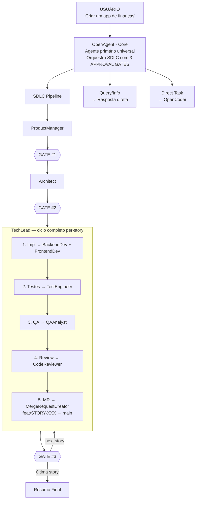
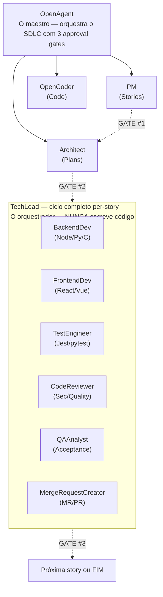
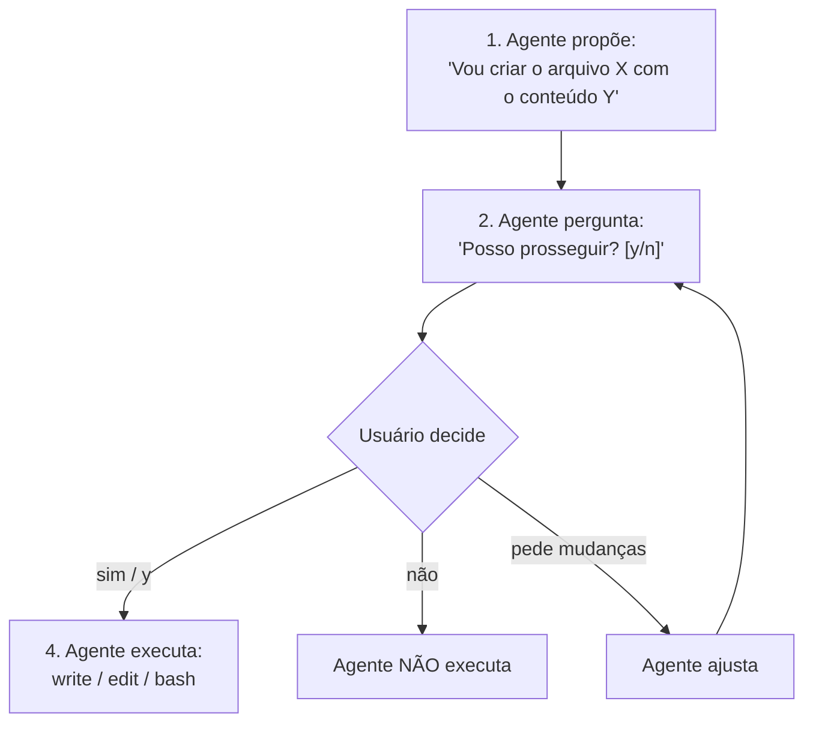

# Como Funciona o New OpenCode Workflow

Este documento explica a arquitetura completa, como os componentes se conectam, e como o fluxo de trabalho acontece desde o pedido do usuário até a entrega final.

---

## Visão Geral da Arquitetura



---

## Comandos vs Linguagem Natural

**Você NÃO precisa usar `/story`, `/plan`, `/implement`!** O OpenAgent detecta automaticamente a intenção:

### Detecção Automática

| O que você diz | O que o OpenAgent faz |
|----------------|----------------------|
| "Crie um site de investimento com dashboard" | **SDLC automático**: PM → ⏸️ → Arch → ⏸️ → TechLead(full cycle) → ⏸️ → next story |
| "Build a user authentication system" | **SDLC automático**: Pipeline completo |
| "Implemente um sistema de pagamentos" | **SDLC automático**: Pipeline completo |
| "Fix this bug in auth.ts" | **Task direto**: Correção simples (sem SDLC) |
| "Add a button to the header" | **Task direto**: Modificação simples |
| "What does this code do?" | **Conversacional**: Apenas responde |

### Quando usar comandos explicitamente

| Comando | Quando usar |
|---------|-------------|
| `/story` | Quer APENAS o documento da story, sem implementar |
| `/plan` | Quer APENAS o plano técnico, revisar antes de implementar |
| `/implement` | Já tem story/plano e quer executar |
| `/review` | Quer code review em mudanças existentes |
| `/qa` | Quer validação QA em trabalho completado |
| `/mr` | Quer criar MR para trabalho finalizado |

### Exemplo: Site de Investimento

```
# Opção 1: Linguagem natural (automático)
Você: "Crie um site de investimento com:
       - Dashboard de portfólio
       - Gráficos de performance
       - Exportação para CSV
       - Autenticação de usuários"

OpenAgent: [Detecta feature request complexa]
           → ProductManager cria STORY-001.md
           → ⏸️ GATE #1: "Prosseguir para Architect?"
           → Architect cria plano técnico
           → ⏸️ GATE #2: "Implementar STORY-001?"
           → TechLead orquestra ciclo COMPLETO:
             ├─ Devs implementam (Backend + Frontend)
             ├─ TestEngineer cria testes
             ├─ QAAnalyst valida
             ├─ CodeReviewer revisa
             └─ MergeRequestCreator cria MR
           → ⏸️ GATE #3: "Story completa. Próxima?"
           → Você aprova em 3 momentos!

# Opção 2: Comandos explícitos (controle passo a passo)
Você: "/story criar site de investimento"
OpenAgent: ProductManager cria STORY-001.md
Você: [Revisa story] → aprova GATE #1
Você: "/plan STORY-001"
OpenAgent: Architect cria technical-analysis.md
Você: [Revisa plano] → aprova GATE #2
Você: "/implement STORY-001"
OpenAgent: TechLead executa ciclo completo (impl→test→QA→review→MR)
Você: [Revisa resultado] → aprova GATE #3
```

**Recomendação**: Use linguagem natural para features completas — o OpenAgent pede aprovação em 3 momentos-chave. Use comandos quando quiser granularidade extra.

---

## Estrutura de Diretórios

### `/agent/` - Definições de Agentes

**O que é:** Contém todos os agentes IA do sistema. Cada ficheiro `.md` define um agente com seu comportamento, regras, e capacidades.

**Estrutura:**
```
agent/
├── core/                    # Agentes primários (entry points)
│   ├── openagent.md         # Agente universal - recebe todos os pedidos
│   └── opencoder.md         # Agente de desenvolvimento - coordena implementação
│
└── subagents/               # Agentes especializados (invocados pelos core)
    ├── analysis/            # Análise de código
    ├── code/                # Implementação, testes, review
    ├── core/                # Contexto, documentação, tarefas
    ├── development/         # Frontend, shell, UX
    ├── sdlc/                # Pipeline SDLC completo
    └── system-builder/      # Organização de contexto
```

**Como se conecta:**
- Os agentes `core/` são o entry point - o usuário interage com eles
- Os `subagents/` são invocados via `task(subagent_type="NomeDoAgente", ...)`
- Cada agente pode delegar para outros agentes usando a ferramenta `task`

---

### `/command/` - Comandos Slash

**O que é:** Atalhos para invocar fluxos específicos. O usuário digita `/story`, `/plan`, etc.

**Estrutura:**
```
command/
├── commit.md                # /commit - criar commits formatados
├── test.md                  # /test - rodar pipeline de testes
├── context.md               # /context - gerir sistema de contexto
├── clean.md                 # /clean - limpar código
│
└── sdlc/                    # Comandos do pipeline SDLC
    ├── story.md             # /story - criar user story
    ├── plan.md              # /plan - análise técnica
    ├── implement.md         # /implement - executar implementação
    ├── review.md            # /review - code review
    ├── qa.md                # /qa - validação QA
    ├── mr.md                # /mr - criar merge request
    ├── bugfix.md            # /bugfix - diagnosticar e corrigir bug
    └── analyze.md           # /analyze - analisar codebase
```

**Como se conecta:**
- Quando o usuário digita `/story criar app de finanças`, o OpenCode carrega `command/sdlc/story.md`
- O comando invoca o agente apropriado via `task(subagent_type="ProductManager", ...)`
- Comandos são atalhos - o mesmo resultado pode ser obtido pedindo diretamente ao OpenAgent

---

### `/config/` - Registro de Metadados

**O que é:** Registro centralizado de todos os agentes com seus metadados.

**Conteúdo:**
```
config/
└── agent-metadata.json      # Registry de 41 agentes
```

**Campos do metadata:**
```json
{
  "id": "backend-developer",
  "name": "BackendDeveloper",           // Nome exato do frontmatter
  "category": "subagents/code",         // Categoria para organização
  "type": "subagent",                   // agent ou subagent
  "version": "1.0.0",
  "author": "opencode",
  "tags": ["backend", "nodejs", ...],   // Tags para busca
  "dependencies": [                     // Dependências do agente
    "subagent:contextscout",
    "subagent:externalscout",
    "subagent:test-engineer"
  ]
}
```

**Como se conecta:**
- Usado pelo sistema OpenCode para descoberta e instalação de agentes
- Define dependências - quais outros agentes/skills um agente precisa
- Não é usado em runtime - é metadata para gestão do sistema

---

### `/context/` - Base de Conhecimento

**O que é:** Arquivos de conhecimento que os agentes carregam para entender padrões, convenções, e workflows do projeto.

**Estrutura:**
```
context/
├── navigation.md            # Índice principal
│
├── core/                    # Conhecimento central
│   ├── standards/           # Padrões de código, documentação, testes
│   ├── workflows/           # Workflows de delegação, review, design
│   ├── context-system/      # Como o sistema de contexto funciona
│   └── task-management/     # Schema de tarefas
│
├── development/             # Guias de desenvolvimento
│   ├── frontend/            # React, Vue, Angular, styling
│   ├── backend/             # APIs, databases
│   ├── principles/          # Clean code, API design
│   └── ai/                  # Integrações de IA
│
├── project-intelligence/    # Conhecimento específico do projeto
│   ├── living-notes.md      # Notas do projeto
│   ├── decisions-log.md     # Decisões arquiteturais
│   └── ...
│
└── project/                 # Contexto do projeto atual
    └── project-context.md
```

**Como se conecta:**
- O **ContextScout** descobre e recomenda context files relevantes
- Agentes carregam contexto ANTES de executar tarefas
- Contexto é carregado uma vez e compartilhado entre agentes
- Exemplo: `ContextScout` encontra `context/core/standards/code-quality.md` → agente lê → aplica padrões

---

### `/skills/` - Habilidades Executáveis

**O que é:** Scripts e ferramentas que os agentes podem invocar.

**Estrutura:**
```
skills/
├── task-management/          # Gestão de tarefas
│   ├── SKILL.md             # Definição da skill
│   ├── router.sh            # Router de comandos bash
│   └── scripts/task-cli.ts  # CLI TypeScript para tarefas
│
└── context7/                 # Documentação de bibliotecas externas
    ├── SKILL.md             # Definição da skill
    ├── library-registry.md  # Registro de bibliotecas suportadas
    └── ...
```

**Como se conecta:**
- Skills são invocadas via `skill:nome-da-skill`
- `task-management`: Usado pelo TaskManager para criar/gerir tarefas JSON
- `context7`: Usado pelo ExternalScout para buscar documentação de libs externas

---

### `/tool/` - Utilitários

**O que é:** Módulos utilitários reutilizáveis.

**Conteúdo:**
```
tool/
└── env/
    └── index.ts             # Loader de variáveis de ambiente
```

**Como se conecta:**
- Importado por skills e scripts
- Não é invocado diretamente por agentes

---

## O Fluxo Completo: "Criar um App de Finanças"

### Passo 1: Usuário faz o pedido

```
Usuário: "Quero criar um aplicativo de finanças pessoais com:
- Dashboard de gastos
- Categorização automática
- Gráficos mensais
- Exportação para CSV"
```

### Passo 2: OpenAgent recebe e classifica

O **OpenAgent** (`agent/core/openagent.md`) é o agente primário. Ele:

1. **Recebe** o pedido do usuário
2. **Classifica** o tipo de pedido:
   - Query (pergunta) → responde diretamente
   - Task (tarefa) → executa ou delega
   - Story (feature completa) → inicia pipeline SDLC
3. **Decide** que é uma "Story" (feature complexa)
4. **Delega** para o **ProductManager**

```javascript
// OpenAgent decide delegar
task(
  subagent_type="ProductManager",
  description="Create user story for finance app",
  prompt="Create a structured user story for: aplicativo de finanças pessoais..."
)
```

### Passo 3: ProductManager cria a Story

O **ProductManager** (`agent/subagents/sdlc/product-manager.md`):

1. **Chama ContextScout** para carregar padrões de stories
2. **Analisa** o pedido do usuário
3. **Cria** a story estruturada:

```markdown
# STORY-001: Aplicativo de Finanças Pessoais

## User Story
**As a** usuário
**I want** um aplicativo para gerir finanças pessoais
**So that** posso controlar meus gastos e entender para onde vai meu dinheiro

## Acceptance Criteria
- GIVEN que estou no dashboard
  WHEN visualizo meus gastos
  THEN vejo total mensal e breakdown por categoria

- GIVEN que tenho transações
  WHEN o sistema processa
  THEN categoriza automaticamente baseado em descrição

- GIVEN que quero analisar
  WHEN seleciono um período
  THEN vejo gráficos de gastos por categoria

- GIVEN que quero exportar
  WHEN clico em exportar
  THEN recebo arquivo CSV com todas transações

## Definition of Done
- [ ] Todos os critérios de aceitação passam
- [ ] Testes com cobertura >= 90%
- [ ] Code review aprovado
- [ ] QA validado
```

4. **Salva** em `docs/stories/STORY-001.md`
5. **Retorna** o caminho do arquivo

### Passo 4: ⏸️ GATE #1 — ProductManager → Architect

O OpenAgent **PARA** e apresenta ao usuário:
- Stories criadas (lista de arquivos)
- Resumo de cada story
- Pergunta: "Stories criadas. Prosseguir para Architect? [Y/n]"

**O usuário aprova**, e o OpenAgent delega para o **Architect**:

```javascript
task(
  subagent_type="Architect",
  description="Plan architecture for finance app",
  prompt="Analyze and create technical plan for: docs/stories/STORY-001.md"
)
```

### Passo 5: Architect cria o Plano Técnico

O **Architect** (`agent/subagents/sdlc/architect.md`):

1. **Chama ContextScout** para padrões de arquitetura
2. **Detecta** a stack do projeto (ou pergunta ao usuário)
3. **Chama CodeAnalyzer** para analisar codebase existente
4. **Cria** o plano técnico:

```markdown
# Technical Analysis: STORY-001

## Stack Detection
- Frontend: React + TypeScript
- Backend: Node.js + Express
- Database: PostgreSQL + Prisma
- Charts: Recharts

## Architecture
- /frontend/src/
  - components/Dashboard/
  - components/Charts/
  - pages/Dashboard.tsx
- /backend/src/
  - routes/transactions.ts
  - services/categorization.ts
  - models/transaction.ts

## Execution Batches

### Batch 1 (Parallel)
- Task 01: Setup database schema (BackendDeveloper)
- Task 02: Create Dashboard layout (FrontendDeveloperReact)
- Task 03: Setup API structure (BackendDeveloper)

### Batch 2 (Sequential, depends on Batch 1)
- Task 04: Implement categorization service (BackendDeveloper)
- Task 05: Create charts components (FrontendDeveloperReact)

### Batch 3 (Sequential, depends on Batch 2)
- Task 06: Integration tests (TestEngineer)
- Task 07: E2E tests (TestEngineer)

### Batch 4
- Task 08: Code review (CodeReviewer)
- Task 09: QA validation (QAAnalyst)
```

5. **Salva** em `docs/stories/STORY-001-technical-analysis.md`

### Passo 6: ⏸️ GATE #2 — Architect → TechLead

O OpenAgent **PARA** e apresenta ao usuário:
- Planos técnicos criados (lista de arquivos)
- Resumo da abordagem técnica
- Ordem de execução (se múltiplas stories)
- Pergunta: "Plano técnico completo. Implementar STORY-001? [Y/n]"

**O usuário aprova**, e o OpenAgent delega para o **TechLead**:

```javascript
task(
  subagent_type="TechLead",
  description="Execute STORY-001 (full cycle)",
  prompt="Read story + technical analysis from docs/stories/.
          Create branch feat/STORY-001.
          Execute the FULL story cycle:
          1. DELEGATE implementation to appropriate developers
          2. Request TestEngineer for tests (>=90% coverage)
          3. Request QAAnalyst to validate acceptance criteria
          4. Request CodeReviewer for security and quality review
          5. Request MergeRequestCreator to create MR
          You coordinate — you NEVER write code directly."
)
```

### Passo 7: TechLead orquestra o ciclo completo

O **TechLead** (`agent/subagents/sdlc/tech-lead.md`) orquestra **todo o ciclo** de uma story internamente, sem gates intermediários:

1. **Lê** a story e o plano técnico
2. **Cria branch** `feat/STORY-001`
3. **Detecta** a linguagem (Node.js/TypeScript)
4. **Delega implementação** (NUNCA escreve código diretamente):

```javascript
// TechLead delega em paralelo (máx 2 concurrent)
task(subagent_type="BackendDeveloper", description="Setup DB schema", prompt="...")
task(subagent_type="FrontendDeveloperReact", description="Dashboard layout", prompt="...")
```

5. **Delega testes** ao TestEngineer (>=90% coverage)
6. **Delega QA** ao QAAnalyst (valida acceptance criteria)
7. **Delega review** ao CodeReviewer (segurança + qualidade)
8. **Delega MR** ao MergeRequestCreator (feat/STORY-001 → main)

### Passo 8: Agentes de implementação trabalham

**BackendDeveloper** (`agent/subagents/code/backend-developer.md`):

1. **Chama ContextScout** → carrega padrões de código Node.js
2. **Chama ExternalScout** → busca docs de Prisma, Express
3. **Implementa** o código
4. **Escreve** testes com Jest
5. **Valida** cobertura >= 90%
6. **Gera** Implementation Report

**FrontendDeveloperReact** (`agent/subagents/development/frontend-developer-react.md`):

1. **Chama ContextScout** → carrega padrões React
2. **Chama ExternalScout** → busca docs de Recharts
3. **Implementa** componentes
4. **Escreve** testes com Vitest
5. **Valida** acessibilidade e responsividade

### Passo 9: Validação de qualidade (orquestrada pelo TechLead)

**TestEngineer** executa testes de integração e E2E.

**CodeReviewer** faz review de segurança e qualidade.

**QAAnalyst** valida contra os critérios de aceitação:

```markdown
# QA Report: STORY-001

## Acceptance Criteria Validation
| Criterion | Status | Notes |
|-----------|--------|-------|
| Dashboard mostra gastos | ✅ PASS | Verificado manualmente |
| Categorização automática | ✅ PASS | Testes passando |
| Gráficos mensais | ✅ PASS | Recharts funcionando |
| Exportação CSV | ✅ PASS | Testado com 1000 transações |

## Definition of Done
- [x] Todos critérios passam
- [x] Cobertura 94%
- [x] Code review aprovado
- [x] Sem vulnerabilidades

## Recommendation: APPROVE
```

### Passo 10: Merge Request (orquestrado pelo TechLead)

**MergeRequestCreator** agrega tudo e cria o MR (branch `feat/STORY-001 → main`):

```markdown
# MR: Implement Finance App (STORY-001)

## Summary
Implementação completa do aplicativo de finanças pessoais.

## Changes
- 15 files added
- 3 files modified

## Test Coverage
- Unit: 94%
- Integration: 12 tests passing
- E2E: 4 flows passing

## Linked Story
Closes #STORY-001

## Checklist for Reviewers
- [ ] Review database schema
- [ ] Test categorization logic
- [ ] Verify chart rendering
- [ ] Check CSV export
```

---

## Diagrama de Delegação



---

## Regras Fundamentais

### 1. Context First (Sempre!)

**Todo agente DEVE chamar ContextScout ANTES de executar.**

```javascript
// Regra absoluta em todos os agentes
<rule id="context_first" scope="all_execution">
  ALWAYS call ContextScout BEFORE writing any code.
  This is not optional — it's how you produce code that fits the project.
</rule>
```

**Por quê?** Sem contexto, o agente não conhece:
- Padrões de código do projeto
- Convenções de nomenclatura
- Estrutura de pastas
- Dependências existentes

### 2. External Scout para Bibliotecas

**Quando usar bibliotecas externas, DEVE chamar ExternalScout.**

```javascript
<rule id="external_scout_mandatory" scope="all_execution">
  When you encounter ANY external package, ALWAYS call ExternalScout
  for current docs BEFORE implementing. Training data is outdated.
</rule>
```

**Por quê?** A documentação de treinamento pode estar desatualizada. ExternalScout busca docs atuais via Context7 API.

### 3. Testes Obrigatórios

**Toda implementação DEVE ter testes com cobertura >= 90%.**

```javascript
<rule id="test_mandatory" scope="implementation">
  Write tests for EVERY code change. Target at least 90% coverage.
  Unit tests + integration tests are mandatory.
</rule>
```

**Por quê?** Sem testes, não há garantia de qualidade. 90% é o mínimo para confiança.

### 4. Approval Gates (Human-Guided AI)

**NUNCA executar sem aprovação do usuário.**

```javascript
<rule id="approval_gate" scope="all_execution">
  Request approval before ANY execution (bash, write, edit).
  Read/list/glob/grep don't require approval.
  Always propose, get approval, then execute.
</rule>
```

**Por quê?** O usuário mantém controle total. O agente propõe, não impõe. Sempre sabe o que vai acontecer antes de acontecer.

**Como funciona:**



**O que precisa de aprovação:**

| Operação | Precisa de Aprovação? | Exemplo |
|----------|----------------------|---------|
| `write` | **SIM** | Criar arquivo |
| `edit` | **SIM** | Modificar código |
| `bash` | **SIM** | Executar comando |
| `task` | **SIM** | Delegar para subagent |
| `read` | NÃO | Ler arquivo |
| `grep` | NÃO | Buscar conteúdo |
| `glob` | NÃO | Listar arquivos |
| `ls` | NÃO | Listar diretório |

**Exceções (não precisam de aprovação):**

| Agente | Por quê |
|--------|---------|
| ContextScout | Read-only, só descobre contexto |
| CodeReviewer | Read-only, só sugere diffs |
| BuildAgent | Bash limitado a build/type-check |
| QAAnalyst | Bash limitado a testes |

### 5. MVI Principle (Token Efficiency)

**Carregar APENAS o contexto relevante.**

```javascript
<rule id="mvi_principle" scope="context_loading">
  Load ONLY relevant context files. ContextScout discovers what's needed.
  MVI = Minimal Viable Information.
  Target: <200 lines per context file, scannable in <30 seconds.
</rule>
```

**Por quê?** Carregar todo o contexto desperdiça tokens. O MVI principle reduz o uso de tokens em **80%**.

**Como funciona:**

| Abordagem Tradicional | Abordagem MVI |
|----------------------|---------------|
| Carrega todo o contexto | ContextScout descobre apenas o relevante |
| 8,000+ tokens | ~750 tokens |
| Respostas lentas | Respostas rápidas |
| Custos altos | Custos baixos |

**Tamanhos de arquivo MVI:**

| Tipo de arquivo | Limite | Por quê |
|-----------------|--------|---------|
| Concepts | 100 linhas | Definição rápida |
| Examples | 80 linhas | Código mínimo |
| Guides | 150 linhas | Instruções essenciais |
| Lookup | 100 linhas | Referência rápida |

---

## Roteamento por Linguagem

O sistema detecta automaticamente a linguagem do projeto e roteia para os agentes corretos:

| Detecção | Linguagem | Agentes Usados |
|----------|-----------|----------------|
| `package.json` + `tsconfig.json` | Node.js/TS | CoderAgent, TestEngineer, CodeReviewer, BackendDeveloper |
| `pyproject.toml` + `requirements.txt` | Python | CoderAgentPython, TestEngineerPython, CodeReviewerPython, BackendDeveloperPython |
| `CMakeLists.txt` + `Makefile` | C | CoderAgentC, TestEngineerC, CodeReviewerC, BackendDeveloperC |
| `package.json` + `react` | React | FrontendDeveloperReact |
| `package.json` + `vue` | Vue | FrontendDeveloperVue |
| `angular.json` | Angular | FrontendDeveloperAngular |

**Exemplo de detecção no TechLead:**

```markdown
| `react` in deps, `next.config.*` | FrontendDeveloperReact |
| `vue` in deps, `nuxt.config.*` | FrontendDeveloperVue |
| `angular.json`, `@angular/core` | FrontendDeveloperAngular |
| `django` in deps, `manage.py` | BackendDeveloperPython |
| `fastapi` in deps, `main.py` | BackendDeveloperPython |
| `express` in deps | BackendDeveloper |
| `CMakeLists.txt` | BackendDeveloperC |
```

---

## Resumo: Por que a "Mágica" Acontece

1. **OpenAgent é o maestro** - recebe tudo, classifica, e orquestra com 3 approval gates
2. **ContextScout é a memória** - carrega conhecimento do projeto
3. **ExternalScout é a pesquisa** - busca documentação atualizada
4. **SDLC Pipeline é o processo** - PM → ⏸️ → Arch → ⏸️ → TechLead(full cycle) → ⏸️ → next story
5. **TechLead orquestra** - delega impl→test→QA→review→MR (NUNCA escreve código)
6. **Linguagem é detectada** - roteamento automático para agentes certos
7. **Testes são obrigatórios** - qualidade garantida por regras
8. **Per-story branches** - cada story = `feat/STORY-XXX → main`

A "mágica" é **coordenação + contexto + qualidade**:
- **Coordenação**: OpenAgent orquestra, TechLead coordena, especialistas implementam
- **Contexto**: Conhecimento do projeto é carregado antes de cada ação
- **Qualidade**: Cada story passa por testes, QA, review, e MR antes de avançar
