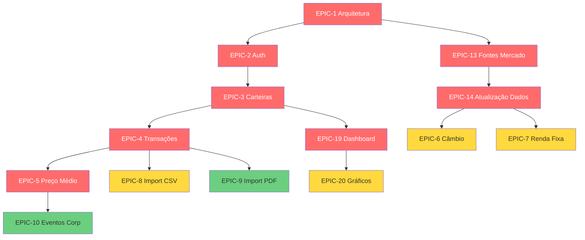

# 📊 Gestor de Investimentos — PO Input (Versão Enriquecida)

> Esta é a versão **enriquecida** do `PO-epicos.md` original.
> Use este arquivo como input para o agente **ProductOwner** via `/epic analyze @PO-epicos-enriched.md`.
> O PO vai gerar os artefatos finais em `docs/product/` e `docs/epics/`.

---

## 🎯 1. Visão do Produto

**Nome do produto**: Gestor de Investimentos (codename: a definir)

**Problema que resolve**:
Investidores brasileiros com portfólio multi-ativo (ações BR, ações internacionais, FIIs, renda fixa, cripto) não têm uma ferramenta única, gratuita e acurada para consolidar posições, calcular preço médio com eventos corporativos, e visualizar rendimento vs benchmarks.

**Proposta de valor**:
- ✅ **Consolidação unificada** de ativos em BRL (cross-currency)
- ✅ **Precisão contábil** — preço médio com eventos corporativos aplicados automaticamente
- ✅ **Privacy-first** — dados ficam no servidor do usuário (self-hosted via Docker)
- ✅ **Multi-fonte** com fallback (BRAPI → Yahoo Finance → CoinGecko)

**Diferenciais vs concorrência**:
- Kinvo / Status Invest: proprietário, dados na nuvem deles
- Planilhas Excel: manual, sem atualização automática
- **Este produto**: self-hosted + automação + open data sources

---

## 👥 2. Personas

### Persona A — "Investidor de Longo Prazo" (Primária)

- **Perfil**: 30-50 anos, profissional liberal/CLT, investe mensalmente
- **Tech-savvy**: Médio (usa Excel, instala apps, sabe rodar Docker com tutorial)
- **Patrimônio**: R$ 50k - R$ 2M
- **Tipos de ativo**: Ações BR, FIIs, Renda Fixa, Tesouro Direto, BDRs
- **JTBD**: Quando estou montando carteira pra aposentadoria, quero acompanhar evolução patrimonial sem depender de planilha manual, pra tomar decisões baseadas em dados reais e não em achismo.
- **Pains**: Split/bonificação bagunça planilha; taxa de corretagem não entra no preço médio; converter USD→BRL toda hora é trabalhoso
- **Gains**: Ver valorização real líquida de taxas; benchmark vs CDI automático; proventos agregados por período

### Persona B — "Day Trader / Swing Trader"

- **Perfil**: 25-40 anos, opera ativamente, múltiplas posições
- **Tech-savvy**: Alto
- **JTBD**: Quando fecho operações diárias, quero importar nota de corretagem sem digitar nada, pra focar na análise e não na contabilidade.
- **Pains**: Notas de corretagem em PDF com formatos diferentes; reconciliação manual; IR complexo
- **Gains**: Importação PDF automatizada; histórico de operações completo

### Persona C — "Cripto Investor"

- **Perfil**: 20-35 anos, diversifica em cripto
- **Tech-savvy**: Alto
- **JTBD**: Quando consolido cripto + ações, quero preço atualizado em tempo real, pra ver exposure total por classe.
- **Pains**: Valorização cripto oscila muito; múltiplas exchanges; difícil consolidar com ativos tradicionais
- **Gains**: Atualização alta frequência; visualização unificada BRL

---

## 📈 3. OKRs (Objetivos e Key Results)

### Objetivo 1 — Entregar MVP utilizável

- **KR 1.1**: MVP rodando 100% em containers Docker Compose
- **KR 1.2**: Suportar 3 tipos de ativo (ações BR, FIIs, renda fixa)
- **KR 1.3**: Preço médio calculado corretamente em >= 95% dos casos testados

### Objetivo 2 — Ser confiável e preciso

- **KR 2.1**: Eventos corporativos (split/bonificação) aplicados corretamente em 100% dos casos
- **KR 2.2**: Tempo de atualização de preços < 5min para ações, < 1min para cripto
- **KR 2.3**: Zero discrepâncias vs extrato de corretora em reconciliação manual

### Objetivo 3 — Boa UX mobile e desktop

- **KR 3.1**: PWA instalável em iOS/Android
- **KR 3.2**: First Meaningful Paint < 2s em 3G
- **KR 3.3**: Operação offline básica (leitura de dashboard)

---

## 🗓️ 4. Roadmap de Releases (Sugerido)

### MVP (v1.0) — Must Have

- Épico 1 — Arquitetura (Docker)
- Épico 2 — Autenticação (email/senha + Google)
- Épico 3 — Carteiras (CRUD)
- Épico 4 — Transações (registro manual)
- Épico 5 — Preço Médio
- Épico 13 — Fontes de Dados de Mercado
- Épico 14 — Atualização de Dados
- Épico 16-18 — Layout Base, Navegação, Sidebar
- Épico 19 — Dashboard básico
- Épico 22-23 — Formulários, Feedback UX

### V1.1 — Should Have

- Épico 6 — Câmbio (ativos internacionais)
- Épico 7 — Renda Fixa (CDI, IPCA, prefixado)
- Épico 8 — Importação CSV
- Épico 11 — Proventos
- Épico 20 — Gráficos avançados
- Épico 21 — Transações UI (filtros, ordenação)
- Épico 15 — PWA
- Épico 28 — Responsividade

### V1.2 — Should Have

- Épico 9 — Importação PDF de notas
- Épico 10 — Eventos Corporativos
- Épico 12 — Criptomoedas
- Épico 24 — Editor de Gráficos
- Épico 25 — Auditoria / Soft delete

### V2.0 — Could Have

- Épico 26 — Performance (lazy loading otimizado)
- Multi-usuário com permissões
- Exportação para IR (DARF automático)

### Won't Have (MVP) — Explícito

- ❌ **Execução de ordens** (não é homebroker)
- ❌ **Consultoria financeira** (sem recomendações)
- ❌ **Integração direta com corretoras via API** (apenas notas de corretagem PDF)

---

## 🚦 5. Requisitos Não-Funcionais (NFRs)

### Performance
- P95 de resposta da API < 500ms
- Dashboard carrega em < 2s
- Atualização de preços não bloqueia UI

### Segurança
- Senhas hashed com bcrypt (cost >= 12)
- JWT com refresh token
- Rate limiting: 100 req/min por usuário
- Dados do usuário isolados (multi-tenant logic)
- **LGPD**: dados podem ser exportados e deletados pelo usuário

### Disponibilidade
- Self-hosted: responsabilidade do usuário
- Fallback automático entre APIs externas (BRAPI → Yahoo)

### Observabilidade
- Logs estruturados em JSON
- Health check endpoint
- Métricas de sucesso/falha em chamadas externas

### Acessibilidade
- WCAG 2.1 Level AA
- Suporte a screen reader
- Contraste mínimo 4.5:1

### Compliance
- Sem assessoria financeira (CVM 30)
- Dados não são transmitidos a terceiros (exceto APIs de cotação públicas)

---

## 📖 6. Glossário de Domínio

| Termo | Definição |
|-------|-----------|
| **Ação** | Título de propriedade de empresa (ex: PETR4) |
| **FII** | Fundo de Investimento Imobiliário |
| **BDR** | Brazilian Depositary Receipt — ação estrangeira negociada na B3 |
| **Preço Médio** | `(total investido + taxas) / quantidade total` |
| **Split** | Desdobramento de ações (1 ação vira N) |
| **Bonificação** | Ações gratuitas distribuídas aos acionistas |
| **CDI** | Certificado de Depósito Interbancário — benchmark de renda fixa |
| **IPCA** | Índice Nacional de Preços ao Consumidor Amplo — inflação oficial |
| **Provento** | Dividendos, JCP ou rendimentos pagos pelo ativo |
| **Corretagem** | Taxa cobrada pela corretora por operação |
| **Nota de Corretagem** | Documento PDF emitido pela corretora com detalhes da operação |

---

## 🧩 7. Épicos Originais (mantidos, apenas referência)

> Os épicos abaixo foram o input original.
> O ProductOwner vai reescrevê-los no formato enriquecido em `docs/epics/EPIC-XXX.md`,
> acrescentando: persona-alvo, KPIs, prioridade MoSCoW, dependências, NFRs aplicáveis,
> regras de negócio, edge cases, e hints de decomposição para o PM.

### 🧩 ÉPICO 1 — Arquitetura

**Priority (sugerido)**: Must Have | **Persona**: Todas | **Target**: MVP

Feature: Sistema

  Scenario: Container
    Given ambiente de produção
    When o sistema é iniciado
    Then Nginx, frontend, backend, mongodb e redis devem rodar em containers separados, orquestrado pelo docker compose
    And health check de cada container deve estar verde em < 30s

  Scenario: Requisições
    Given requisição do frontend
    When usuário interage com a UI
    Then todas as requisições devem passar pelo NGINX (reverse proxy)
    And NGINX deve aplicar rate limiting de 100 req/min por IP

  Scenario: Persistência
    Given aplicação em produção
    When backend salva dados
    Then deve usar MongoDB como banco primário
    And conexão deve usar auth interna do docker network (sem senha exposta no .env do host)

  Scenario: Cache
    Given chamadas repetidas à mesma API externa em < 5min
    When backend tenta nova requisição
    Then sistema deve retornar do Redis cache
    And evitar chamada externa

### 🧩 ÉPICO 2 — Autenticação

**Priority**: Must Have | **Persona**: Todas | **Target**: MVP

Feature: Autenticação de usuário

  Scenario: Login com Google
    Given o usuário acessa a tela de login
    When ele seleciona login com Google
    Then o sistema deve autenticar via OAuth 2.0
    And criar conta caso não exista
    And redirecionar para /dashboard após sucesso

  Scenario: Login com email e senha
    Given o usuário possui cadastro
    When ele informa email e senha válidos
    Then o sistema deve autenticar o usuário
    And retornar JWT com expiração de 1h
    And refresh token com expiração de 7 dias

  Scenario: Recuperação de senha
    Given o usuário esqueceu a senha
    When solicita recuperação informando email cadastrado
    Then deve receber email com token único
    And token deve expirar em 30 minutos
    And ao redefinir, todas as sessões ativas devem ser invalidadas

  Scenario: Rate limit em tentativas de login
    Given tentativas repetidas de login com senha incorreta
    When ocorrem 5 falhas em 10 minutos do mesmo IP
    Then sistema deve bloquear novas tentativas por 15 minutos
    And retornar HTTP 429

  Scenario: Logout
    Given usuário autenticado
    When solicita logout
    Then sistema deve invalidar o refresh token
    And limpar cookies httpOnly

### 🧩 ÉPICO 3 — Carteiras

**Priority**: Must Have | **Persona**: Todas | **Target**: MVP
**Depends on**: EPIC-002

Feature: Gestão de carteiras

  Scenario: Criar carteira
    Given usuário autenticado
    When cria nova carteira informando nome
    Then carteira deve ser salva com nome único para aquele usuário
    And se nome duplicado, retornar erro 409 Conflict

  Scenario: Alternar carteira ativa
    Given usuário possui múltiplas carteiras
    When seleciona uma carteira no menu
    Then todos os dados exibidos (dashboard, transações, proventos) devem refletir apenas essa carteira
    And seleção deve persistir entre sessões (localStorage)

  Scenario: Visão consolidada
    Given usuário possui múltiplas carteiras
    When seleciona modo "Consolidado" no seletor
    Then sistema deve somar todos os ativos de todas as carteiras em BRL
    And mostrar breakdown por carteira em um gráfico de pizza

  Scenario: Deletar carteira (edge case)
    Given carteira com transações
    When usuário tenta deletar
    Then sistema deve pedir confirmação explícita
    And aplicar soft delete (marcar como deletada, não remover do banco)

> ... (demais épicos seguem o mesmo padrão enriquecido)

---

## 🔗 8. Dependências entre Épicos (Grafo Sugerido)

---

## 🎯 9. O que está Faltando no Input Original

Comparativo do que foi adicionado nesta versão enriquecida:

| Categoria | Original | Enriquecido |
|-----------|----------|-------------|
| Visão de produto | ❌ | ✅ |
| Personas | ❌ | ✅ 3 personas |
| OKRs | ❌ | ✅ 3 objetivos |
| Priorização (MoSCoW) | ❌ | ✅ MVP/V1.1/V1.2/V2 |
| Requisitos não-funcionais | ❌ | ✅ 6 categorias |
| Glossário de domínio | ❌ | ✅ 11 termos |
| Dependências entre épicos | ❌ | ✅ Grafo Mermaid |
| Roadmap | ❌ | ✅ 4 releases |
| Out of scope explícito | ❌ | ✅ Won't Have documentado |
| Given nos cenários | Parcial | ✅ Sempre que aplicável |
| Edge cases | Raro | ✅ Rate limit, soft delete, duplicatas |
| Métricas de sucesso | ❌ | ✅ KRs mensuráveis |

---

> **Próximo passo**: Rodar `/epic analyze @PO-epicos-enriched.md` para o ProductOwner gerar os artefatos finais em `docs/product/` e `docs/epics/`, e o `PM-HANDOFF.md` que instruirá o ProductManager.
