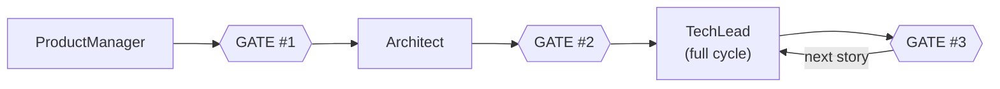
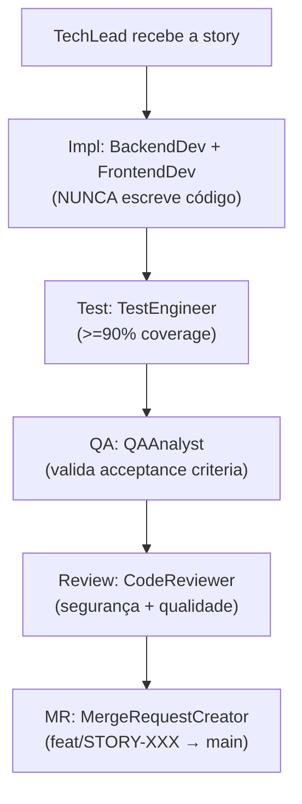
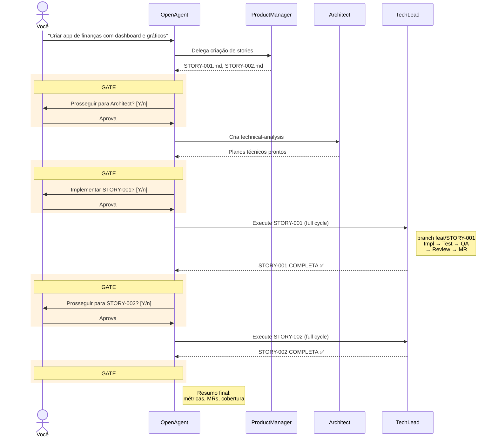
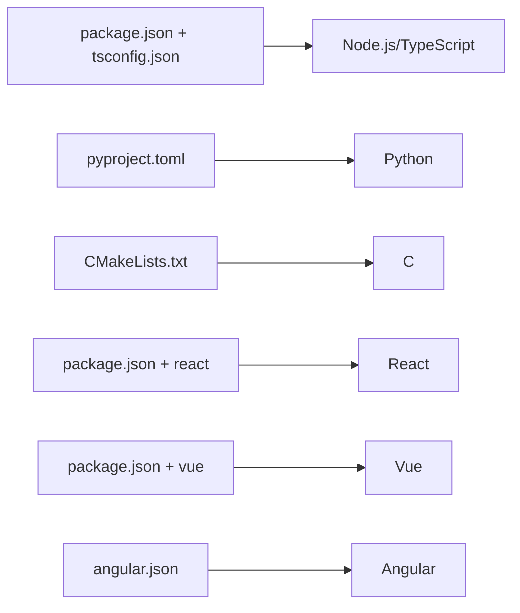

# Quick Reference: Fluxo de Agentes

## Pipeline SDLC em 30 Segundos

**TechLead orquestra o ciclo completo internamente** (sem gates entre sub-estágios):

## 3 Approval Gates

| Gate | Transição | O que o usuário vê |
|------|-----------|---------------------|
| **#1** | ProductManager → Architect | Stories criadas. Lista + resumo. |
| **#2** | Architect → TechLead | Plano técnico. Ordem de execução. |
| **#3** | TechLead → próxima story | Story COMPLETA: impl, testes, QA, review, MR. |

Gate #3 repete para **cada story** (ciclo per-story). Cada story = branch próprio (`feat/STORY-XXX → main`).

## Agentes por Função

### Entry Points (Você fala com eles)
| Agente | Quando usar |
|--------|-------------|
| **OpenAgent** | Qualquer pedido - ele roteia automaticamente |
| **OpenCoder** | Tarefas de código diretas (sem SDLC completo) |

### SDLC Pipeline
| Agente | Função | Output |
|--------|--------|--------|
| **ProductManager** | Transforma pedidos em stories | `docs/stories/STORY-XXX.md` |
| **Architect** | Cria plano técnico (NUNCA implementa) | `docs/stories/STORY-XXX-technical-analysis.md` |
| **TechLead** | Orquestra ciclo completo: impl→test→QA→review→MR (NUNCA escreve código) | Story completa com MR |
| **QAAnalyst** | Valida acceptance criteria (invocado pelo TechLead) | QA Report (APPROVE/REJECT) |
| **MergeRequestCreator** | Cria MR/PR (invocado pelo TechLead) | PR no GitHub/GitLab |

### Implementação (por linguagem)
| Node.js/TS | Python | C |
|------------|--------|---|
| BackendDeveloper | BackendDeveloperPython | BackendDeveloperC |
| CoderAgent | CoderAgentPython | CoderAgentC |
| TestEngineer | TestEngineerPython | TestEngineerC |
| CodeReviewer | CodeReviewerPython | CodeReviewerC |
| BugFixerNodejs | BugFixerPython | BugFixerC |

### Frontend (por framework)
| React | Vue | Angular | Genérico |
|-------|-----|---------|----------|
| FrontendDeveloperReact | FrontendDeveloperVue | FrontendDeveloperAngular | FrontendDeveloper |

### Infraestrutura
| Agente | Função |
|--------|--------|
| **ContextScout** | Descobre context files relevantes |
| **ExternalScout** | Busca docs de bibliotecas externas |
| **TaskManager** | Decompõe features em tarefas JSON |
| **DocWriter** | Gera documentação |

## Comandos Rápidos

| Comando | O que faz | Agente invocado |
|---------|-----------|-----------------|
| `/story <desc>` | Cria user story | ProductManager |
| `/plan <story>` | Cria plano técnico | Architect |
| `/implement <story>` | Executa ciclo completo | TechLead |
| `/review [files]` | Code review | CodeReviewer* |
| `/qa <story>` | Validação QA | QAAnalyst |
| `/mr [base]` | Cria merge request | MergeRequestCreator |
| `/bugfix <desc>` | Diagnostica e corrige | BugFixer* |
| `/analyze [scope]` | Analisa codebase | CodeAnalyzer* |
| `/commit` | Cria commit formatado | (direto) |
| `/test` | Roda testes | (direto) |
| `/context` | Gerencia contexto | ContextOrganizer |

*Variantes por linguagem detectada automaticamente

## Regras de Ouro

1. **ContextScout SEMPRE** - Todo agente carrega contexto antes de agir
2. **ExternalScout para libs** - Documentação atualizada de bibliotecas
3. **Testes >= 90%** - Cobertura obrigatória
4. **3 Approval Gates** - Gates entre PM→Arch→TechLead→next story
5. **TechLead delega, NUNCA implementa** - Coordena especialistas

## Exemplo: "Criar app de finanças" (múltiplas stories)

## Detecção de Linguagem

O sistema detecta automaticamente:

E roteia para os agentes corretos automaticamente!
