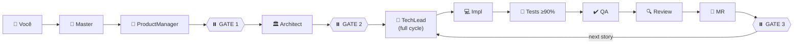

# 🚀 New OpenCode Workflow

> **Seu time de 25 agentes IA especializados, coordenados por 3 Approval Gates, entregando features completas do zero ao merge request.**
>
> Do briefing ao PR, sem você sair do terminal. Humano no comando das decisões estratégicas, IA cuidando da execução.

---

## ✨ Por que usar?

- 🎯 **Pipeline SDLC completo** — Story → Plano técnico → Código → Testes → QA → Review → Merge Request, tudo em uma sessão
- 🛑 **3 Approval Gates** — Você aprova em 3 momentos críticos. O resto, a IA coordena sozinha
- 🧠 **Contexto on-demand** — ContextScout + ExternalScout (Context7) carregam só o necessário. **~80% menos tokens** que abordagens tradicionais
- ✅ **Qualidade obrigatória** — Cobertura de testes **≥90%** é gate, não sugestão
- 🏗️ **Stack-aware** — Detecta React/Vue/Angular/Node e roteia para o especialista certo
- 📦 **Instalação num comando** — Single script auto-contido de 252 KB

---

## ⚡ Instalação (1 comando)

```bash
bash opencode-workflow-installer.sh --dest /caminho/para/seu-projeto
```

O instalador auto-contido extrai e configura tudo em `<projeto>/.opencode/`. Pré-requisitos: [OpenCode CLI](https://opencode.ai/docs) + [Bun](https://bun.sh).

```bash
# Depois, no seu projeto:
opencode --agent Master
> "Crie uma feature de login com JWT, validação Zod e testes E2E"
# → Pipeline SDLC dispara com 3 gates de aprovação
```

> 📘 Instalação detalhada, verificação manual e troubleshooting em **[GUIDE.md](GUIDE.md)**

---

## 🎬 O fluxo em 1 diagrama



**3 gates, zero surpresas**: você aprova depois do PM, depois do Architect, e entre stories. No ciclo do TechLead, a IA trabalha sem interrupção.

---

## 🤖 25 Agentes Especializados

| Categoria | Quem mora aqui |
|-----------|----------------|
| **🎯 Core** | `Master` — ponto de entrada universal |
| **📋 SDLC** (5) | `ProductManager` `Architect` `TechLead` `QAAnalyst` `MergeRequestCreator` |
| **💻 Code** (5) | `BackendDeveloper` `TestEngineer` `CodeReviewer` `BugFixerNodejs` `BuildAgent` |
| **🎨 Frontend** (4) | `FrontendDeveloperReact` `FrontendDeveloperVue` `FrontendDeveloperAngular` `FrontendDeveloper` |
| **🛠️ Dev Support** (3) | `DevOpsSpecialist` `UXDesigner` `ShellDeveloper` |
| **🧠 Infra** (4) | `ContextScout` `ExternalScout` `TaskManager` `DocWriter` |
| **🔍 Análise** (2) | `CodeAnalyzer` `ImplReviewerNodejs` |
| **⚙️ System** (1) | `ContextOrganizer` |

---

## ⌨️ 17 Comandos Slash

**Pipeline SDLC** (8):
`/story` `/plan` `/implement` `/review` `/qa` `/mr` `/bugfix` `/analyze`

**Utilitários** (9):
`/commit` `/test` `/context` `/add-context` `/clean` `/caveman` `/caveman-commit` `/caveman-compress` `/caveman-review`

---

## 🛠️ 8 Skills + 🔌 4 Plugins

**Skills** — habilidades reutilizáveis carregadas on-demand:

| Skill | Para quê |
|-------|----------|
| `task-management` | Decomposição e tracking de tasks JSON |
| `context7` | Fetch de docs atualizadas de 50+ libs populares |
| `caveman` / `-commit` / `-review` / `-help` | Modo ultra-compressed (economia de tokens) |
| `compress` | Compressão de arquivos de contexto |
| `cove` | Toolkit auxiliar |

**Plugins** — estendem o OpenCode runtime:

| Plugin | Função |
|--------|--------|
| `opencode-agent-fallback` | Fallback automático entre agentes |
| `opencode-background` | Execução em background |
| `opencode-token-logger` | Log de uso de tokens |
| `rtk` | Runtime toolkit |

---

## 📜 Princípios Operacionais

- **🎯 Context First** — Todo agente chama ContextScout antes de tocar código. Sem padrões do projeto, sem PR.
- **🌐 ExternalScout sempre** — Libs externas? Docs frescas via Context7, nunca training data desatualizada.
- **📏 MVI (Minimal Viable Information)** — Cada arquivo de contexto ≤200 linhas. Scannable em <30s. ~750 tokens/contexto vs 8.000+ tradicional.
- **🛑 Approval Gates** — Human-Guided AI: write/edit/bash sempre pedem aprovação. Read-only não precisa.
- **🧪 Coverage ≥90%** — Não é meta, é portão. TestEngineer garante.
- **👷 TechLead NUNCA escreve código** — Só delega. Specialists executam.

---

## 🗂️ Estrutura (visão rápida)

```
.opencode/
├── agent/        # 25 agentes (.md) com YAML frontmatter
├── command/      # 17 comandos slash
├── config/       # agent-metadata.json (registry)
├── context/      # 5 buckets flat: standards/ workflows/ stacks/ meta/ project/
├── skills/       # 8 skills reutilizáveis
├── plugins/      # 4 plugins TypeScript
└── tool/env/     # Loader de variáveis de ambiente
```

---

## 📚 Quer mais?

| Documento | O que tem |
|-----------|-----------|
| **[📘 GUIDE.md](GUIDE.md)** | Guia completo (10 seções): arquitetura profunda, catálogo detalhado de agentes, configuração de projeto, troubleshooting, glossário |
| `opencode-workflow-installer.sh` | Instalador auto-contido (252 KB, payload base64 embutido) |
| `install.sh` / `update.sh` / `uninstall.sh` | Scripts individuais para dev local do workflow |
| `build-installer.sh` | Gera o instalador auto-contido a partir dos fontes |

---

## 🎯 Ideal para

- Times que querem **padronizar SDLC** com agentes IA sem perder controle humano
- Projetos **Node.js / TypeScript** com React, Vue, Angular
- Quem **já usa [OpenCode CLI](https://opencode.ai)** e quer turbinar o workflow
- Equipes que precisam de **qualidade auditável** (coverage, review, QA estruturado)

---

## 🚦 Status

Versão: **2.0** · Modo de instalação: **local apenas** (`<projeto>/.opencode/`) · Runtime: **Bun ≥ 1.0**

---

> **Comece agora:**
> ```bash
> bash opencode-workflow-installer.sh --dest /meu-projeto
> cd /meu-projeto && opencode --agent Master
> ```
>
> Detalhes completos em **[📘 GUIDE.md](GUIDE.md)**.
