<div align="center">

<!-- TODO: Adicionar logo/banner em docs/assets/banner.png e descomentar -->
<!--  -->

# 🚀 New OpenCode Workflow

### Pipeline SDLC com IA, sem perder o controle.

**Agentes IA que aprendem os padrões do seu projeto e entregam features completas — do briefing ao merge request — com você no comando das decisões.**

🎯 **SDLC end-to-end** — Visão/Épicos → Story → Stack → Plano → Código → Testes → QA → Review → MR
🛑 **5 Approval Gates** — Você aprova nos momentos certos, IA executa o resto. 3 modos: Manual, Parcial (pára entre stories), Batch (autônomo)
🧠 **Contexto on-demand** — ContextScout + Context7 (~80% menos tokens)
✅ **Coverage ≥90% obrigatório** — Não é meta, é portão
🏗️ **Stack-aware** — Define a stack (SystemArchitect) em greenfield e roteia para o especialista em projetos existentes
📦 **Instalação em 1 comando** — Single-file installer auto-contido (252 KB)

**Stacks:** TypeScript • JavaScript • React • Vue • Angular • Node.js
**Runtime:** [OpenCode CLI](https://opencode.ai) + [Bun](https://bun.sh)

[](https://opensource.org/licenses/MIT)
[](https://github.com/dgofreitas/opencode-workflow)
[](https://opencode.ai)
[](GUIDE.md)

[⚡ Quick Start](#-quick-start) • [💻 Exemplo](#-exemplo-de-fluxo) • [🎯 É pra mim?](#-isso-é-pra-mim) • [📘 Guia Completo](GUIDE.md)

</div>

---

> **Construído sobre [OpenCode](https://opencode.ai)** — framework open-source de agentes IA. Este workflow estende o OpenCode com 27 agentes especializados em SDLC (com ProductOwner estratégico), sistema de contexto on-demand e 5 gates de aprovação humana.

---

## 🤔 O Problema

A maioria dos agentes IA é como contratar um dev que não conhece sua codebase. Geram código genérico, você reescreve por horas, queima tokens, e no fim entrega nada produção-ready.

**Exemplo:**

```typescript
// O que a IA genérica entrega
export async function POST(request: Request) {
  const data = await request.json();
  return Response.json({ success: true });
}

// O que seu projeto realmente precisa
export async function POST(request: Request) {
  const body = await request.json();
  const validated = LoginSchema.parse(body);          // sua validação Zod
  const user = await authService.login(validated);    // seu padrão de service
  return apiResponse(user, { status: 200 });          // seu wrapper de response
}
```

## ✅ A Solução

**O New OpenCode Workflow ensina os padrões do seu projeto aos agentes antes deles tocarem código.** Eles descobrem suas convenções via ContextScout, propõem planos antes de implementar, executam incrementalmente com validação e param em **3 momentos críticos** para você aprovar.

**Resultado**: código que sai produção-ready, com cobertura de testes ≥90%, code review automatizado e PR pronto pra merge — em uma sessão só.

---

## 🆚 Comparação Rápida

| Funcionalidade | New OpenCode Workflow | Cursor / Copilot | Aider | Agentes autônomos |
|----------------|------------------------|-------------------|-------|---------------------|
| **Aprende seus padrões** | ✅ Context System + 5 buckets | ❌ | ❌ | ⚠️ Setup manual |
| **Approval Gates** | ✅ 4 gates explícitos (GATE #0 opcional para estratégica) | ⚠️ Opcional | ❌ Auto-executa | ❌ Autônomo |
| **Eficiência de tokens** | ✅ MVI (~80% redução) | ❌ Carrega tudo | ❌ Carrega tudo | ❌ Alto consumo |
| **Pipeline SDLC completo** | ✅ Story→Plan→Impl→Test→QA→Review→MR | ❌ | ❌ | ⚠️ Manual |
| **Coverage como gate** | ✅ ≥90% obrigatório | ❌ | ❌ | ❌ |
| **Multi-stack auto-detect** | ✅ React/Vue/Angular/Node | ⚠️ Genérico | ⚠️ Genérico | ⚠️ Genérico |
| **Agentes editáveis** | ✅ Markdown direto | ❌ Proprietário | ⚠️ Limitado | ✅ |
| **Docs externas atualizadas** | ✅ ExternalScout + Context7 | ❌ Training data | ❌ Training data | ⚠️ Variável |

**Use este workflow quando:**

- ✅ Tem padrões estabelecidos e quer código que combina com o projeto
- ✅ Precisa de gates de qualidade auditáveis (coverage, review, QA)
- ✅ Trabalha em time e precisa repetibilidade
- ✅ Custos de token importam

---

## ⚡ Quick Start

**Pré-requisitos:** [OpenCode CLI](https://opencode.ai/docs) • [Bun ≥ 1.0](https://bun.sh) • Git

### 1️⃣ Instalar (1 comando)

```bash
bash opencode-workflow-installer.sh --dest /caminho/para/seu-projeto
```

<sub>Instalador auto-contido (252 KB com payload base64). Extrai e configura tudo em <code>&lt;projeto&gt;/.opencode/</code>.</sub>

### 2️⃣ Começar a construir

```bash
cd /caminho/para/seu-projeto
opencode --agent Master
> "Crie uma feature de autenticação com email/senha, validação Zod e testes E2E"
```

### 3️⃣ Aprovar e enviar

O que acontece:

1. **ProductOwner** cria visão e épicos (para requests estratégicos)
2. ⏸️ **GATE-PM** — Você aprova as stories
3. **SystemArchitect** propõe stack (se projeto greenfield)
4. ⏸️ **GATE-SA** — Você aprova a stack
5. **Architect** monta o plano técnico
6. ⏸️ **GATE-AR** — Você aprova o plano
7. **TechLead** orquestra: impl → testes (≥90%) → QA → review → MR
8. ⏸️ **GATE-MR** — Você aprova o MR e faz merge
9. ⏸️ **GATE-NEXT** — Próxima story? (ou resumo final)

**3 modos de execução**: Manual (todos os gates perguntam), Parcial (só pergunta entre stories), Batch (autônomo, sem interação). Veja [📘 GUIDE.md](GUIDE.md#4.3) para detalhes.

**Pronto.** Funciona com seu modelo padrão. Zero configuração inicial.

---

## 📖 Como Funciona

### A ideia central

> **Maioria das ferramentas IA**: código genérico → você refatora
> **Este workflow**: seus padrões → IA gera código que combina

### O fluxo visual

```mermaid
graph LR
    User["👤 Você"] --> Master["🎯 Master"]
    Master --> PO["🎯 ProductOwner"]
    PO --> G0{{⏸️ GATE 0}}
    G0 --> PM[📝 PM]
    PM --> G1{{⏸️ GATE 1}}
    G1 --> SA[🏗️ SystemArchitect]
    SA --> GSA{{⏸️ GATE SA}}
    GSA --> Arch[🏛️ Architect]
    G1 -.->|existente| Arch
    Arch --> G2{{⏸️ GATE 2}}
    G2 --> TL["👷 TechLead"]
    TL --> Impl[💻 Impl]
    Impl --> Test[🧪 Test ≥90%]
    Test --> QA[✔️ QA]
    QA --> Review[🔍 Review]
    Review --> MR[🚀 MR]
    MR --> G3{{⏸️ GATE 3}}
    G3 -.->|próxima story| TL
```



### Os 6 princípios

**🎯 Context First**
ContextScout descobre os padrões do projeto **antes** de qualquer write. Código sai combinando com a codebase de cara.

**🌐 ExternalScout para libs externas**
Trabalhando com Drizzle? Next.js 15? Mastra? ExternalScout busca docs **atualizadas** via Context7. Nunca training data desatualizada.

**📏 MVI — Minimal Viable Information**
Cada arquivo de contexto ≤200 linhas, scannable em <30s. **~750 tokens por contexto vs 8.000+ tradicional**. ~80% de redução.

**✋ Approval Gates — Human-Guided AI**
`write` / `edit` / `bash` / `task` SEMPRE pedem aprovação. `read` / `grep` / `ls` não precisam. Você fica no controle.

**🧪 Coverage ≥90% é gate**
TestEngineer não delivera abaixo disso. Não é métrica de vaidade — é portão de qualidade.

**👷 TechLead NUNCA escreve código**
Coordena impl → test → QA → review → MR delegando para specialists. Separação clara entre quem decide e quem executa.

---

## 🛠️ O que vem incluído

### 🤖 27 Agentes especializados

**Core (1):** `Master` — entry point universal, classifica e roteia

**SDLC (7):** `ProductOwner` `ProductManager` `SystemArchitect` `Architect` `TechLead` `QAAnalyst` `MergeRequestCreator`

**Code (5):** `BackendDeveloper` `TestEngineer` `CodeReviewer` `BugFixerNodejs` `BuildAgent`

**Frontend (4):** `FrontendDeveloperReact` `FrontendDeveloperVue` `FrontendDeveloperAngular` `FrontendDeveloper`

**Dev Support (3):** `DevOpsSpecialist` `UXDesigner` `ShellDeveloper`

**Infra (4):** `ContextScout` `ExternalScout` `TaskManager` `DocWriter`

**Análise (2):** `CodeAnalyzer` `ImplReviewerNodejs`

**System (1):** `ContextOrganizer`

### ⌨️ 18 Comandos slash

**Pipeline SDLC:**
`/epic` `/story` `/plan` `/implement` `/review` `/qa` `/mr` `/bugfix` `/analyze`

**Utilitários:**
`/commit` `/test` `/context` `/add-context` `/clean` `/caveman*` (4 variantes)

### 🛠️ 12 Skills + 🔌 4 Plugins

**Skills:** `task-management` `context7` `caveman` (+ 3 variantes) `compress` `cove` `node-version-guard` `playwright-debug` `tavily` `test-execution`

**Plugins:** `opencode-agent-fallback` `opencode-background` `opencode-token-logger` `rtk`

### 📚 Sistema de contexto (5 buckets flat)

```
context/
├── INDEX.md          # índice semântico flat (33 entradas)
├── standards/        # padrões de código, segurança, API
├── workflows/        # processos: review, delegation, breakdown
├── stacks/           # tech-específico: React, Node, Mastra, design system
├── meta/             # como o sistema de contexto funciona
└── project/          # específico do seu projeto: living-notes, decisions
```

ContextScout lê apenas o `INDEX.md`, filtra por tags relevantes, e carrega só os arquivos necessários. **Lazy loading puro.**

---

## 💻 Exemplo de Fluxo

```bash
opencode --agent Master
> "Crie um sistema de autenticação com login, registro, JWT e testes"
```

**O que acontece:**

### 1️⃣ Discover (~1-2 min)
Master invoca **ContextScout**, que descobre:
- Sua stack: Next.js 15 + TypeScript + Drizzle + PostgreSQL
- Seu padrão de API: Zod validation, error middleware centralizado
- Seu padrão de service: classes com DI manual
- Suas convenções: kebab-case files, PascalCase types

### 2️⃣ Story + Plano (~3-4 min) — ⏸️ 2 gates
**PM** cria `docs/stories/STORY-001-auth.md` com 6 acceptance criteria.
→ ⏸️ **GATE #1**: você aprova
**Architect** cria `STORY-001-technical-analysis.md` com:
- Endpoints: `/api/auth/login`, `/api/auth/register`, `/api/auth/me`
- Schema Drizzle: `users`, `sessions`
- Componentes: `login-form.tsx`, `register-form.tsx`, `auth-guard.tsx`
- Estratégia de testes: unit (Vitest) + E2E (Playwright)
→ ⏸️ **GATE #2**: você aprova

### 3️⃣ Execução TechLead (~12-18 min) — sem gates
**TechLead** cria branch `feat/STORY-001-auth` e delega:

```
BackendDeveloper      → endpoints + schema + service
FrontendDeveloperReact → components + hooks
TestEngineer          → unit (Vitest) + E2E (Playwright) — 92% coverage
QAAnalyst             → valida vs acceptance criteria → APPROVE
CodeReviewer          → segurança + performance + padrões → APPROVE
MergeRequestCreator   → cria PR com sumário, métricas, checklist
```

### 4️⃣ Resultado — ⏸️ GATE #3
- ✅ Branch `feat/STORY-001-auth` com 24 commits incrementais
- ✅ PR #42 aberto, base `main`
- ✅ Coverage: 92% (gate ≥90%)
- ✅ QA Report: APPROVE
- ✅ Code Review: 0 críticos, 2 sugestões já aplicadas
- ⏸️ **GATE #3**: você aprova → próxima story (ou fecha sessão)

**Tempo total: ~15-25 min** para uma feature completa, com aprovação humana nos 4 momentos críticos.

---

## 🎯 Isso é pra mim?

### ✅ Use este workflow se você:

- Trabalha com **Node.js / TypeScript** (React, Vue, Angular ou backend Express/Fastify/NestJS)
- Já usa o **[OpenCode CLI](https://opencode.ai)** e quer turbinar o workflow SDLC
- Quer **padronizar SDLC em time** sem perder controle humano
- Precisa de **qualidade auditável**: coverage, review, QA report
- Liga pra **custos de token** (MVI cuida disso)
- Tem **padrões estabelecidos** e quer código que combina com o projeto desde o primeiro draft

### ⚠️ Pule se você:

- Quer **execução totalmente autônoma** sem gates de aprovação
- Trabalha em **prototipagem rápida** sem padrões estabelecidos
- Não usa OpenCode CLI nem Bun
- Não trabalha com stacks Node/JS/TS

### 🤔 Não tem certeza?

Comece pelo Quick Start. Os agentes são **arquivos markdown editáveis** — sem vendor lock-in, dá pra customizar tudo. Se não bater, `bash uninstall.sh --dest /seu-projeto` e remove em 5 segundos.

---

## 📚 Documentação

| Documento | Para quem |
|-----------|-----------|
| **[📘 GUIDE.md](GUIDE.md)** | Guia completo (10 seções, 828 linhas): arquitetura profunda, catálogo detalhado de agentes, configuração de projeto, troubleshooting, glossário |
| `opencode-workflow-installer.sh` | Instalador auto-contido (recomendado para usuários) |
| `install.sh` / `update.sh` / `uninstall.sh` | Scripts individuais (para dev local do workflow) |
| `build-installer.sh` | Gera o instalador auto-contido a partir dos fontes |

---

## 🚦 Status

**Versão**: 2.1 · **Modo**: instalação local apenas (`<projeto>/.opencode/`) · **Runtime**: Bun ≥ 1.0 · **Idioma docs**: PT-BR

---

<div align="center">

### 🚀 Comece agora

```bash
bash opencode-workflow-installer.sh --dest /meu-projeto
cd /meu-projeto && opencode --agent Master
```

**Detalhes completos em [📘 GUIDE.md](GUIDE.md)**

</div>
