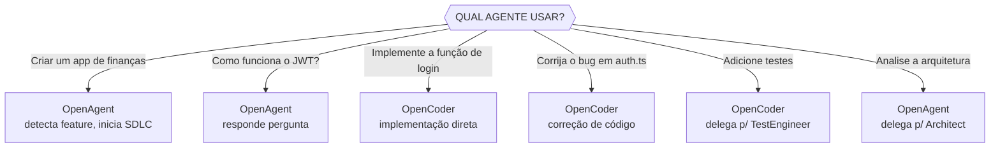
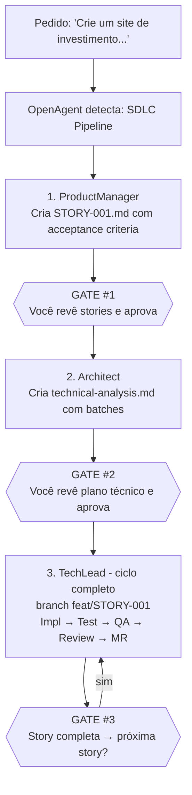
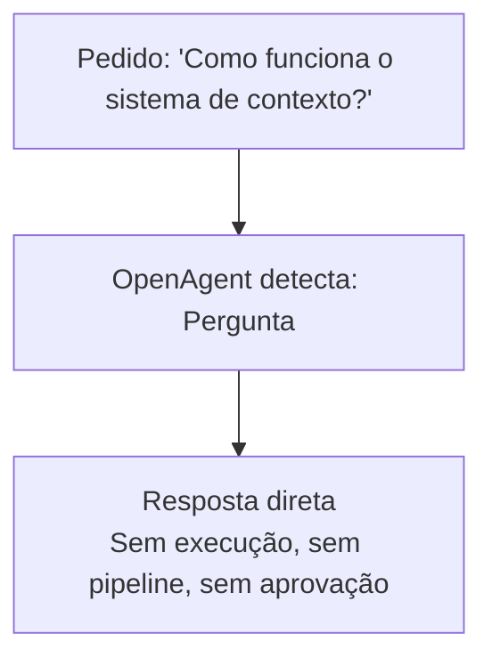
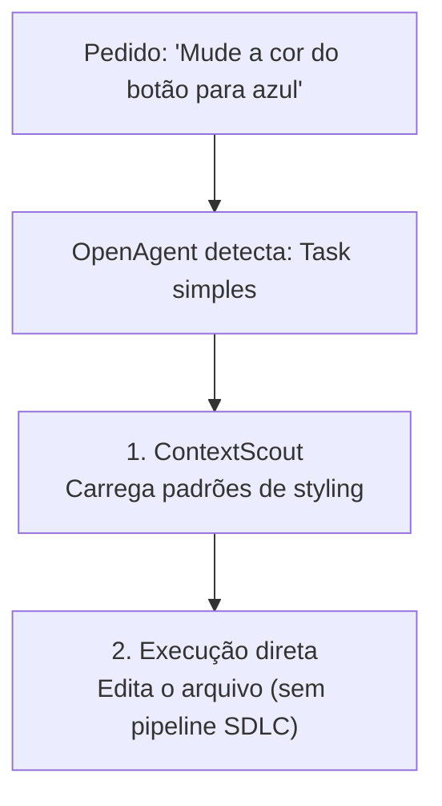
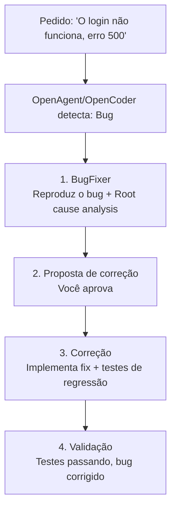
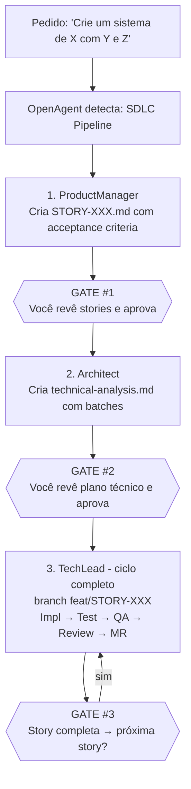
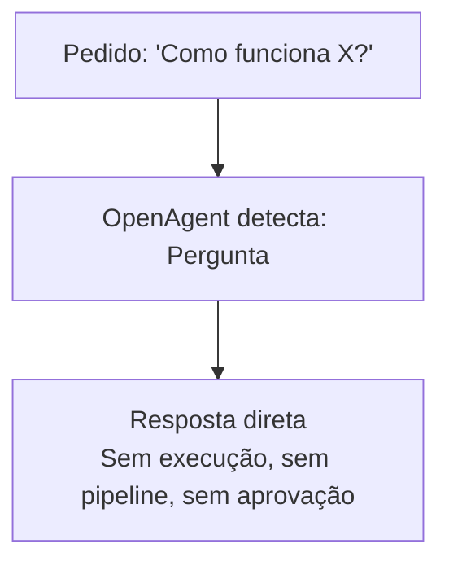

# Guia Prático de Uso

Este documento explica como usar o New OpenCode Workflow no dia a dia.

---

## Iniciando o OpenCode

### Com OpenAgent (Recomendado para Início)

```bash
opencode --agent OpenAgent
```

**Use quando:**
- Quer fazer qualquer coisa (perguntas, tarefas, features completas)
- Não sabe qual agente usar
- Quer o pipeline SDLC automático
- Quer delegação automática para especialistas

### Com OpenCoder (Desenvolvimento Focado)

```bash
opencode --agent OpenCoder
```

**Use quando:**
- Sabe que vai implementar código
- Quer desenvolvimento direto, sem passar pelo ProductManager
- Está trabalhando em tarefas de código específicas
- Não precisa de story/plano (já sabe o que fazer)

---

## Diferença: OpenAgent vs OpenCoder

| Característica | OpenAgent | OpenCoder |
|----------------|-----------|-----------|
| **Propósito** | Universal - faz tudo | Especializado em código |
| **SDLC Pipeline** | Detecta automaticamente e inicia | Executa diretamente |
| **Perguntas** | Responde diretamente | Redireciona para OpenAgent |
| **Features completas** | PM → ⏸️ → Arch → ⏸️ → TechLead(full cycle) → ⏸️ | TechLead direto |
| **Delegação** | Delega para qualquer subagent | Delega para agentes de código |
| **Melhor para** | Início de qualquer tarefa | Implementação de código conhecido |

### Quando Usar Cada Um



---

## Usando Linguagem Natural

### Features Completas (SDLC Automático)

**Diga:**
```
"Crie um site de investimento com:
 - Dashboard de portfólio
 - Gráficos de performance
 - Exportação CSV
 - Login com Google"
```

**O que acontece:**


### Perguntas (Resposta Direta)

**Diga:**
```
"Como funciona o sistema de contexto?"
"O que faz o ContextScout?"
"Quais agentes estão disponíveis?"
```

**O que acontece:**


### Tarefas Simples (Execução Direta)

**Diga:**
```
"Adicione um botão no header"
"Corrija o typo no README"
"Mude a cor do botão para azul"
```

**O que acontece:**


### Bugs (Diagnóstico e Correção)

**Diga:**
```
"O login não está funcionando, aparece erro 500"
"Corrija o bug no módulo de pagamentos"
```

**O que acontece:**


---

## Usando Comandos Slash

### Quando Usar Comandos

| Comando | Quando Usar |
|---------|-------------|
| `/story` | Quer APENAS criar a story, sem implementar ainda |
| `/plan` | Quer APENAS o plano técnico, revisar antes |
| `/implement` | Já tem story/plano, quer executar |
| `/review` | Quer review de código existente |
| `/qa` | Quer validação QA |
| `/mr` | Quer criar MR |
| `/bugfix` | Quer diagnosticar e corrigir bug |
| `/analyze` | Quer análise de arquitetura |
| `/commit` | Quer criar commit formatado |
| `/test` | Quer rodar testes |
| `/context` | Quer gerenciar contexto |

### Fluxo com Comandos (Controle Passo a Passo)

```bash
opencode --agent OpenAgent

# Passo 1: Criar story
> /story criar sistema de notificações por email

# ProductManager cria STORY-001.md
# ⏸️ GATE #1: Você revisa a story, aprova para prosseguir

# Passo 2: Criar plano técnico
> /plan STORY-001

# Architect cria technical-analysis.md
# ⏸️ GATE #2: Você revisa o plano, aprova para implementar

# Passo 3: Implementar (ciclo completo!)
> /implement STORY-001

# TechLead orquestra o ciclo completo:
# impl → testes → QA → review → MR
# (NÃO precisa de /review, /qa, /mr separados!)
# ⏸️ GATE #3: Story completa, você aprova para próxima
```

### Fluxo com Linguagem Natural (Automático)

```bash
opencode --agent OpenAgent

# Uma frase, pipeline completo
> "Crie um sistema de notificações por email com templates, fila, e retry"

# OpenAgent orquestra o SDLC com 3 approval gates:
# 1. ProductManager cria stories
#    ⏸️ GATE #1: Você aprova
# 2. Architect cria plano
#    ⏸️ GATE #2: Você aprova
# 3. TechLead executa ciclo completo (impl→test→QA→review→MR)
#    ⏸️ GATE #3: Story completa, próxima story?
```

---

## Exemplos Práticos

### Exemplo 1: App de Finanças

```bash
opencode --agent OpenAgent

> "Crie um aplicativo de finanças pessoais com:
   - Dashboard de gastos mensais
   - Categorização automática de transações
   - Gráficos de evolução
   - Exportação para Excel
   - Login com email/senha"

# OpenAgent detecta: Feature completa
# Pipeline: PM → ⏸️#1 → Architect → ⏸️#2 → TechLead(impl→test→QA→review→MR) → ⏸️#3
```

### Exemplo 2: Bug em Produção

```bash
opencode --agent OpenCoder

> "O endpoint /api/payments está retornando 500 quando o usuário usa cupom de desconto. Corrija."

# OpenCoder detecta: Bug
# Pipeline: BugFixerNodejs → Diagnóstico → Correção → Testes
```

### Exemplo 3: Adicionar Feature em Código Existente

```bash
opencode --agent OpenCoder

> "Adicione autenticação de dois fatores (2FA) no sistema de login existente"

# OpenCoder detecta: Feature em código existente
# Pipeline: ContextScout → Implementação direta → TestEngineer → CodeReviewer
```

### Exemplo 4: Análise de Arquitetura

```bash
opencode --agent OpenAgent

> /analyze

# OpenAgent delega para CodeAnalyzer
# Output: Análise completa da arquitetura, padrões, e débitos técnicos
```

### Exemplo 5: Code Review

```bash
opencode --agent OpenAgent

> /review src/

# OpenAgent delega para CodeReviewer
# Output: Relatório de segurança, qualidade, e sugestões
```

### Exemplo 6: Apenas Pergunta

```bash
opencode --agent OpenAgent

> "Como implementar websockets com Socket.io no Next.js?"

# OpenAgent responde diretamente
# Sem execução, sem pipeline
```

---

## Fluxos por Tipo de Pedido

### Feature Nova Completa



### Modificação Simples


### Bug


### Pergunta



---

## Dicas Práticas

### 1. Comece com OpenAgent

Sempre comece com `opencode --agent OpenAgent`. Ele sabe quando delegar para OpenCoder ou outros especialistas.

### 2. Seja Específico

**Bom:**
```
"Crie um sistema de agendamento com:
 - Calendário visual mensal
 - Criação de eventos com título, data, hora
 - Notificações por email 1h antes
 - Compartilhamento de eventos entre usuários"
```

**Ruim:**
```
"Crie um calendário"
```

### 3. Use Comandos para Controle

Se quer revisar antes de prosseguir:
```
/story criar sistema X    # Para, revisa story
/plan STORY-001           # Para, revisa plano
/implement STORY-001      # Executa
```

### 4. Deixe o Pipeline Rodar

Para features completas, use linguagem natural e deixe o OpenAgent gerenciar:
```
"Crie um e-commerce completo com carrinho, checkout, e pagamentos"
# OpenAgent orquestra tudo com 3 gates:
# ⏸️#1 após stories | ⏸️#2 após plano | ⏸️#3 após cada story completa
```

### 5. Para Bugs, Seja Preciso

```
"O endpoint POST /api/users retorna 500 quando o email já existe.
 Esperado: retornar 409 Conflict com mensagem 'Email already registered'.
 Atual: retorna 500 Internal Server Error."
```

---

## Resumo Rápido

| Situação | Agente | Como Pedir |
|----------|--------|------------|
| Feature completa | OpenAgent | Linguagem natural: "Crie um..." (3 gates) |
| Pergunta | OpenAgent | Linguagem natural: "Como funciona...?" |
| Bug | OpenAgent ou OpenCoder | "O bug X acontece quando..." |
| Modificação simples | OpenAgent ou OpenCoder | "Mude X para Y" |
| Implementação direta | OpenCoder | "Implemente a função X" |
| Code review | OpenAgent | `/review` |
| Análise | OpenAgent | `/analyze` |
| Controle passo a passo | OpenAgent | `/story` → `/plan` → `/implement` |
