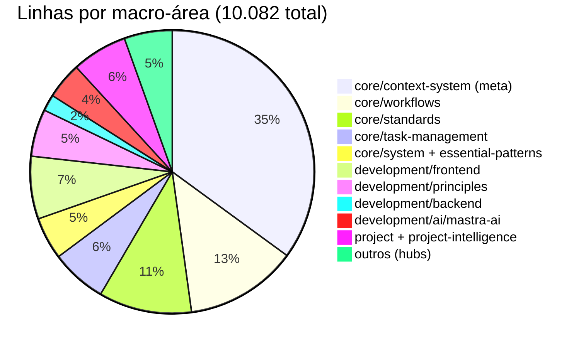
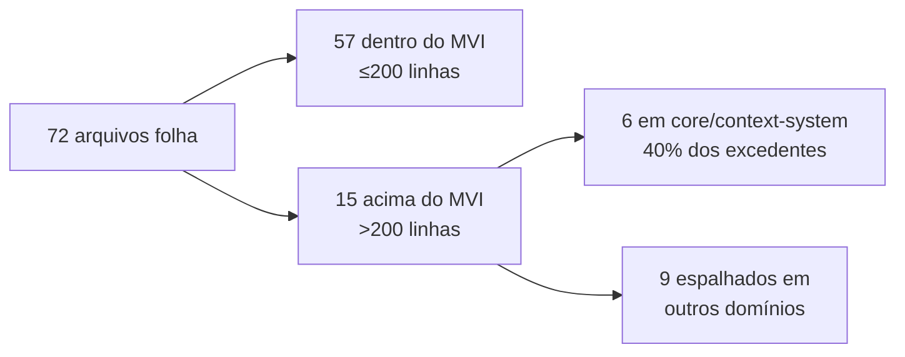
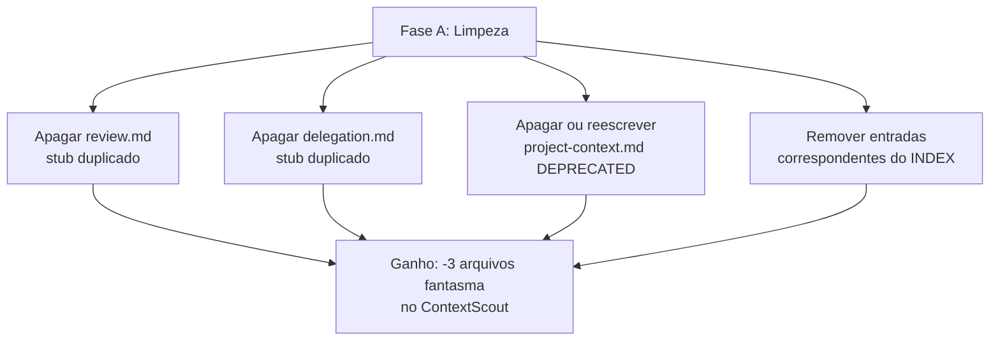
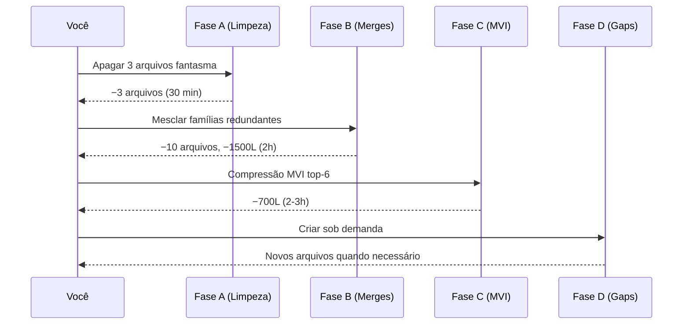

<a name="indice"></a>

# 📊 Relatório de Cobertura do Context System

> **Auditoria completa dos 72 arquivos folha em `context/`**
>
> Mapeia o que já está coberto, o que está duplicado, o que passou do MVI e
> quais gaps existem. Base de decisão para consolidação e expansão.
>
> **Data**: 2026-05-02 | **Escopo**: `@/home/diogo.freitas/dgo/opencode-workflow/context/`

---

## 📑 Índice

| # | Seção | Descrição |
|---|-------|-----------|
| 1 | [🔭 Visão Geral](#visao-geral) | Números agregados e distribuição |
| 2 | [🗺️ Mapa de Cobertura por Domínio](#mapa-dominio) | O que cada domínio cobre |
| 3 | [🧬 Duplicações e Sobreposições](#duplicacoes) | Candidatos a consolidação |
| 4 | [📏 Arquivos Acima do MVI (>200 linhas)](#acima-mvi) | Candidatos a compressão |
| 5 | [🕳️ Gaps — O Que Falta](#gaps) | Domínios vazios ou rasos |
| 6 | [⚠️ Achados Críticos](#criticos) | Itens que exigem ação imediata |
| 7 | [🎯 Recomendações Priorizadas](#recomendacoes) | Plano de ataque por ROI |
| 8 | [📎 Apêndice: Inventário Completo](#inventario) | Lista bruta com linhas e títulos |

---

<a name="visao-geral"></a>

## 🔭 1. Visão Geral

### Números-chave

| Métrica | Valor |
|---------|-------|
| Total de arquivos folha | **72** |
| Total de linhas | **10.082** |
| Total aproximado em tokens | **~75.000** (≈7.5 tokens/linha) |
| Arquivos acima do MVI 200 | **15** (20,8%) |
| Duplicações diretas detectadas | **2** pares (H1 idêntico) |
| Famílias redundantes | **2** (task-delegation, essential-patterns) |
| Domínios `🚧 Placeholder` | **5** (data, infrastructure, integration, frameworks, config) |
| Arquivo marcado `DEPRECATED` | **1** (`project/project-context.md`) |

### Distribuição por macro-área



> **Observação crítica**: `core/context-system/` (meta-documentação sobre COMO
> manter o sistema) sozinho representa **35%** de todo o contexto. Isso é
> desproporcional — é sistema sobre sistema.

[⬆️ Voltar ao Índice](#indice)

---

<a name="mapa-dominio"></a>

## 🗺️ 2. Mapa de Cobertura por Domínio

### 2.1 `core/` — 6.809 linhas (67,5% do total)

| Subdomínio | Arquivos | Linhas | Avaliação |
|------------|----------|--------|-----------|
| `context-system/` | 19 | 3.534 | 🔴 **Inflado**. 35% do contexto total |
| `workflows/` | 10 | 1.288 | 🟡 Boa cobertura, mas família delegation duplicada |
| `standards/` | 7 | 1.068 | 🟢 Cobertura sólida |
| `task-management/` | 4 | 642 | 🟢 Bem dimensionado |
| `system/` | 2 | 277 | 🟡 Sobrepõe com `context-system.md` |
| `essential-patterns.md` | 1 | 210 | 🟡 Levemente acima do MVI |

### 2.2 `development/` — 1.874 linhas (18,6%)

| Subdomínio | Arquivos | Linhas | Avaliação |
|------------|----------|--------|-----------|
| `frontend/` | 4 | 721 | 🟢 Denso (React + design systems + styling + when-to-delegate) |
| `ai/mastra-ai/` | 11 | 420 | 🟢 11 arquivos pequenos e focados — modelo a copiar |
| `principles/` | 2 | 544 | 🟡 `api-design.md` tem 366L — acima do MVI |
| `backend/` | 1 | 189 | 🔴 **Apenas Node.js project-structure** — sem padrões, sem testes, sem auth |
| `ui-navigation.md` + `backend-navigation.md` + `fullstack-navigation.md` | 3 | 200 | 🟡 Hubs sobreviventes da era navigation |

### 2.3 `project/` + `project-intelligence/` — 637 linhas (6,3%)

| Arquivo | Linhas | Avaliação |
|---------|--------|-----------|
| `project/project-context.md` | 103 | 🔴 **DEPRECATED** (marcado no próprio arquivo) |
| `project-intelligence/business-domain.md` | 88 | 🟢 |
| `project-intelligence/technical-domain.md` | 108 | 🟢 |
| `project-intelligence/decisions-log.md` | 130 | 🟢 |
| `project-intelligence/living-notes.md` | 114 | 🟢 |
| `project-intelligence/business-tech-bridge.md` | 94 | 🟢 |

[⬆️ Voltar ao Índice](#indice)

---

<a name="duplicacoes"></a>

## 🧬 3. Duplicações e Sobreposições

### 3.1 Duplicações DIRETAS (H1 idêntico)

| Par | Status | Ação recomendada |
|-----|--------|------------------|
| `core/workflows/code-review.md` (136L) ≡ `core/workflows/review.md` (19L) | 🔴 Mesmo H1 "Code Review Guidelines" | **Apagar `review.md`** — é stub |
| `core/workflows/task-delegation-basics.md` (138L) ≡ `core/workflows/delegation.md` (20L) | 🔴 Mesmo H1 "Delegation Context Template" | **Apagar `delegation.md`** — é stub |

### 3.2 Famílias redundantes (mesmo tópico, múltiplos arquivos)

**Família `task-delegation*`** (4 arquivos, 480L) — mesmo padrão dos 4 external-libraries que você já consolidou:

| Arquivo | Linhas | Escopo |
|---------|--------|--------|
| `task-delegation-basics.md` | 138 | Core workflow |
| `task-delegation-specialists.md` | 179 | Quem delegar para quem |
| `task-delegation-caching.md` | 143 | Cache de contexto |
| `delegation.md` | 20 | Stub duplicado do basics |

→ **Consolidar em `core/workflows/task-delegation.md`** (~200L) com seções
internas: Basics / Specialists / Caching. Replica o sucesso do merge do external-libraries.

**Família `essential-patterns` + `security-patterns`** (2 arquivos, 359L) — H1s suspeitos:

| Arquivo | H1 | Linhas |
|---------|-----|--------|
| `core/essential-patterns.md` | "Essential Patterns - Core Development Guidelines" | 210 |
| `core/standards/security-patterns.md` | "Essential Patterns - Core Knowledge Base" | 149 |

→ **Auditar**: H1 inicial de `security-patterns.md` parece trocado ou herdado de template. Verificar se há conteúdo duplicado.

### 3.3 Sobreposições conceituais (candidatos a mesclar)

| Arquivos | Motivo | Ação |
|----------|--------|------|
| `core/context-system.md` (439L) + `core/system/context-guide.md` (192L) | Ambos documentam "o que é o context system" | Mesclar em `core/context-system.md` ≤200L ou promover guia como único |
| `core/standards/project-intelligence.md` (77L) + `core/standards/project-intelligence-management.md` (249L) | Um é "o quê", outro é "como" | Avaliar se `management.md` >200L precisa split ou se absorve o outro |
| `development/ui-navigation.md` + `development/frontend/when-to-delegate.md` | Ambos roteiam para frontend | Considerar eliminar `ui-navigation.md` (hub redundante agora com INDEX) |
| `development/backend-navigation.md` + `development/fullstack-navigation.md` | Hubs sem conteúdo próprio | Mesma situação — INDEX já cumpre esse papel |

[⬆️ Voltar ao Índice](#indice)

---

<a name="acima-mvi"></a>

## 📏 4. Arquivos Acima do MVI (>200 linhas)

**15 arquivos** excedem o limite MVI de 200 linhas (20,8% do total).



### Tabela completa dos excedentes

| # | Arquivo | Linhas | Excesso | Criticidade |
|---|---------|--------|---------|-------------|
| 1 | `core/context-system.md` | 439 | +239 | 🔴 Crítico (2,2x) |
| 2 | `core/context-system/standards/templates.md` | 396 | +196 | 🔴 Crítico |
| 3 | `development/principles/api-design.md` | 366 | +166 | 🔴 Alto |
| 4 | `core/context-system/operations/harvest.md` | 321 | +121 | 🟡 Alto |
| 5 | `development/frontend/design-systems.md` | 321 | +121 | 🟡 Alto |
| 6 | `core/standards/project-intelligence-management.md` | 249 | +49 | 🟡 Médio |
| 7 | `core/context-system/standards/structure.md` | 240 | +40 | 🟡 Médio |
| 8 | `core/context-system/operations/update.md` | 237 | +37 | 🟡 Médio |
| 9 | `core/workflows/feature-breakdown.md` | 234 | +34 | 🟡 Médio |
| 10 | `core/context-system/operations/error.md` | 232 | +32 | 🟡 Médio |
| 11 | `core/context-system/operations/organize.md` | 224 | +24 | 🟢 Baixo |
| 12 | `core/context-system/operations/migrate.md` | 223 | +23 | 🟢 Baixo |
| 13 | `core/essential-patterns.md` | 210 | +10 | 🟢 Baixo |
| 14 | `core/context-system/operations/extract.md` | 202 | +2 | 🟢 Baixo |
| 15 | `core/task-management/lookup/task-commands.md` | 201 | +1 | 🟢 Baixo |

### Observação

**6 dos 15 excedentes vivem em `core/context-system/`** — o domínio já é o
mais inflado, e ainda carrega os arquivos mais gordos. Compressão aqui tem
o maior ROI.

[⬆️ Voltar ao Índice](#indice)

---

<a name="gaps"></a>

## 🕳️ 5. Gaps — O Que Falta

### 5.1 Domínios explicitamente `🚧 Placeholder`

Detectados nos `navigation.md` antes da refatoração (agora apagados), mas os
diretórios seguem existindo vazios:

| Domínio | Status |
|---------|--------|
| `development/data/` | Vazio — sem patterns de banco, query, cache |
| `development/infrastructure/` | Vazio — sem Docker, CI/CD, deploy |
| `development/integration/` | Vazio — sem REST client, retry, third-party |
| `development/frameworks/` | Vazio (apenas pasta `ai/mastra-ai/` de fato populada) |
| `core/config/` | Vazio — sem padrões de config centralizada |

### 5.2 Cobertura backend desbalanceada

| Stack | Cobertura atual | Gap |
|-------|-----------------|-----|
| Node.js | `project-structure.md` (189L) | Falta: testes, auth, error handling, logging |
| Python | ❌ Zero | Workflow `/backend-developer-python` existe mas sem contexto |
| Go | ❌ Zero | Sem workflow e sem contexto |
| C | ❌ Zero | Workflow `/backend-developer-c` existe mas sem contexto |

> **Inconsistência**: existem workflows `/backend-developer-python`, `/bug-fixer-c`, `/code-analyzer-python` etc. mas **zero arquivos de contexto** para essas stacks. Os agentes vão operar sem referência.

### 5.3 Outros gaps observados

| Área | Observação |
|------|------------|
| **Testes por stack** | Só `core/standards/test-coverage.md` genérico + guia Mastra. Sem Vitest-específico, Jest, pytest, etc. |
| **Observabilidade** | Sem logging, tracing, métricas padronizadas |
| **Segurança por stack** | `security-patterns.md` é genérico. Sem auth-specific, secrets management |
| **Database patterns** | Sem migrations, schemas, query patterns, ORM-neutro |
| **Frontend Vue/Angular** | Workflows `/frontend-developer-vue`, `/frontend-developer-angular` existem mas contexto só cobre React |

[⬆️ Voltar ao Índice](#indice)

---

<a name="criticos"></a>

## ⚠️ 6. Achados Críticos

### 🔴 C1 — Arquivo DEPRECATED ainda indexado

`context/project/project-context.md` começa com o título literal:
```
⚠️ DEPRECATED: OpenCode Agent System Project Context
```

Está no `INDEX.md` e seria retornado pelo ContextScout.

**Ação**: Apagar ou substituir pelo conteúdo novo. **Nunca** manter arquivo
deprecated no índice.

### 🔴 C2 — Duas duplicações diretas com H1 idêntico

`review.md` e `delegation.md` são stubs de 19–20 linhas com título igual a
arquivos maiores. Poluem o INDEX e confundem o ContextScout.

**Ação**: Apagar ambos (comando: `rm context/core/workflows/review.md context/core/workflows/delegation.md`) e remover do INDEX.

### 🔴 C3 — `core/context-system/` está inflado (35% do contexto)

Sistema sobre sistema. Operations + Guides + Standards + Examples = 3.534L.
6 dos 15 arquivos acima do MVI 200 vivem aqui.

**Ação**: Compressão agressiva. Muitos arquivos de "operations" (harvest, update,
migrate, organize, extract, error) podem ser consolidados em um único
`operations.md` ou reduzidos a checklists.

### 🟡 C4 — Workflows têm contexto, contexto não tem workflow (inverso)

Existem workflows definidos em `.windsurf/workflows/` para Python, C, Vue,
Angular, mas não há UM ÚNICO arquivo de contexto cobrindo essas stacks.

**Ação**: Ou cria-se o contexto mínimo para cada, ou esses workflows dependerão
100% de ExternalScout — o que é lento e caro em tokens.

### 🟡 C5 — Hubs de navegação sobreviventes

`development/ui-navigation.md`, `backend-navigation.md`, `fullstack-navigation.md`
são herança da era "navigation.md" já eliminada. Eles listam rotas que o
INDEX.md já cobre.

**Ação**: Avaliar e provavelmente apagar.

[⬆️ Voltar ao Índice](#indice)

---

<a name="recomendacoes"></a>

## 🎯 7. Recomendações Priorizadas

### Fase A — Limpeza imediata (30 min, zero risco)



### Fase B — Consolidações de alto ROI (2h, risco médio)

| Passo | Ação | Ganho |
|-------|------|-------|
| B1 | Merge da família `task-delegation*` (4→1) | −3 arquivos, −280L |
| B2 | Merge `context-system.md` + `system/context-guide.md` (2→1) | −1 arquivo, −192L |
| B3 | Compressão dos 6 arquivos em `context-system/operations/` (6→1 ou 6→3) | −450L a −900L |
| B4 | Apagar 3 hubs `*-navigation.md` em `development/` | −3 arquivos, −200L |

**Total estimado**: −10 arquivos, **−1.500 linhas** (~15% do contexto).

### Fase C — Compressão MVI (2–3h, risco baixo)

Aplicar MVI 200 nos 15 excedentes, priorizando top-6:

1. `core/context-system.md` (439 → ≤200)
2. `core/context-system/standards/templates.md` (396 → ≤200)
3. `development/principles/api-design.md` (366 → ≤200)
4. `core/context-system/operations/harvest.md` (321 → ≤200)
5. `development/frontend/design-systems.md` (321 → ≤200)
6. `core/standards/project-intelligence-management.md` (249 → ≤200)

**Ganho**: ~−700L adicionais.

### Fase D — Preenchimento de gaps (prioridade baixa, conforme uso)

Crie APENAS quando uma consulta real trigar o gap — não antecipe. Lista de
prontidão:

- `development/backend/python/project-structure.md` (se `/backend-developer-python` for usado)
- `development/backend/nodejs/testing-patterns.md`
- `development/backend/nodejs/auth-patterns.md`
- `development/data/database-patterns.md`
- `development/infrastructure/docker-patterns.md`

### Resumo visual do plano



**Estado final estimado**: ~60 arquivos (de 72), ~7.800L (de 10.082). Redução de **22% no total do contexto** sem perder informação.

[⬆️ Voltar ao Índice](#indice)

---

<a name="inventario"></a>

## 📎 8. Apêndice: Inventário Completo

Lista bruta dos 72 arquivos folha ordenados por linhas (desc), com H1.

| # | Arquivo | Linhas | H1 |
|---|---------|--------|-----|
| 1 | `core/context-system.md` | 439 | Context System |
| 2 | `core/context-system/standards/templates.md` | 396 | Context File Templates |
| 3 | `development/principles/api-design.md` | 366 | API Design Patterns |
| 4 | `core/context-system/operations/harvest.md` | 321 | Context Harvest Operation |
| 5 | `development/frontend/design-systems.md` | 321 | Design Systems |
| 6 | `core/standards/project-intelligence-management.md` | 249 | Project Intelligence Management |
| 7 | `core/context-system/standards/structure.md` | 240 | Context Structure |
| 8 | `core/context-system/operations/update.md` | 237 | Update Operation |
| 9 | `core/workflows/feature-breakdown.md` | 234 | Task Breakdown Guidelines |
| 10 | `core/context-system/operations/error.md` | 232 | Error Operation |
| 11 | `core/context-system/operations/organize.md` | 224 | Organize Operation |
| 12 | `core/context-system/operations/migrate.md` | 223 | Context Migrate Operation |
| 13 | `core/essential-patterns.md` | 210 | Essential Patterns |
| 14 | `core/context-system/operations/extract.md` | 202 | Extract Operation |
| 15 | `core/task-management/lookup/task-commands.md` | 201 | Lookup: Task CLI Commands |
| 16 | `core/task-management/standards/task-schema.md` | 197 | Standard: Task JSON Schema |
| 17 | `core/system/context-guide.md` | 192 | Context System Guide |
| 18 | `development/backend/nodejs/project-structure.md` | 189 | Node.js Backend — Project Structure |
| 19 | `core/context-system/guides/navigation-templates.md` | 185 | Navigation File Templates |
| 20 | `core/workflows/task-delegation-specialists.md` | 179 | When to Delegate to Specialists |
| 21 | `development/principles/clean-code.md` | 178 | Clean Code Principles |
| 22 | `development/frontend/ui-styling-standards.md` | 174 | UI Styling Standards |
| 23 | `core/context-system/guides/creation.md` | 173 | Context File Creation Standards |
| 24 | `core/workflows/external-libraries.md` | 166 | External Libraries |
| 25 | `core/standards/code-quality.md` | 164 | Code Standards |
| 26 | `core/workflows/session-management.md` | 157 | Session Management |
| 27 | `core/standards/code-analysis.md` | 152 | Analysis Guidelines |
| 28 | `core/context-system/guides/organizing-context.md` | 152 | Organizing Context by Concern |
| 29 | `core/context-system/standards/mvi.md` | 151 | MVI Principle |
| 30 | `core/standards/documentation.md` | 150 | Documentation Standards |
| 31 | `core/standards/security-patterns.md` | 149 | ⚠️ H1 suspeito |
| 32 | `core/context-system/examples/navigation-examples.md` | 148 | Examples: Navigation Files |
| 33 | `core/context-system/standards/codebase-references.md` | 145 | Codebase References |
| 34 | `core/workflows/task-delegation-caching.md` | 143 | Context Caching for Delegation |
| 35 | `core/workflows/task-delegation-basics.md` | 138 | Delegation Context Template |
| 36 | `core/workflows/code-review.md` | 136 | Code Review Guidelines |
| 37 | `core/context-system/guides/navigation-design-basics.md` | 133 | Designing Navigation Files |
| 38 | `project-intelligence/decisions-log.md` | 130 | Decisions Log |
| 39 | `core/task-management/guides/managing-tasks.md` | 129 | Managing Task Lifecycle |
| 40 | `development/frontend/react/react-patterns.md` | 128 | React Patterns |
| 41 | `core/standards/test-coverage.md` | 127 | Testing Standards |
| 42 | `core/context-system/guides/compact.md` | 122 | Context Compaction |
| 43 | `core/task-management/guides/splitting-tasks.md` | 115 | Splitting Features into Tasks |
| 44 | `project-intelligence/living-notes.md` | 114 | Living Notes |
| 45 | `project-intelligence/technical-domain.md` | 108 | Technical Domain |
| 46 | `project/project-context.md` | 103 | ⚠️ DEPRECATED |
| 47 | `core/context-system/guides/workflows.md` | 99 | Context Operation Workflows |
| 48 | `development/frontend/when-to-delegate.md` | 98 | When to Delegate to FrontendDeveloper |
| 49 | `core/workflows/component-planning.md` | 96 | Component-Based Planning |
| 50 | `project-intelligence/business-tech-bridge.md` | 94 | Business ↔ Tech Bridge |
| 51 | `project-intelligence/business-domain.md` | 88 | Business Domain |
| 52 | `core/system/context-paths.md` | 85 | Context File Path Resolution |
| 53 | `development/backend-navigation.md` | 79 | Backend Development Navigation |
| 54 | `core/standards/project-intelligence.md` | 77 | Project Intelligence |
| 55 | `development/fullstack-navigation.md` | 75 | Full-Stack Development Navigation |
| 56 | `core/context-system/standards/frontmatter.md` | 64 | Frontmatter Format |
| 57 | `development/ui-navigation.md` | 46 | UI Development Navigation |
| 58 | `development/ai/mastra-ai/examples/workflow-example.md` | 42 | Document Ingestion Workflow |
| 59 | `development/ai/mastra-ai/lookup/mastra-config.md` | 41 | Mastra Configuration |
| 60 | `development/ai/mastra-ai/concepts/evaluations.md` | 41 | Mastra Evaluations |
| 61 | `development/ai/mastra-ai/concepts/agents-tools.md` | 41 | Mastra Agents & Tools |
| 62 | `development/ai/mastra-ai/guides/workflow-step-structure.md` | 40 | Workflow Step Structure |
| 63 | `development/ai/mastra-ai/concepts/storage.md` | 38 | Mastra Data Storage |
| 64 | `development/ai/mastra-ai/guides/modular-building.md` | 37 | Modular Mastra Building |
| 65 | `development/ai/mastra-ai/concepts/core.md` | 37 | Mastra Core |
| 66 | `development/ai/mastra-ai/guides/testing.md` | 35 | Testing Mastra |
| 67 | `development/ai/mastra-ai/concepts/workflows.md` | 35 | Mastra Workflows |
| 68 | `development/ai/mastra-ai/errors/mastra-errors.md` | 33 | Mastra Implementation |
| 69 | `core/workflows/delegation.md` | 20 | ⚠️ Stub duplicado |
| 70 | `core/workflows/review.md` | 19 | ⚠️ Stub duplicado |

[⬆️ Voltar ao Índice](#indice)

---

## 📝 Notas Finais

- **Fonte de dados**: `find context -name "*.md"`, `wc -l`, `grep "^# "` em 2026-05-02.
- **Escopo**: Pós-refatoração Fase 1+2 (INDEX.md + external-libraries consolidado + 18 navigation.md removidos).
- **Próximo passo recomendado**: Fase A (limpeza) é 30 min de trabalho e remove 3 arquivos-fantasma do INDEX imediatamente.
