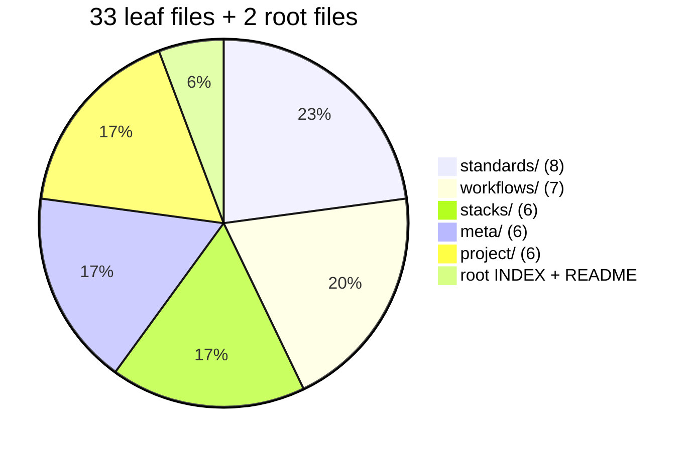
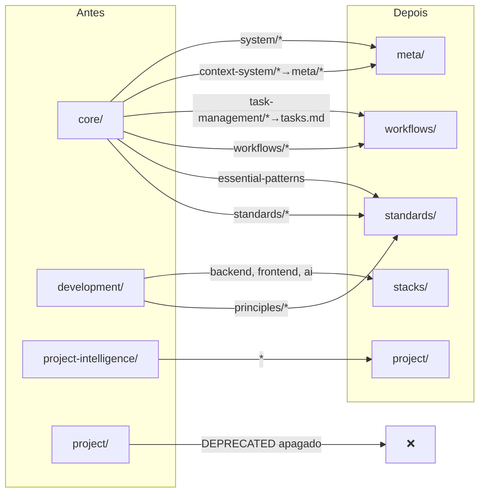

<a name="indice"></a>

# 🏛️ Relatório de Reestruturação do Context System

> **De 72 arquivos em 21 pastas (5 níveis) → 33 arquivos em 5 pastas (2 níveis).**
>
> Consolidação, renomeação e reorganização completas. Base nova, intuitiva,
> pronta para crescer sem virar labirinto.
>
> **Data**: 2026-05-02 | **Escopo**: `context/` completo + agents afetados

---

## 📑 Índice

| # | Seção | Descrição |
|---|-------|-----------|
| 1 | [📊 Resultado em Números](#numeros) | Antes vs depois |
| 2 | [🗂️ Nova Estrutura](#nova-estrutura) | 5 buckets planos |
| 3 | [🔄 Mapa de Transformação](#mapa) | O que veio de onde |
| 4 | [📉 Consolidações Realizadas](#consolidacoes) | Merges 4→1, 6→1, 11→1 |
| 5 | [🗑️ Arquivos Removidos](#removidos) | Legado e fantasmas |
| 6 | [🔧 Mudanças em Agentes](#agents) | Refs de path atualizadas |
| 7 | [✅ Validação](#validacao) | Paths, índice, referências |
| 8 | [🎯 Próximos Passos](#proximos) | Recomendações pós-restruturação |

---

<a name="numeros"></a>

## 📊 1. Resultado em Números

| Métrica | Antes | Depois | Δ |
|---------|-------|--------|---|
| Arquivos folha | 72 | **33** | **−54%** |
| Linhas totais | 10.082 | **5.572** | **−45%** |
| Pastas | 21 | **6** (5 buckets + root) | **−71%** |
| Profundidade máxima | 5 | **2** | **−60%** |
| Arquivos acima MVI 200 | 15 | **7** | **−53%** |
| `navigation.md` intermediários | 18 | **0** | **−100%** |
| Duplicações H1 | 2 | **0** | **−100%** |
| Arquivos DEPRECATED indexados | 1 | **0** | **−100%** |
| Domínios `🚧 Placeholder` vazios | 5 | **0** | **−100%** |
| Tokens estimados (contexto total) | ~75k | **~42k** | **−44%** |

### Distribuição final por bucket



[⬆️ Voltar ao Índice](#indice)

---

<a name="nova-estrutura"></a>

## 🗂️ 2. Nova Estrutura

```
context/
├── INDEX.md                    # Único mapa de navegação (33 entradas)
├── README.md                   # Documento humano explicando a estrutura
│
├── standards/                  # "COMO escrever" — universal
│   ├── essential-patterns.md
│   ├── code-quality.md
│   ├── clean-code.md
│   ├── api-design.md
│   ├── test-coverage.md
│   ├── security.md             # ex-security-patterns.md
│   ├── documentation.md
│   └── code-analysis.md
│
├── workflows/                  # "COMO agir" — processos
│   ├── code-review.md
│   ├── component-planning.md
│   ├── feature-breakdown.md
│   ├── session-management.md
│   ├── task-delegation.md      # ← MERGED 4→1
│   ├── tasks.md                # ← MERGED 4→1
│   └── external-libraries.md
│
├── stacks/                     # "TECNOLOGIA-específico"
│   ├── nodejs.md               # ex-backend/nodejs/project-structure.md
│   ├── react.md                # ex-frontend/react/react-patterns.md
│   ├── frontend.md             # ex-when-to-delegate.md
│   ├── ui-styling.md           # ex-ui-styling-standards.md
│   ├── design-systems.md
│   └── mastra-ai.md            # ← MERGED 11→1
│
├── meta/                       # "SOBRE o context system em si"
│   ├── overview.md             # ← MERGED 2→1
│   ├── mvi.md
│   ├── structure.md
│   ├── frontmatter.md
│   ├── creation.md             # ← MERGED 6→1
│   └── operations.md           # ← MERGED 6→1
│
└── project/                    # "ESTE projeto específico"
    ├── intelligence-guide.md   # ← MERGED 2→1 (ex-project-intelligence-management)
    ├── business-domain.md
    ├── technical-domain.md
    ├── business-tech-bridge.md
    ├── decisions-log.md
    └── living-notes.md
```

### Teste de intuição — passou?

Pergunta: "Onde coloco um padrão de auth?"
→ **`standards/security.md`** ✅ (único lugar plausível)

Pergunta: "Onde coloco o workflow de code review?"
→ **`workflows/code-review.md`** ✅ (único lugar plausível)

Pergunta: "Onde coloco padrões de React?"
→ **`stacks/react.md`** ✅ (único lugar plausível)

Pergunta: "Onde coloco o histórico de decisões do projeto?"
→ **`project/decisions-log.md`** ✅ (único lugar plausível)

[⬆️ Voltar ao Índice](#indice)

---

<a name="mapa"></a>

## 🔄 3. Mapa de Transformação



[⬆️ Voltar ao Índice](#indice)

---

<a name="consolidacoes"></a>

## 📉 4. Consolidações Realizadas

### 4.1 `workflows/task-delegation.md` (4→1, 186L)

Merge de:
- `core/workflows/task-delegation-basics.md` (138L)
- `core/workflows/task-delegation-specialists.md` (179L)
- `core/workflows/task-delegation-caching.md` (143L)
- `core/workflows/delegation.md` (20L, stub apagado)

Seções: Flow | Session Template | Choosing Specialist | Delegate Call | Context Caching.

### 4.2 `workflows/tasks.md` (4→1, 199L)

Merge de:
- `core/task-management/standards/task-schema.md` (197L)
- `core/task-management/guides/managing-tasks.md` (129L)
- `core/task-management/guides/splitting-tasks.md` (115L)
- `core/task-management/lookup/task-commands.md` (201L)

Seções: Schema | Status Transitions | Lifecycle | Decomposition | CLI Reference | Planning Agents.

### 4.3 `stacks/mastra-ai.md` (11→1, 212L)

Merge de 11 arquivos pequenos (420L total) em:
Core | Agents & Tools | Workflows | Step Structure | Storage | Evaluations | Modular Building | File Map | Testing | Common Errors | Commands.

### 4.4 `meta/overview.md` (2→1, 139L)

Merge de `core/context-system.md` (439L) + `core/system/context-guide.md` (192L). Reescrito do zero refletindo a realidade atual (flat INDEX, 5 buckets, sem navegação hierárquica). 70% menor que o original combinado.

### 4.5 `meta/operations.md` (6→1, 161L)

Merge das 6 operations (1.439L total, ~90% de redução):
`harvest.md` (321L) + `extract.md` (202L) + `organize.md` (224L) + `update.md` (237L) + `migrate.md` (223L) + `error.md` (232L).

Formato: cada operação vira seção com Trigger + Stages + Approval gates. Redundância removida (cada operação tinha o mesmo preâmbulo MVI/approval/related repetido).

### 4.6 `meta/creation.md` (6→1, 201L)

Merge dos 6 guides de `core/context-system/guides/`:
`compact.md` + `creation.md` + `navigation-design-basics.md` + `navigation-templates.md` + `organizing-context.md` + `workflows.md`.

Removidas as partes relacionadas a `navigation.md` (obsoletas). Templates embutidos inline.

### 4.7 `project/intelligence-guide.md` (2→1, 156L)

Merge de `core/standards/project-intelligence.md` (77L) + `core/standards/project-intelligence-management.md` (249L). Conteúdo reorganizado para uma narrativa única: o quê → arquivos → onboarding → triggers → governança.

[⬆️ Voltar ao Índice](#indice)

---

<a name="removidos"></a>

## 🗑️ 5. Arquivos Removidos

### Stubs duplicados (H1 idêntico a arquivos maiores)
- `core/workflows/review.md` (19L)
- `core/workflows/delegation.md` (20L)

### DEPRECATED
- `project/project-context.md` (103L — começava com "⚠️ DEPRECATED")

### Arquivos absorvidos por merges
- 4 × `core/workflows/task-delegation-*.md` → `workflows/task-delegation.md`
- 4 × `core/task-management/**/*.md` → `workflows/tasks.md`
- 11 × `development/ai/mastra-ai/**/*.md` → `stacks/mastra-ai.md`
- 2 × `core/context-system.md` + `core/system/context-guide.md` → `meta/overview.md`
- 6 × `core/context-system/operations/*.md` → `meta/operations.md`
- 6 × `core/context-system/guides/*.md` → `meta/creation.md`
- 2 × `core/standards/project-intelligence*.md` → `project/intelligence-guide.md`

### Legado da era "navigation.md" (todos os hubs e templates obsoletos)
- `core/context-system/standards/templates.md` (396L de templates de navigation)
- `core/context-system/standards/codebase-references.md` (145L, niche)
- `core/context-system/examples/navigation-examples.md` (148L, exemplos de navigation)
- `core/context-system/CHANGELOG.md` (uso de git log preferido)
- `core/system/context-paths.md` (85L, absorvido em overview.md)
- `development/backend-navigation.md` (79L, hub redundante)
- `development/fullstack-navigation.md` (75L, hub redundante)
- `development/ui-navigation.md` (46L, hub redundante)

**Total removido**: 72 arquivos originais → 35 restantes (incluindo 7 novos consolidados). Net: **−39 arquivos**.

[⬆️ Voltar ao Índice](#indice)

---

<a name="agents"></a>

## 🔧 6. Mudanças em Agentes

### `agent/subagents/core/task-manager.md`

Paths antigos → novos:

| De | Para |
|----|------|
| `core/task-management/navigation.md` | `workflows/tasks.md` |
| `core/task-management/standards/task-schema.md` | `workflows/tasks.md` (absorvido) |
| `core/task-management/guides/splitting-tasks.md` | `workflows/tasks.md` (absorvido) |
| `core/task-management/guides/managing-tasks.md` | `workflows/tasks.md` (absorvido) |
| `core/workflows/task-delegation-basics.md` | `workflows/task-delegation.md` |
| `core/standards/code-quality.md` | `standards/code-quality.md` |

### `agent/subagents/core/contextscout.md` e `externalscout.md`

Sem mudanças — já consultavam apenas `INDEX.md` (path-estável). ✅

[⬆️ Voltar ao Índice](#indice)

---

<a name="validacao"></a>

## ✅ 7. Validação

### Integridade do índice

```
Entradas no INDEX.md: 33
Arquivos folha em context/*/: 33
Paths no INDEX que não existem: 0 ✅
```

### Profundidade

Máximo 2 níveis: `context/{bucket}/{file}.md`. Nenhum arquivo em 3+ níveis.

### Arquivos acima do MVI 200

7 arquivos, justificáveis:

| Arquivo | Linhas | Justificativa |
|---------|--------|---------------|
| `standards/api-design.md` | 366 | Herdado (não alterado agora — candidato a futura compressão) |
| `stacks/design-systems.md` | 321 | Templates CSS de referência (lookup material) |
| `meta/structure.md` | 240 | Herdado (não alterado) |
| `workflows/feature-breakdown.md` | 234 | Herdado (candidato a futura compressão) |
| `stacks/mastra-ai.md` | 212 | Merge 11→1, margem mínima aceitável |
| `standards/essential-patterns.md` | 210 | Herdado |
| `meta/creation.md` | 201 | Merge 6→1, 1 linha de margem |

### Duplicações

- H1 únicos em todos os 33 arquivos ✅
- Zero arquivos DEPRECATED ✅
- Zero pastas vazias ✅

[⬆️ Voltar ao Índice](#indice)

---

<a name="proximos"></a>

## 🎯 8. Próximos Passos

### 🔵 Curto prazo (opcional, 1–2h)

- **Compressão MVI dos 4 herdados >200L**: `api-design.md` (366), `structure.md` (240), `feature-breakdown.md` (234), `essential-patterns.md` (210). Ganho estimado: −300L.
- **Script `scripts/generate-context-index.sh`**: regenera `INDEX.md` a partir do filesystem + frontmatter. Garante que nunca fica stale. Posso escrever quando quiser.

### 🟢 Médio prazo (conforme uso real)

- **Preencher gaps por demanda**: Python, Go, Vue, Angular, testing-per-stack, database-patterns. Criar APENAS quando uma consulta real triggar — não antecipar.
- **`stacks/` crescer com discrição**: só adicionar sub-pasta quando uma stack tiver ≥6 arquivos reais.

### 🟣 Longo prazo (manutenção)

- **Review quarterly**: `wc -l` para detectar arquivos que cresceram além do MVI.
- **Audit semestral**: checar se cada bucket ainda responde a pergunta única dele. Se não, reorganizar.
- **Zero `navigation.md`** — regra perene.

### Commit sugerido

Os arquivos estão no working tree, sem commit. Sugestão de boundaries:

```bash
git add context/
git commit -m "refactor(context): restructure to 5 flat buckets, consolidate 72→33 files"

git add agent/subagents/core/task-manager.md
git commit -m "chore(agents): update task-manager paths to new context structure"

git add docs/
git commit -m "docs: add context restructure reports"
```

[⬆️ Voltar ao Índice](#indice)

---

## 📝 Notas Finais

- **Reversibilidade**: tudo em git. `git checkout HEAD -- context/ agent/` desfaz integralmente.
- **Compatibilidade com instalador**: `context/` é a fonte que vira `.opencode/context/` ao instalar em projeto-alvo. Paths no INDEX são relativos, então funcionam em qualquer instalação.
- **Token economy esperada**: ~−44% de tokens no contexto total + ganho adicional por redução de discovery (já era plano anterior).
