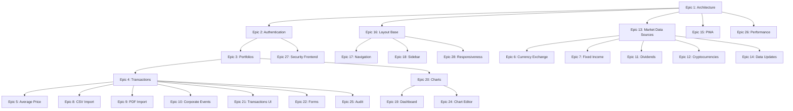

# STORY-001: Investment Management System

## Overview

### Business Context
The Investment Management System is a comprehensive web application designed to help Brazilian investors manage their investment portfolios across multiple asset classes including stocks (B3 and international), fixed income, and cryptocurrencies. The system provides real-time market data integration, portfolio performance tracking, transaction management, and advanced analytics.

### Value Proposition
- **Unified Portfolio Management**: Consolidate all investments (stocks, fixed income, crypto) in a single platform
- **Real-time Data Integration**: Automatic price updates from multiple reliable sources (BRAPI, Yahoo Finance, CoinGecko, Binance, Banco Central)
- **Multi-Portfolio Support**: Manage multiple portfolios with consolidated view capability
- **Smart Import**: CSV and PDF import with duplicate detection and template management
- **Performance Analytics**: Track portfolio performance against benchmarks (CDI, IPCA) and asset groups
- **PWA Capabilities**: Installable app with offline support for basic features

### Target Users
- **Primary**: Individual investors managing personal portfolios
- **Secondary**: Independent financial advisors managing client portfolios
- **Tertiary**: Small investment clubs tracking shared investments

### User Personas
1. **Carlos - Active Trader**: Day trader who needs real-time crypto updates and quick transaction entry
2. **Ana - Long-term Investor**: Passive investor focused on fixed income and dividend tracking
3. **Pedro - Diversified Investor**: Manages stocks, FIIs, fixed income, and crypto across multiple portfolios

---

## Scope

### Total Epics: 28
### Total Acceptance Criteria: 73 scenarios

### Phase 1: Foundation & Architecture (5 Epics)
**Duration Estimate: 2-3 weeks**

| Epic | Title | Priority | Dependencies |
|------|-------|----------|--------------|
| 1 | Architecture | Must Have | None |
| 2 | Authentication | Must Have | Epic 1 |
| 16 | Layout Base | Must Have | Epic 1 |
| 17 | Navigation | Must Have | Epic 16 |
| 27 | Security Frontend | Must Have | Epic 2 |

**Deliverables:**
- Docker Compose infrastructure (Nginx, Frontend, Backend, MongoDB, Redis)
- Google OAuth and email/password authentication
- JWT token management
- Base layout with sidebar and main area
- Protected route navigation
- User data isolation

### Phase 2: Core Features (7 Epics)
**Duration Estimate: 4-5 weeks**

| Epic | Title | Priority | Dependencies |
|------|-------|----------|--------------|
| 3 | Portfolios | Must Have | Epic 2 |
| 4 | Transactions | Must Have | Epic 3 |
| 5 | Average Price | Must Have | Epic 4 |
| 6 | Currency Exchange | Must Have | Epic 13 |
| 7 | Fixed Income | Must Have | Epic 13 |
| 11 | Dividends | Should Have | Epic 13 |
| 12 | Cryptocurrencies | Should Have | Epic 13 |

**Deliverables:**
- Portfolio CRUD operations
- Transaction registration (buy/sell)
- Average price calculation engine
- Currency conversion (USD to BRL)
- Fixed income calculations (CDI, IPCA, Fixed rate)
- Dividend tracking and filtering
- Cryptocurrency management with high-frequency updates

### Phase 3: Data Integration (2 Epics)
**Duration Estimate: 2-3 weeks**

| Epic | Title | Priority | Dependencies |
|------|-------|----------|--------------|
| 13 | Market Data Sources | Must Have | Epic 1 |
| 14 | Data Updates | Must Have | Epic 13 |

**Deliverables:**
- BRAPI integration (Brazilian stocks - primary)
- Yahoo Finance integration (International stocks - fallback)
- CoinGecko integration (Cryptocurrencies)
- Binance API integration (Crypto real-time)
- Banco Central integration (CDI, IPCA, SELIC, PTAX)
- Fallback strategy implementation
- Configurable update intervals
- Redis caching layer

### Phase 4: Import Features (3 Epics)
**Duration Estimate: 2-3 weeks**

| Epic | Title | Priority | Dependencies |
|------|-------|----------|--------------|
| 8 | CSV Import | Should Have | Epic 4 |
| 9 | PDF Import | Could Have | Epic 4 |
| 10 | Corporate Events | Should Have | Epic 4 |

**Deliverables:**
- CSV file import with validation
- Duplicate detection (ignore/duplicate/replace)
- PDF template creation and management
- Automatic PDF field mapping
- Corporate event detection (splits, bonuses, mergers)
- Position recalculation after events

### Phase 5: UI/UX Features (8 Epics)
**Duration Estimate: 3-4 weeks**

| Epic | Title | Priority | Dependencies |
|------|-------|----------|--------------|
| 18 | Sidebar | Must Have | Epic 16 |
| 19 | Dashboard | Must Have | Epic 20 |
| 20 | Charts | Must Have | Epic 3, Epic 13 |
| 21 | Transactions UI | Must Have | Epic 4 |
| 22 | Forms | Must Have | Epic 4 |
| 23 | UX Feedback | Must Have | None |
| 24 | Chart Editor | Should Have | Epic 20 |
| 28 | Responsiveness | Must Have | Epic 16 |

**Deliverables:**
- Collapsible sidebar with menu navigation
- Customizable dashboard with widgets
- Performance charts with benchmarks
- Transaction table with filters and sorting
- Form validation and error handling
- Loading indicators and success confirmations
- Chart editor (line, bar, pie, donut)
- Mobile-responsive layout

### Phase 6: Advanced Features (3 Epics)
**Duration Estimate: 1-2 weeks**

| Epic | Title | Priority | Dependencies |
|------|-------|----------|--------------|
| 15 | PWA | Should Have | Epic 1 |
| 25 | Audit | Should Have | Epic 4 |
| 26 | Performance | Should Have | Epic 1 |

**Deliverables:**
- PWA manifest and service worker
- Installable app capability
- Basic offline support
- Transaction change history
- Soft delete implementation
- Lazy loading optimization
- Local cache implementation

---

## Acceptance Criteria

### 🧩 ÉPICO 1 — Arquitetura

**Feature: Sistema**

- [ ] **Scenario: Container**
  - GIVEN the system is deployed
  - WHEN containers are orchestrated
  - THEN Nginx, frontend, backend, mongodb and redis must run in separate containers orchestrated by docker compose

- [ ] **Scenario: Requisições**
  - GIVEN any HTTP request
  - WHEN the request reaches the system
  - THEN all requests must pass through NGINX

- [ ] **Scenario: Persistência**
  - GIVEN the backend needs to store data
  - WHEN persisting information
  - THEN backend must use MongoDB without requiring passwords

- [ ] **Scenario: Cache**
  - GIVEN external API calls
  - WHEN the system fetches data
  - THEN the system must avoid excessive API calls using Redis cache

---

### 🧩 ÉPICO 2 — Autenticação

**Feature: Autenticação de usuário**

- [ ] **Scenario: Login com Google**
  - GIVEN the user accesses the login screen
  - WHEN they select Google login
  - THEN the system must authenticate via OAuth
  - AND create an account if it doesn't exist

- [ ] **Scenario: Login com email e senha**
  - GIVEN the user has a registered account
  - WHEN they provide valid email and password
  - THEN the system must authenticate the user

- [ ] **Scenario: Recuperação de senha**
  - GIVEN the user forgot their password
  - WHEN they request recovery
  - THEN they must receive an email for password reset

---

### 🧩 ÉPICO 3 — Carteiras

**Feature: Gestão de carteiras**

- [ ] **Scenario: Criar carteira**
  - GIVEN an authenticated user
  - WHEN they create a new portfolio
  - THEN the portfolio must be saved with a unique name

- [ ] **Scenario: Alternar carteira ativa**
  - GIVEN multiple portfolios exist
  - WHEN the user selects one
  - THEN all displayed data must reflect only that portfolio

- [ ] **Scenario: Visão consolidada**
  - GIVEN multiple portfolios exist
  - WHEN the user selects consolidated mode
  - THEN the system must sum all assets in BRL

---

### 🧩 ÉPICO 4 — Transações

**Feature: Registro de transações**

- [ ] **Scenario: Registrar compra**
  - GIVEN the user inserts a purchase
  - WHEN they save the transaction
  - THEN the system must increase the asset position

- [ ] **Scenario: Registrar venda válida**
  - GIVEN the user owns 10 units
  - WHEN they sell 5 units
  - THEN the final quantity must be 5

- [ ] **Scenario: Bloquear venda inválida**
  - GIVEN the user owns 10 units
  - WHEN they try to sell 15
  - THEN the system must prevent the operation

- [ ] **Scenario: Zerar posição**
  - GIVEN the user owns 10 units
  - WHEN they sell 10
  - THEN the quantity must be 0
  - AND the average price must be reset

---

### 🧩 ÉPICO 5 — Preço Médio

**Feature: Cálculo de preço médio**

- [ ] **Scenario: Calcular preço médio**
  - GIVEN multiple purchases with fees
  - WHEN calculating the position
  - THEN the average price must be: (total invested + fees) / total quantity

- [ ] **Scenario: Venda não altera preço médio**
  - GIVEN a calculated average price
  - WHEN a partial sale occurs
  - THEN the average price must remain the same

---

### 🧩 ÉPICO 6 — Câmbio

**Feature: Conversão cambial**

- [ ] **Scenario: Converter ativo internacional**
  - GIVEN an asset in USD
  - WHEN displaying in BRL
  - THEN it must use the daily exchange rate

- [ ] **Scenario: Histórico de câmbio**
  - GIVEN a historical chart
  - WHEN displaying evolution
  - THEN it must use the corresponding historical exchange rate

---

### 🧩 ÉPICO 7 — Renda Fixa

**Feature: Cálculo de renda fixa**

- [ ] **Scenario: Investimento CDI**
  - GIVEN a CDI + rate investment
  - WHEN calculating the value
  - THEN use proportional accumulated CDI

- [ ] **Scenario: Investimento IPCA**
  - GIVEN an IPCA + rate investment
  - WHEN calculating the value
  - THEN use accumulated IPCA + rate

- [ ] **Scenario: Investimento prefixado**
  - GIVEN a fixed annual rate
  - WHEN calculating the value
  - THEN use compound interest over time

---

### 🧩 ÉPICO 8 — Importação CSV

**Feature: Importação CSV**

- [ ] **Scenario: Importar arquivo válido**
  - GIVEN a correct CSV file
  - WHEN importing
  - THEN data must be inserted

- [ ] **Scenario: Detectar duplicidade**
  - GIVEN an existing record
  - WHEN importing again
  - THEN the system must ask: ignore, duplicate, or replace

---

### 🧩 ÉPICO 9 — Importação PDF

**Feature: Importação de nota de corretagem**

- [ ] **Scenario: Criar template**
  - GIVEN a new PDF
  - WHEN the user maps fields
  - THEN the template must be saved

- [ ] **Scenario: Reutilizar template**
  - GIVEN a known PDF
  - WHEN importing
  - THEN the system must apply the template automatically

- [ ] **Scenario: Validar antes de salvar**
  - WHEN data is extracted
  - THEN the user must confirm before persisting

---

### 🧩 ÉPICO 10 — Eventos Corporativos

**Feature: Reconciliação de eventos**

- [ ] **Scenario: Detectar eventos históricos**
  - GIVEN an asset with history
  - WHEN importing an old position
  - THEN the system must search for events (split, bonus, merger, etc)

- [ ] **Scenario: Aprovar eventos**
  - GIVEN found events
  - WHEN the user reviews
  - THEN they can select which to apply

- [ ] **Scenario: Aplicar eventos**
  - WHEN events are applied
  - THEN quantity and average price must be recalculated

---

### 🧩 ÉPICO 11 — Proventos

**Feature: Proventos**

- [ ] **Scenario: Registrar provento**
  - GIVEN an asset with dividends
  - WHEN the system imports data
  - THEN it must register the dividend

- [ ] **Scenario: Não reinvestir automaticamente**
  - GIVEN a received dividend
  - THEN it must not automatically change the position

- [ ] **Scenario: Visualização por período**
  - GIVEN a dividend history
  - WHEN the user filters
  - THEN it must show monthly, semester, annual, or total

---

### 🧩 ÉPICO 12 — Criptomoedas

**Feature: Gestão de criptomoedas**

- [ ] **Scenario: Registrar compra cripto**
  - GIVEN a purchase operation
  - THEN it must calculate average price including fees

- [ ] **Scenario: Atualizar preço**
  - GIVEN a crypto asset
  - WHEN the system updates data
  - THEN it must use external API at high frequency

- [ ] **Scenario: Exibir valorização**
  - THEN the system must show: current value, % gain, absolute gain

---

### 🧩 ÉPICO 13 — Fontes de Dados de Mercado (APIs)

**Feature: Coleta de dados externos**

- [ ] **Scenario: Obter dados da B3**
  - GIVEN a Brazilian asset
  - THEN the system must use BRAPI as primary source
  - AND use Yahoo Finance as fallback

- [ ] **Scenario: Obter dados internacionais**
  - GIVEN an international asset
  - THEN the system must use Yahoo Finance

- [ ] **Scenario: Obter dados de proventos**
  - GIVEN an asset with dividends
  - THEN the system must collect data via: BRAPI and Yahoo Finance

- [ ] **Scenario: Obter eventos corporativos**
  - GIVEN an asset with events
  - THEN the system must collect data via: BRAPI and Yahoo Finance

- [ ] **Scenario: Obter índices econômicos**
  - GIVEN need for CDI or IPCA
  - THEN the system must use Banco Central API to fetch economic indicators
  - AND store daily history

- [ ] **Scenario: Obter dados de criptomoedas**
  - GIVEN a crypto asset
  - THEN the system must use: CoinGecko and Binance API

- [ ] **Scenario: Estratégia de fallback**
  - GIVEN primary API failure
  - THEN the system must use secondary source

---

### 🧩 ÉPICO 14 — Atualização de Dados

**Feature: Atualização de mercado**

- [ ] **Scenario: Atualizar ações**
  - THEN update at configurable interval

- [ ] **Scenario: Atualizar renda fixa**
  - THEN update daily

- [ ] **Scenario: Atualizar cripto**
  - THEN update at high frequency

---

### 🧩 ÉPICO 15 — PWA

**Feature: Aplicação instalável**

- [ ] **Scenario: Instalar app**
  - THEN allow adding to home screen

- [ ] **Scenario: Executar standalone**
  - THEN open as app

- [ ] **Scenario: Offline básico**
  - THEN allow minimal loading

---

### 🧩 ÉPICO 16 — Layout Base

**Feature: Estrutura da aplicação**

- [ ] **Scenario: Exibir layout principal**
  - THEN it must show sidebar and main area

- [ ] **Scenario: Layout responsivo**
  - THEN it must adapt for mobile and desktop

---

### 🧩 ÉPICO 17 — Navegação

**Feature: Rotas**

- [ ] **Scenario: Navegar entre páginas**
  - THEN it must load correct content

- [ ] **Scenario: Proteção**
  - THEN unauthenticated user must be redirected

---

### 🧩 ÉPICO 18 — Sidebar

**Feature: Navegação lateral**

- [ ] **Scenario: Exibir menu**
  - THEN it must contain: Dashboard, Transactions, Import, Registers, Portfolios

- [ ] **Scenario: Colapsar sidebar**
  - WHEN the user clicks
  - THEN it must reduce to icons

---

### 🧩 ÉPICO 19 — Dashboard

**Feature: Dashboard customizável**

- [ ] **Scenario: Adicionar gráfico**
  - GIVEN a dashboard
  - WHEN the user adds a widget
  - THEN it must appear in the layout

- [ ] **Scenario: Redimensionar**
  - WHEN the user drags the border
  - THEN the chart must adjust size

- [ ] **Scenario: Salvar layout**
  - WHEN the user saves the dashboard
  - THEN the layout must persist per portfolio

---

### 🧩 ÉPICO 20 — Gráficos

**Feature: Gráfico de rendimento**

- [ ] **Scenario: Exibir carteira**
  - GIVEN an active chart
  - THEN it must show the portfolio line

- [ ] **Scenario: Adicionar benchmark**
  - WHEN the user selects CDI
  - THEN the chart must include CDI

- [ ] **Scenario: Adicionar grupo**
  - WHEN the user selects FIIs
  - THEN the chart must include FIIs line

- [ ] **Scenario: Combinação dinâmica**
  - THEN the system must allow multiple simultaneous combinations

---

### 🧩 ÉPICO 21 — Transações UI

**Feature: Tabela**

- [ ] **Scenario: Exibir transações**
  - THEN show complete list

- [ ] **Scenario: Filtrar**
  - THEN allow filters by period and type

- [ ] **Scenario: Ordenar**
  - THEN allow sorting by columns

---

### 🧩 ÉPICO 22 — Formulários

**Feature: Entrada de dados**

- [ ] **Scenario: Validação**
  - THEN prevent invalid fields

- [ ] **Scenario: Tipo obrigatório**
  - THEN require buy or sell

---

### 🧩 ÉPICO 23 — Feedback UX

**Feature: Feedback**

- [ ] **Scenario: Loading**
  - THEN show indicator

- [ ] **Scenario: Erro**
  - THEN show clear message

- [ ] **Scenario: Sucesso**
  - THEN confirm operation

---

### 🧩 ÉPICO 24 — Editor de Gráficos

**Feature: Configuração de gráficos**

- [ ] **Scenario: Selecionar tipo**
  - THEN allow: line, bar, pie, donut

- [ ] **Scenario: Comparações**
  - THEN allow adding: portfolio, indices, groups

---

### 🧩 ÉPICO 25 — Auditoria e Consistência

**Feature: Auditoria**

- [ ] **Scenario: Alterar transação**
  - THEN the system must maintain change history

- [ ] **Scenario: Soft delete**
  - WHEN deleting a record
  - THEN do not remove from database

---

### 🧩 ÉPICO 26 — Performance

**Feature: Performance**

- [ ] **Scenario: Lazy loading**
  - THEN load on demand

- [ ] **Scenario: Cache**
  - THEN reuse local data

---

### 🧩 ÉPICO 27 — Segurança Frontend

**Feature: Segurança**

- [ ] **Scenario: Proteção**
  - THEN data must be isolated by user

---

### 🧩 ÉPICO 28 — Responsividade

**Feature: Responsividade**

- [ ] **Scenario: Mobile**
  - THEN sidebar becomes overlay

- [ ] **Scenario: Desktop**
  - THEN use full layout

---

## Dependencies

### Critical Path Dependencies

### Dependency Matrix

| Epic | Depends On | Blocks |
|------|------------|--------|
| 1 | None | 2, 13, 15, 16, 26 |
| 2 | 1 | 3, 27 |
| 3 | 2 | 4, 20 |
| 4 | 3 | 5, 8, 9, 10, 21, 22, 25 |
| 5 | 4 | None |
| 6 | 13 | None |
| 7 | 13 | None |
| 8 | 4 | None |
| 9 | 4 | None |
| 10 | 4 | None |
| 11 | 13 | None |
| 12 | 13 | None |
| 13 | 1 | 6, 7, 11, 12, 14 |
| 14 | 13 | None |
| 15 | 1 | None |
| 16 | 1 | 17, 18, 28 |
| 17 | 16 | None |
| 18 | 16 | None |
| 19 | 20 | None |
| 20 | 3, 13 | 19, 24 |
| 21 | 4 | None |
| 22 | 4 | None |
| 23 | None | None |
| 24 | 20 | None |
| 25 | 4 | None |
| 26 | 1 | None |
| 27 | 2 | None |
| 28 | 16 | None |

---

## Definition of Ready

### Technical Readiness
- [ ] Architecture design approved by Architect
- [ ] Database schema designed and documented
- [ ] API contracts defined (OpenAPI/Swagger)
- [ ] External API documentation reviewed and validated
- [ ] Development environment setup complete
- [ ] CI/CD pipeline configured

### Requirements Readiness
- [ ] All 28 epics documented with Gherkin scenarios
- [ ] Acceptance criteria reviewed and approved by PO
- [ ] Dependencies mapped and prioritized
- [ ] Technical constraints documented
- [ ] Risk assessment completed
- [ ] Success metrics defined

### Team Readiness
- [ ] TechLead assigned
- [ ] Development team allocated
- [ ] QA resources assigned
- [ ] Sprint planning completed
- [ ] Story points estimated

### External Dependencies
- [ ] BRAPI API access validated
- [ ] Yahoo Finance API access validated
- [ ] CoinGecko API access validated
- [ ] Binance API access validated
- [ ] Banco Central API access validated
- [ ] Google OAuth credentials configured

---

## Definition of Done

### Code Quality
- [ ] Code reviewed by CodeReviewer
- [ ] Follows clean code principles (docs: .opencode/context/development/principles/clean-code.md)
- [ ] Follows API design standards (docs: .opencode/context/development/principles/api-design.md)
- [ ] No critical code smells detected
- [ ] Technical debt documented

### Testing
- [ ] Unit tests with coverage ≥90% for business logic
- [ ] Integration tests passing
- [ ] E2E tests for critical user journeys
- [ ] Performance tests executed
- [ ] Security tests executed
- [ ] All tests passing in CI/CD pipeline

### Documentation
- [ ] API documentation updated (Swagger/OpenAPI)
- [ ] README updated with setup instructions
- [ ] Code comments for complex logic
- [ ] User guide created
- [ ] Architecture documentation updated

### QA Validation
- [ ] All 73 acceptance criteria validated by QAAnalyst
- [ ] No critical bugs open
- [ ] UX/UI approved
- [ ] Cross-browser testing completed
- [ ] Mobile responsiveness validated
- [ ] PWA installation tested

### Deployment
- [ ] Docker Compose setup working
- [ ] Environment variables documented
- [ ] Database migrations tested
- [ ] Redis cache configured
- [ ] Nginx routing validated
- [ ] Production deployment checklist completed

### Integration
- [ ] BRAPI integration working with fallback
- [ ] Yahoo Finance integration working with fallback
- [ ] CoinGecko integration working
- [ ] Binance integration working
- [ ] Banco Central integration working
- [ ] All fallback strategies tested

---

## Risks

### Technical Risks

| Risk | Impact | Probability | Mitigation |
|------|--------|-------------|------------|
| External API rate limits | High | Medium | Implement Redis caching, use fallback APIs, respect rate limits |
| API breaking changes | High | Low | Version API clients, monitor API changelogs, implement fallback |
| MongoDB performance degradation | Medium | Low | Implement proper indexing, use Redis for hot data, monitor query performance |
| PWA offline limitations | Medium | Medium | Clearly define offline scope, implement service worker correctly |
| Real-time crypto updates overload | Medium | Medium | Implement WebSocket connection pooling, use Binance streams efficiently |
| Currency exchange rate delays | Medium | Medium | Cache daily rates, use PTAX as fallback, implement retry logic |

### Business Risks

| Risk | Impact | Probability | Mitigation |
|------|--------|-------------|------------|
| Incorrect financial calculations | Critical | Low | Extensive unit tests, use battle-tested libraries, peer review |
| Data loss | Critical | Low | Implement soft delete, regular backups, audit trail |
| User data leakage | Critical | Low | Strict data isolation, security audit, penetration testing |
| Regulatory compliance issues | High | Low | Consult legal team, implement audit trail, data retention policies |
| User adoption resistance | Medium | Medium | Intuitive UX, comprehensive onboarding, user feedback loop |

### External Risks

| Risk | Impact | Probability | Mitigation |
|------|--------|-------------|------------|
| BRAPI service outage | High | Medium | Yahoo Finance fallback, cache historical data |
| Banco Central API changes | Medium | Low | Monitor API updates, implement versioning |
| Google OAuth policy changes | Medium | Low | Monitor Google developer updates, maintain email/password fallback |
| Binance API restrictions | Medium | Medium | CoinGecko fallback, implement rate limiting |

---

## Success Metrics

### Technical Metrics

| Metric | Target | Measurement Method |
|--------|--------|-------------------|
| Test Coverage | ≥90% | Jest/Istanbul coverage report |
| API Response Time | <200ms (p95) | Application monitoring |
| Page Load Time | <3s (p95) | Lighthouse audit |
| PWA Lighthouse Score | ≥90 | Lighthouse audit |
| Uptime | ≥99.5% | Application monitoring |
| Error Rate | <0.1% | Application monitoring |

### Business Metrics

| Metric | Target | Measurement Method |
|--------|--------|-------------------|
| User Registration | Track growth | Database analytics |
| Portfolio Creation | Track per user | Database analytics |
| Transaction Volume | Track daily | Database analytics |
| Import Feature Usage | Track CSV/PDF imports | Application analytics |
| Dashboard Customization | Track widget usage | Application analytics |
| Mobile Usage | Track PWA installations | Application analytics |

### User Experience Metrics

| Metric | Target | Measurement Method |
|--------|--------|-------------------|
| Task Completion Rate | ≥95% | User testing |
| Time to First Transaction | <5 minutes | User onboarding analytics |
| User Satisfaction (NPS) | ≥50 | User surveys |
| Support Ticket Volume | <5 per week | Support system |
| Feature Adoption Rate | ≥70% for core features | Application analytics |

### Integration Metrics

| Metric | Target | Measurement Method |
|--------|--------|-------------------|
| API Fallback Success Rate | 100% | Application monitoring |
| Cache Hit Rate | ≥80% | Redis monitoring |
| Data Freshness | <5 min for stocks, <1 min for crypto | Application monitoring |
| External API Error Rate | <5% | Application monitoring |

---

## Technical Notes

### Architecture Stack
- **Frontend**: React 18 + TypeScript + Vite + PWA
- **State Management**: TanStack Query (server state) + Zustand (client state)
- **UI Framework**: Tailwind CSS + Headless UI
- **Charts**: Recharts (static) + Lightweight Charts (real-time)
- **Backend**: Node.js + Express + TypeScript
- **Authentication**: JWT + OAuth 2.0 (Google)
- **Database**: MongoDB (no passwords required)
- **Cache**: Redis (API response caching)
- **Infrastructure**: Docker Compose (Nginx, Frontend, Backend, MongoDB, Redis)

### External API Integration Strategy
1. **Brazilian Stocks**: BRAPI (primary) → Yahoo Finance (fallback)
2. **International Stocks**: Yahoo Finance
3. **Cryptocurrencies**: CoinGecko (historical) + Binance (real-time)
4. **Economic Indicators**: Banco Central (CDI, IPCA, SELIC, PTAX)
5. **Dividends & Corporate Events**: BRAPI + Yahoo Finance

### Financial Calculation Requirements
- All financial calculations must use pure functions
- Use decimal.js or similar for precision
- Average price formula: (total invested + fees) / total quantity
- Sell operations do not change average price
- Zero position resets average price

### Data Isolation Requirements
- All user data must be isolated by user ID
- Portfolio data scoped to user
- No cross-user data access
- Audit trail for all changes

### Performance Requirements
- Lazy loading for all routes
- Redis cache for external API responses
- Local storage for user preferences
- Optimistic updates for better UX
- Debounced search inputs

### Security Requirements
- JWT tokens with expiration
- Refresh token rotation
- HTTPS only in production
- Input validation on all forms
- SQL injection prevention (MongoDB)
- XSS prevention
- CSRF protection

---

## Test Scenarios

### Critical Path Testing
1. **User Registration and Authentication Flow**
   - Google OAuth login
   - Email/password registration
   - Password recovery
   - JWT token refresh

2. **Portfolio Management Flow**
   - Create portfolio
   - Switch active portfolio
   - Consolidated view
   - Delete portfolio (soft delete)

3. **Transaction Management Flow**
   - Register buy transaction
   - Register sell transaction (valid)
   - Block invalid sell (exceeds position)
   - Zero position handling
   - Average price calculation

4. **Data Import Flow**
   - CSV import with valid data
   - CSV duplicate detection
   - PDF template creation
   - PDF template reuse

5. **Market Data Integration Flow**
   - Brazilian stock price fetch (BRAPI)
   - Fallback to Yahoo Finance
   - Cryptocurrency price update (Binance)
   - Economic indicator fetch (Banco Central)

### Edge Case Testing
1. **Currency Exchange**
   - Historical exchange rate for charts
   - Missing exchange rate handling
   - Weekend/holiday rate handling

2. **Fixed Income Calculations**
   - CDI investment with rate
   - IPCA investment with rate
   - Fixed rate compound interest

3. **Corporate Events**
   - Stock split detection
   - Bonus share application
   - Merger handling

4. **Performance**
   - Large portfolio (100+ assets)
   - High-frequency crypto updates
   - Concurrent user access

### Security Testing
1. **Authentication**
   - Invalid JWT token rejection
   - Expired token handling
   - OAuth flow security

2. **Data Isolation**
   - Cross-user data access prevention
   - Portfolio access control
   - API endpoint authorization

3. **Input Validation**
   - SQL injection attempts
   - XSS attack prevention
   - CSRF token validation

---

## Implementation Priority

### Sprint 1-2: Foundation (Must Have)
- Epic 1: Architecture
- Epic 2: Authentication
- Epic 16: Layout Base
- Epic 17: Navigation
- Epic 27: Security Frontend

### Sprint 3-4: Core Data Layer (Must Have)
- Epic 13: Market Data Sources
- Epic 14: Data Updates
- Epic 3: Portfolios
- Epic 4: Transactions

### Sprint 5-6: Business Logic (Must Have)
- Epic 5: Average Price
- Epic 6: Currency Exchange
- Epic 7: Fixed Income
- Epic 12: Cryptocurrencies

### Sprint 7-8: UI/UX Core (Must Have)
- Epic 18: Sidebar
- Epic 20: Charts
- Epic 19: Dashboard
- Epic 21: Transactions UI
- Epic 22: Forms
- Epic 23: UX Feedback
- Epic 28: Responsiveness

### Sprint 9-10: Advanced Features (Should Have)
- Epic 11: Dividends
- Epic 8: CSV Import
- Epic 10: Corporate Events
- Epic 24: Chart Editor
- Epic 25: Audit
- Epic 26: Performance

### Sprint 11-12: Polish & PWA (Should Have)
- Epic 9: PDF Import
- Epic 15: PWA

---

## Notes

- This story encompasses the entire Investment Management System as defined in docs/PO-epicos.md
- All 28 epics are included with their complete Gherkin scenarios
- Implementation should follow the phased approach to manage dependencies
- External API integrations are critical and require fallback strategies
- Financial calculations must be thoroughly tested for accuracy
- User data isolation is a security requirement
- PWA capabilities enhance user experience but are not blocking
- Performance optimization should be continuous throughout development

---

**Story Status**: Ready for Architect Review
**Created**: 2026-03-31
**Last Updated**: 2026-03-31
**Estimated Effort**: 12 sprints (24-30 weeks)
**Story Points**: 342 points (based on epic complexity)
